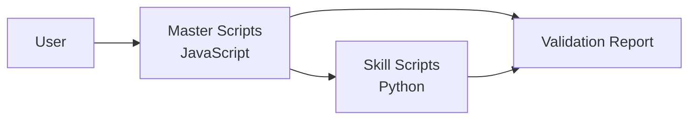

# PikaKit Architecture

> Comprehensive AI Agent Capability Expansion Toolkit

---

## 📋 Overview

PikaKit is a modular system consisting of:

- **26 Specialist Agents** - Role-based AI personas (21 domain + 5 meta)
- **45 Skills** - Domain-specific knowledge modules
- **24 Workflows** - Slash command procedures
- **5 Workflow Chains** - Multi-skill execution sequences

---

## 🏗️ Directory Structure

```plaintext
.agent/
├── ARCHITECTURE.md          # This file
├── GEMINI.md                # Global AI rules & protocols
├── agents/                  # 20 Specialist Agents
├── config/                  # Configuration files
├── docs/                    # Additional documentation
├── knowledge/               # Learning patterns & lessons
├── scripts-js/              # Master Validation Scripts (JS)
├── skills/                  # 45 Skills + registry.json
├── studio/                  # Studio design system tools
└── workflows/               # 18 Slash Commands
```

---

## 🔄 Hybrid Runtime Architecture

### 2-Tier Design

PikaKit uses a **hybrid architecture** combining JavaScript and Python:

```
┌──────────────────────────────────┐
│ TIER 1: Master Scripts (JS)      │
│ - Orchestration & workflow       │
│ - User-facing CLI commands       │
│ - Project management             │
└──────────────┬───────────────────┘
               │ child_process.spawn()
               ↓
┌──────────────────────────────────┐
│ TIER 2: Skill Scripts (Python)   │
│ - Specialized validation (34)    │
│ - Security scanning              │
│ - Performance auditing           │
│ - E2E testing automation         │
└──────────────────────────────────┘
```

### Runtime Requirements

- **Node.js 18+** - Required for all operations
- **Python 3.8+** - Required for skill validation scripts

See [PYTHON_STRATEGY.md](../PYTHON_STRATEGY.md) for architecture rationale.

---

## 🎨 Studio (Design System Generator)

**Location:** `.agent/skills/studio/`

Studio provides AI-powered design system generation using BM25 search across curated design databases.

### Purpose

Generate high-quality UI/UX code by searching 24 CSV databases containing:

- 50+ design styles (Minimalism, Glassmorphism, Brutalism...)
- 95+ color palettes (SaaS, E-commerce, Fintech...)
- 60+ font pairings (Google Fonts combinations)
- 12 framework-specific guidelines (React, Vue, SwiftUI...)

### Components

| Component       | Purpose               | Files                                |
| --------------- | --------------------- | ------------------------------------ |
| **data/**       | Design knowledge base | 24 CSV files (241 KB)                |
| **scripts-js/** | BM25 search engine    | core.js, design_system.js, search.js |

### Usage

```bash
# Search design guidelines
npm run studio:search "minimalist dashboard"

# Generate design system
npm run studio:design

# Stack-specific search
node .agent/skills/studio/scripts-js/search.js "layout" --stack nextjs
```

### Data Domains (11)

- **style** - Design styles (styles.csv)
- **color** - Color palettes (colors.csv)
- **typography** - Font pairings (typography.csv)
- **ux** - UX guidelines (ux-guidelines.csv)
- **icons** - Icon libraries (icons.csv)
- **chart** - Data visualization (charts.csv)
- **landing** - Landing patterns (landing.csv)
- **product** - Product-specific (products.csv)
- **prompt** - AI prompts (prompts.csv)
- **react** - React performance (react-performance.csv)
- **web** - Web interface (web-interface.csv)

### Supported Stacks (12)

Next.js, React, Vue, Nuxt, Svelte, SwiftUI, React Native, Flutter, HTML/Tailwind, shadcn/ui, Jetpack Compose, Nuxt UI

See [STUDIO_MIGRATION.md](../STUDIO_MIGRATION.md) for migration details.

---

## 🤖 Agents (25)

Specialist AI personas for different domains.

### Meta-Agents (Runtime Control)

| Agent                  | Focus                    | Skills Used                       |
| ---------------------- | ------------------------ | --------------------------------- |
| `lead-orchestrator`    | Strategic coordination   | agent-patterns, code-craft        |
| `runtime-orchestrator` | Runtime control          | lifecycle-orchestrator, code-craft |
| `assessor`             | Risk analysis            | code-review, project-planner      |
| `recovery`             | State rollback           | state-rollback, code-craft        |
| `critic`               | Conflict resolution      | code-review, code-quality         |
| `learner`              | Continuous improvement   | auto-learner                      |

### Domain Agents (21)

| Agent                    | Focus                      | Skills Used                                     |
| ------------------------ | -------------------------- | ----------------------------------------------- |
| `orchestrator`           | Multi-agent coordination   | agent-patterns, code-craft                      |
| `project-planner`        | Discovery, task planning   | idea-storm, project-planner, system-design      |
| `frontend-specialist`    | Web UI/UX                  | design-system, react-architect, tailwind-kit    |
| `backend-specialist`     | API, business logic        | api-architect, nodejs-pro, data-modeler         |
| `database-architect`     | Schema, SQL                | data-modeler, code-craft                        |
| `mobile-developer`       | iOS, Android, RN           | mobile-first, code-craft                        |
| `game-developer`         | Game logic, mechanics      | game-engine, code-craft                         |
| `devops-engineer`        | CI/CD, Docker              | cicd-pipeline, server-ops, shell-script         |
| `security-auditor`       | Security compliance        | security-scanner, offensive-sec, api-architect  |
| `penetration-tester`     | Offensive security         | offensive-sec, security-scanner                 |
| `test-engineer`          | Testing strategies         | test-architect, test-driven-dev, e2e-automation |
| `debugger`               | Root cause analysis        | debug-pro, code-craft                       |
| `performance-optimizer`  | Speed, Web Vitals          | perf-optimizer, code-craft                      |
| `seo-specialist`         | Ranking, visibility        | seo-optimizer, geo-spatial                      |
| `documentation-writer`   | Manuals, docs              | doc-templates, code-craft                       |
| `product-manager`        | Requirements, user stories | project-planner, idea-storm                     |
| `product-owner`          | Strategy, backlog, MVP     | project-planner, idea-storm                     |
| `qa-automation-engineer` | E2E testing, CI pipelines  | e2e-automation, test-architect                  |
| `code-archaeologist`     | Legacy code, refactoring   | code-craft, code-review                         |
| `explorer-agent`         | Codebase analysis          | system-design, debug-pro                        |
| `api-designer`           | API design, schemas        | api-architect, data-modeler, auth-patterns      |

---

## 🧩 Skills (45)

Modular knowledge domains that agents can load on-demand. based on task context.

### Frontend & UI

| Skill            | Description                      |
| ---------------- | -------------------------------- |
| `ReactArchitect` | React hooks, state, performance  |
| `NextJSPro`      | App Router, Server Components    |
| `TailwindKit`    | Tailwind CSS v4 utilities        |
| `DesignSystem`   | UI/UX patterns, design systems   |
| `studio`         | 50 styles, 21 palettes, 50 fonts |

### Backend & API

| Skill           | Description                    |
| --------------- | ------------------------------ |
| `APIArchitect`  | REST, GraphQL, tRPC            |
| `nestjs-expert` | NestJS modules, DI, decorators |
| `NodeJSPro`     | Node.js async, modules         |
| `PythonPro`     | Python standards, FastAPI      |

### Database

| Skill           | Description                 |
| --------------- | --------------------------- |
| `DataModeler`   | Schema design, optimization |
| `prisma-expert` | Prisma ORM, migrations      |

### TypeScript/JavaScript

| Skill               | Description                         |
| ------------------- | ----------------------------------- |
| `typescript-expert` | Type-level programming, performance |

### Cloud & Infrastructure

| Skill           | Description               |
| --------------- | ------------------------- |
| `docker-expert` | Containerization, Compose |
| `CICDPipeline`  | CI/CD, deploy workflows   |
| `ServerOps`     | Infrastructure management |

### Testing & Quality

| Skill           | Description              |
| --------------- | ------------------------ |
| `TestArchitect` | Jest, Vitest, strategies |
| `E2EAutomation` | E2E, Playwright          |
| `TestDrivenDev` | Test-driven development  |
| `CodeReview`    | Code review standards    |
| `CodeQuality`   | Linting, validation      |

### Security

| Skill             | Description              |
| ----------------- | ------------------------ |
| `SecurityScanner` | Security auditing, OWASP |
| `OffensiveSec`    | Offensive security       |

### Architecture & Planning

| Skill            | Description                |
| ---------------- | -------------------------- |
| `AppScaffold`    | Full-stack app scaffolding |
| `SystemDesign`   | System design patterns     |
| `ProjectPlanner` | Task planning, breakdown   |
| `IdeaStorm`      | Socratic questioning       |

### Mobile

| Skill         | Description           |
| ------------- | --------------------- |
| `MobileFirst` | Mobile UI/UX patterns |

### Game Development

| Skill        | Description           |
| ------------ | --------------------- |
| `GameEngine` | Game logic, mechanics |

### SEO & Growth

| Skill          | Description                   |
| -------------- | ----------------------------- |
| `SEOOptimizer` | SEO, E-E-A-T, Core Web Vitals |
| `GeoSpatial`   | GenAI optimization            |

### Shell/CLI

| Skill         | Description               |
| ------------- | ------------------------- |
| `ShellScript` | Linux commands, scripting |
| `PowerShell`  | Windows PowerShell        |

### Other

| Skill              | Description               |
| ------------------ | ------------------------- |
| `CodeCraft`        | Coding standards (Global) |
| `AgentPatterns`    | Agent patterns (consolidated) |
| `MCPServer`        | Model Context Protocol    |
| `DocTemplates`     | Doc formats               |
| `PerfOptimizer`    | Web Vitals, optimization  |
| `DebugPro`         | Unified debugging (4-phase + frameworks) |

---

## 🔄 Workflows (24)

Slash command procedures. Invoke with `/command`.

| Command                | Description                 | Chain             |
| ---------------------- | --------------------------- | ----------------- |
| `/build`               | Create new features/apps    | build-web-app     |
| `/boost`               | Improve existing code       | build-web-app     |
| `/autopilot`           | Multi-agent coordination    | build-web-app     |
| `/launch`              | Deploy to production        | deploy-production |
| `/diagnose`            | Debug issues systematically | debug-complex     |
| `/inspect`             | Code review verification    | security-audit    |
| `/think`               | Structured brainstorming    | -                 |
| `/architect`           | Task breakdown & planning   | -                 |
| `/validate`            | Run tests                   | -                 |
| `/chronicle`           | Generate documentation      | -                 |
| `/stage`               | Preview/staging server      | -                 |
| `/forge`               | Create/package skills       | -                 |
| `/pulse`               | Check project status        | -                 |
| `/studio`              | Design with 50+ styles      | -                 |
| `/flags`               | Feature flag management     | -                 |
| `/api`                 | API design & implementation | api-development   |
| `/agent`               | Agent CLI interface         | -                 |
| `/auto-accept-process` | Autonomous workflow         | -                 |

---

## 🔗 Workflow Chains (5)

Multi-skill execution sequences defined in `registry.json`.

| Chain               | Description                 | Skills                                                                                           | Workflows                  |
| ------------------- | --------------------------- | ------------------------------------------------------------------------------------------------ | -------------------------- |
| `build-web-app`     | Full-stack development      | app-scaffold, project-planner, web-core, design-system, tailwind-kit, test-architect, code-craft | /build, /boost, /autopilot |
| `deploy-production` | Production deployment       | cicd-pipeline, security-scanner, perf-optimizer, e2e-automation, feature-flags                   | /launch                    |
| `debug-complex`     | Deep debugging              | debug-pro, debug-toolkit, reasoning-engine, test-architect                                       | /diagnose                  |
| `security-audit`    | Security review             | security-scanner, code-review, offensive-sec, cicd-pipeline                                      | /inspect                   |
| `api-development`   | API design & implementation | api-architect, data-modeler, nodejs-pro, test-architect, security-scanner                        | -                          |

---

## 🎯 Skill Loading Protocol

```plaintext
User Request → Skill Description Match → Load SKILL.md
                                            ↓
                                    Read references/
                                            ↓
                                    Read scripts/
```

### Skill Structure

```plaintext
skill-name/
├── SKILL.md           # (Required) Metadata & instructions
├── scripts/           # (Optional) Python/Bash scripts
├── references/        # (Optional) Templates, docs
└── assets/            # (Optional) Images, logos
```

### Enhanced Skills (with scripts/references)

| Skill               | Files | Coverage                            |
| ------------------- | ----- | ----------------------------------- |
| `typescript-expert` | 5     | Utility types, tsconfig, cheatsheet |
| `studio`            | 27    | 50 styles, 21 palettes, 50 fonts    |
| `AppScaffold`       | 20    | Full-stack scaffolding              |

---

## 📜 Scripts (Runtime - JavaScript)

**Location:** `.agent/scripts-js/`

Master validation scripts orchestrating skill-level validators (Python).

### Architecture (2-Tier Hybrid)



**Why Hybrid:**

- Master scripts: JavaScript (cross-platform, npm integration)
- Skill scripts: Python (34 scripts for specialized validation)
- See [PYTHON_STRATEGY.md](../PYTHON_STRATEGY.md)

### Master Scripts (10)

| Script                    | Purpose                                 | When to Use              |
| ------------------------- | --------------------------------------- | ------------------------ |
| `checklist.js`            | Priority-based validation (Core checks) | Development, pre-commit  |
| `verify_all.js`           | Comprehensive verification (All checks) | Pre-deployment, releases |
| `auto_preview.js`         | Dev server management                   | Local development        |
| `session_manager.js`      | Multi-session coordination              | Complex workflows        |
| `autopilot-runner.js`     | Full autopilot integration              | /autopilot execution     |
| `autopilot-metrics.js`    | Metrics collection (11 metrics)         | Performance tracking     |
| `preflight-assessment.js` | Risk evaluation before execution        | Pre-flight checks        |
| `adaptive-workflow.js`    | Workflow optimization engine            | Step skipping/parallel   |
| `metrics-dashboard.js`    | Metrics visualization & SLO status      | Reporting                |
| `skill-validator.js`      | Skill standard compliance checker       | Skill audits             |

### Usage

```bash
# Quick validation
npm run checklist
# OR: node .agent/scripts-js/checklist.js .

# Full verification before deploy
npm run verify http://localhost:3000
# OR: node .agent/scripts-js/verify_all.js . --url http://localhost:3000
```

### What They Check

**checklist.js** (Core checks):

- Security (vulnerabilities, secrets)
- Code Quality (lint, types)
- Schema Validation
- Test Suite
- UX Audit
- SEO Check

**verify_all.js** (Full suite):

- Everything in checklist.js PLUS:
- Lighthouse (Core Web Vitals)
- Playwright E2E
- Bundle Analysis
- Mobile Audit
- i18n Check

### Migration History

**v3.2.0 (January 2026):**

- ✅ Python → JavaScript master scripts
- ✅ 4 new JS scripts (checklist, verify_all, auto_preview, session_manager)
- ✅ Legacy Python archived to `scripts-legacy/`
- ✅ Python skill scripts retained (34 specialized validators)

See [MIGRATION.md](../MIGRATION.md) for details.

---

## 📊 Statistics

| Metric              | Value                         |
| ------------------- | ----------------------------- |
| **Total Agents**    | 21                            |
| **Total Skills**    | 45                            |
| **Total Workflows** | 24                            |
| **Total Scripts**   | 4 (master) + 34 (skill-level) |
| **Coverage**        | ~95% web/mobile development   |

---

## 🔗 Quick Reference

| Need     | Agent                 | Skills                                |
| -------- | --------------------- | ------------------------------------- |
| Web App  | `frontend-specialist` | react-patterns, nextjs-best-practices |
| API      | `backend-specialist`  | api-patterns, nodejs-best-practices   |
| Mobile   | `mobile-developer`    | mobile-design                         |
| Database | `database-architect`  | database-design, prisma-expert        |
| Security | `security-auditor`    | vulnerability-scanner                 |
| Testing  | `test-engineer`       | testing-patterns, webapp-testing      |
| Debug    | `debugger`            | systematic-debugging                  |
| Plan     | `project-planner`     | brainstorming, plan-writing           |

---

## 📅 Architecture Evolution

### v3.3.0 (January 2026)

**Major Changes:**

- **Rebrand Script v4.0:** Production-grade rebrand tool with 5x performance boost
  - Parallel batch processing (50 files/batch)
  - Stream processing for large files (>1MB)
  - Git-based backup/rollback mechanism
  - Auto-discover package.json files
  - Word boundary matching for precision
- **Execution Policy v1.1:** Enhanced with PowerShell deny patterns
  - Added `codebaseVersion` tracking
  - 5 new Windows-specific safety rules
  - Critical commands blocked (Remove-Item -Recurse, etc.)
- **CLI Package Updates:** v3.3.0 alignment
  - Updated branding across all CLI files
  - Enhanced demo data quality
  - Vitest 4.x upgrade

**Files Added:**

- `scripts/rebrand/v4.mjs` - Enhanced rebrand tool (700+ LOC)
- `scripts/rebrand/README.md` - Comprehensive usage guide
- `.agent/config/execution-policy.json` - v1.1 with codebaseVersion

**Documentation:**

- [rebrand/README.md](../scripts/rebrand/README.md) - Rebrand tool guide
- [CHANGELOG.md](../CHANGELOG.md#330) - v3.3.0 release notes

**Workflow Chains v2.0 (FAANG Upgrade):**

All 5 workflow chains upgraded to schema v2.0 with enterprise-grade features:

- **Error Handling**: Retry policies (0-2 retries), fail-fast strategies, fallback chains
- **Dependency Management**: DAG execution, parallel processing (1-3 concurrent), explicit skill dependencies
- **Success Criteria**: Required and optional metrics with automated verification scripts
- **Versioning**: Semantic versioning (v1.0.0), schema versioning (v2.0), changelog tracking

Chains upgraded:

- `build-web-app`: 7 skills, DAG execution, 3 parallel max
- `security-audit`: 4 skills, DAG execution, 2 parallel max
- `debug-complex`: 4 skills, sequential execution
- `deploy-production`: 5 skills, DAG execution, zero retries (production safety)
- `api-development`: 5 skills, sequential execution

FAANG Compliance: 64% → 90%+ (P0 features complete)

**Files Modified:**

- `.agent/skills/registry.json` - All 5 chains upgraded (+480 lines)
- `.agent/WORKFLOW_CHAINS.md` - Schema v2.0 documentation
- `.agent/workflows/api.md` - New /api workflow

### v3.2.0 (January 2026)

**Major Changes:**

- **Python → JavaScript Migration:** Master scripts rewritten in JS
- **Hybrid Architecture:** 2-tier system (JS master + Python skills)
- **Studio Rename:** `.agent/.shared/studio` → `.agent/skills/studio`

**Rationale:**

- Cross-platform compatibility (Windows, macOS, Linux)
- npm ecosystem integration
- Faster execution (Node.js async I/O)
- Maintain Python for specialized validators

**Files Affected:**

- Added: 4 JavaScript master scripts (~1,000 LOC)
- Added: 14 JavaScript Studio scripts (~1,400 LOC)
- Archived: 4 Python master scripts to `scripts-legacy/`
- Retained: 34 Python skill scripts

**Documentation:**

- [MIGRATION.md](../MIGRATION.md) - Migration guide
- [PYTHON_STRATEGY.md](../PYTHON_STRATEGY.md) - Hybrid rationale
- [STUDIO_MIGRATION.md](../STUDIO_MIGRATION.md) - Studio migration
- [CHANGELOG.md](../CHANGELOG.md) - Release notes

### v3.1.0 (December 2025)

**Changes:**

- Added SelfEvolution v4.0 (auto-learning system)
- Enhanced agent routing (SmartRouter skill)
- 49 skills total
