# Knowledge Graph

> Auto-generated by `knowledge-compiler`. Visualizes relationships between concepts, patterns, and decisions.

---

## Concept Map

```mermaid
graph TD
    ROOT["Knowledge Base"] --> CON001["CON-001: Import Resolution Strategy"]
    CON001 --> PTN001["PTN-001: Import Resolution Pattern"]
    CON001 --> ADR001["ADR-001: Path Alias Decision"]

    ROOT --> CON002["CON-002: Antigravity CDP UI Automation"]
    ROOT --> CON003["CON-003: Claude Skill Metadata Standardization"]
    ROOT --> CON004["CON-004: Knowledge Wiki Architecture"]

    CON004 --> ADR002["ADR-002: Separation of memory.sqlite"]
    CON004 --> ADR003["ADR-003: Epistemic Clustering Membrane"]

    ROOT --> PAT["Active Patterns"]
    PAT --> STY001["STY-001: Mobile Scroll Failure"]
    PAT --> FLOW001["FLOW-001: Workflow Protocol Bypass"]

    ROOT --> SIG["Uncompiled Signals"]
    SIG --> SIG006["SIG-006: Mobile Scroll Bug"]
    SIG --> SIG007["SIG-007: /think Violation"]

    style ROOT fill:#10b981,color:#fff
    style CON001 fill:#3b82f6,color:#fff
    style CON002 fill:#3b82f6,color:#fff
    style CON003 fill:#3b82f6,color:#fff
    style CON004 fill:#3b82f6,color:#fff

    style PTN001 fill:#8b5cf6,color:#fff
    style STY001 fill:#8b5cf6,color:#fff
    style FLOW001 fill:#8b5cf6,color:#fff

    style ADR001 fill:#f59e0b,color:#fff
    style ADR002 fill:#f59e0b,color:#fff
    style ADR003 fill:#f59e0b,color:#fff

    style SIG006 fill:#ef4444,color:#fff
    style SIG007 fill:#ef4444,color:#fff

    style PAT fill:#a855f7,color:#fff
    style SIG fill:#dc2626,color:#fff
```

---

*To rebuild this graph, run `/knowledge compile`.*
