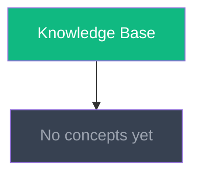

# Knowledge Graph

> Auto-maintained by `knowledge-compiler`. Do not edit manually.
> Visualizes relationships between concept articles.

---

## Concept Map

---

## Relationship Legend

| Edge Type | Meaning |
|-----------|---------|
| `-->` | "depends on" or "is related to" |
| `-.->` | "weak reference" |
| `==>` | "evolved from" |

---

> ⚡ PikaKit Knowledge Compiler v1.0.0
