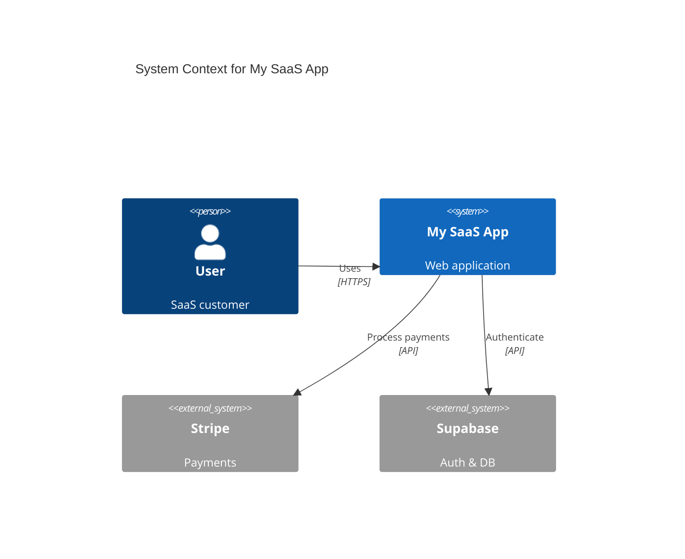
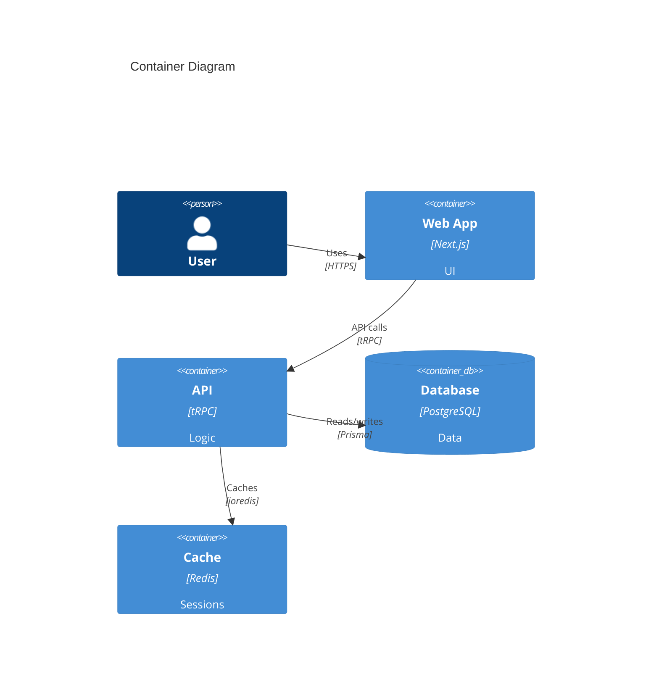
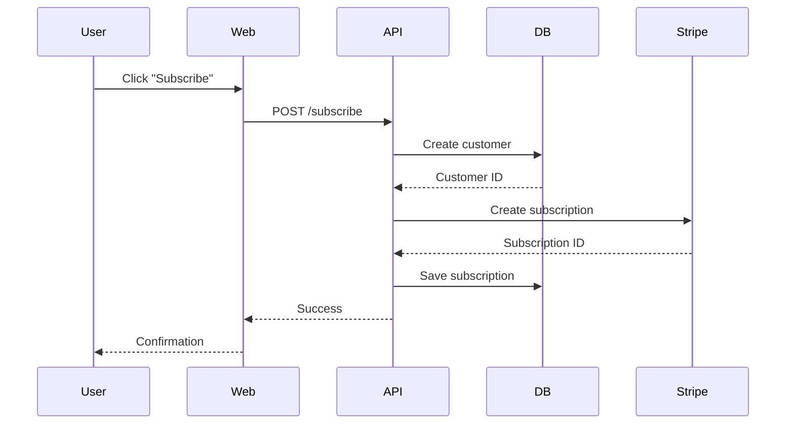
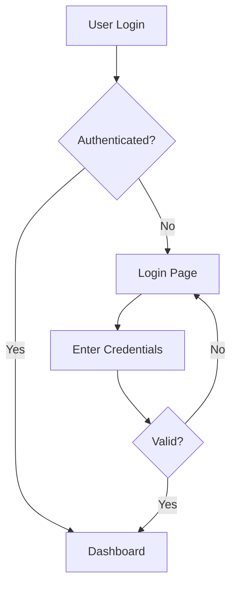
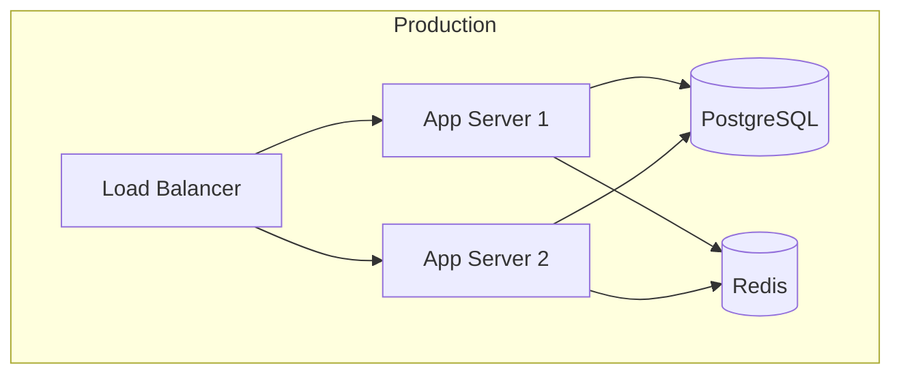

# Architecture Diagramming

> Auto-generate C4, sequence, and ER diagrams using Mermaid

## 🎯 Purpose

Generate and maintain architecture diagrams that auto-update from code changes using C4 model and Mermaid.js.

---

## 1. C4 Context Diagram



---

## 2. C4 Container Diagram



---

## 3. Sequence Diagram



---

## 4. ER Diagram (from Prisma)

### Auto-generate from schema.prisma

```typescript
import { readFileSync } from "fs";

function generateERDiagram(prismaSchema: string) {
  // Parse schema
  const models = extractModels(prismaSchema);

  return `
erDiagram
    USER ||--o{ POST : writes
    USER ||--o{ COMMENT : writes
    POST ||--o{ COMMENT : has
    
    USER {
        string id PK
        string email UK
        string name
    }
    POST {
        string id PK
        string title
        string authorId FK
    }
  `;
}
```

---

## 5. Flowchart



---

## 6. Infrastructure Diagram



---

> **Key Takeaway:** Diagrams explain architecture faster than 1000 words. Keep them current with auto-generation.
