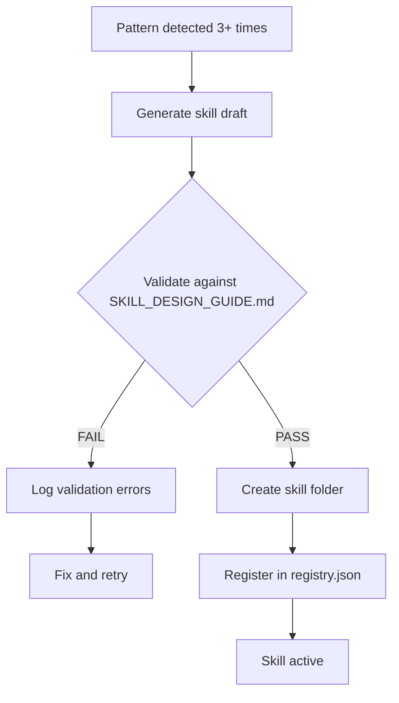
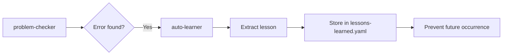

# auto-learner

> **Purpose:** Automatically detect failures and extract lessons for continuous improvement

---

## When to Invoke

| Trigger | Source | Action |
|---------|--------|--------|
| Task failure | Any skill fails | Extract lesson from error |
| User says "mistake" | User feedback | Analyze what went wrong |
| IDE errors after completion | problem-checker | Learn to avoid pattern |
| Regression | Tests that were passing now fail | Document what changed |

---

## Learning Protocol

### Step 1: Detect Failure

```
Failure detected?
├── Task completed with errors
├── User says it's wrong
├── Tests failing
└── Unexpected behavior
```

### Step 2: Analyze Root Cause

| Question | Purpose |
|----------|---------|
| What was attempted? | Understand intent |
| What went wrong? | Identify failure point |
| What should have been done? | Define correct behavior |
| How to prevent recurrence? | Create prevention rule |

### Step 3: Extract Lesson

```yaml
# Lesson format
- id: LEARN-XXX
  pattern: "The specific error pattern or anti-pattern"
  severity: CRITICAL | HIGH | MEDIUM | LOW
  message: |
    Detailed explanation of what to do/not do
    Including specific examples
  date: "YYYY-MM-DD"
  trigger: "What triggers this lesson"
  fix_applied: true | false
  example_fix: |
    // Code showing before/after
```

### Step 4: Store Lesson

Save to `.agent/knowledge/lessons-learned.yaml`

---

## Lesson Categories

| Category | ID Pattern | Example |
|----------|------------|---------|
| Safety violations | `SAFE-XXX` | Deleted file without confirmation |
| Code patterns | `CODE-XXX` | JSX.Element → ReactNode |
| Workflow errors | `FLOW-XXX` | Skipped problem check |
| Integration issues | `INT-XXX` | @import order in CSS |
| Performance | `PERF-XXX` | N+1 query detected |

---

## Skill Validation Requirement

> **MANDATORY:** Any skill created via auto-learning MUST follow the [SKILL_DESIGN_GUIDE.md](file:///docs/SKILL_DESIGN_GUIDE.md)

### Validation Checklist

Before a learned pattern can become a **new skill**, it must pass:

| Check | Requirement | Reference |
|-------|-------------|-----------|
| ✅ YAML Frontmatter | name, description, metadata.category, triggers, coordinates_with | SKILL_DESIGN_GUIDE.md §1 |
| ✅ Purpose Section | Clear 1-2 line purpose statement | SKILL_DESIGN_GUIDE.md §2 |
| ✅ File Limit | SKILL.md < 200 lines | SKILL_DESIGN_GUIDE.md §3 |
| ✅ Quick Reference | Commands/examples for immediate use | SKILL_DESIGN_GUIDE.md §4 |
| ✅ Scripts (if any) | Must be documented with usage examples | SKILL_DESIGN_GUIDE.md §5 |

### Auto-Skill Creation Flow



### Skill Template Path

When creating new skills, use: `docs/SKILL_DESIGN_GUIDE.md` as the authoritative template.

---

## Integration with problem-checker



---

## Scripts

| Script | Purpose | Command |
|--------|---------|---------|
| `learn_from_failure.js` | Extract lesson from error context | `--pattern "..." --message "..."` |
| `error_sensor.js` | Auto-detect errors from test/build/lint | `--scan all` |
| `user_correction_sensor.js` | Detect when user corrects AI code | `--scan` |
| `pattern_analyzer.js` | Analyze patterns and generate auto-rules | `--analyze` |
| `pre_execution_check.js` | Prevent known errors before execution | `--check "intent"` |
| `dashboard_server.js` | Web dashboard for monitoring | `--start` |

### Error Sensor (Phase 1)

Automatically detects errors from multiple sources:

```bash
# Scan all sources
node .agent/skills/auto-learner/scripts/error_sensor.js --scan all

# Scan specific source
node .agent/skills/auto-learner/scripts/error_sensor.js --scan test
node .agent/skills/auto-learner/scripts/error_sensor.js --scan build
node .agent/skills/auto-learner/scripts/error_sensor.js --scan lint

# View statistics
node .agent/skills/auto-learner/scripts/error_sensor.js --stats
```

**Sensors:**
- `test`: Parse vitest/jest output for failures
- `build`: Parse TypeScript compilation errors
- `lint`: Parse ESLint warnings/errors
- `pattern`: Scan code for anti-patterns (empty catch, console.error)

### User Correction Sensor (Phase 1)

Detects patterns when user corrects AI-generated code:

```bash
# Scan uncommitted changes
node .agent/skills/auto-learner/scripts/user_correction_sensor.js --scan

# View correction statistics
node .agent/skills/auto-learner/scripts/user_correction_sensor.js --stats

# Get suggested lessons from patterns
node .agent/skills/auto-learner/scripts/user_correction_sensor.js --suggest
```

**Detects:**
- Import path corrections
- Type annotation fixes
- Added null checks
- Async/await corrections
- Error handling additions
- Logic/condition fixes

### Pattern Analyzer (Phase 2)

Analyzes collected data to find patterns and generate auto-rules:

```bash
# Analyze all patterns
node .agent/skills/auto-learner/scripts/pattern_analyzer.js --analyze

# Generate auto-rules from high-frequency patterns
node .agent/skills/auto-learner/scripts/pattern_analyzer.js --rules

# Get insights and recommendations
node .agent/skills/auto-learner/scripts/pattern_analyzer.js --insights
```

**Features:**
- Frequency analysis (patterns occurring 3+ times flagged)
- Auto-rule generation with YAML output
- Time-based trend analysis
- Hot directory detection

### Pre-Execution Check (Phase 3)

Prevents known errors before they happen:

```bash
# Check intent against all rules
node .agent/skills/auto-learner/scripts/pre_execution_check.js --check "create async function"

# List all active prevention rules
node .agent/skills/auto-learner/scripts/pre_execution_check.js --list

# Approve an auto-generated rule
node .agent/skills/auto-learner/scripts/pre_execution_check.js --approve AUTO-IMPORT
```

**Built-in Rules (7):**
- TypeScript type safety
- Async/await usage
- Error handling
- Import paths
- Null safety
- React component types
- Test before completion

### Dashboard (Phase 4)

Web-based monitoring dashboard:

```bash
# Start dashboard server
node .agent/skills/auto-learner/scripts/dashboard_server.js --start

# Start on custom port
node .agent/skills/auto-learner/scripts/dashboard_server.js --port 8080
```

**Dashboard Features:**
- Error/Correction metrics
- Pattern distribution charts
- High-frequency pattern alerts
- Quick command reference
- API endpoints for data access

---

## Example Usage

### Input: User says "mistake"

```
User: "This is a critical error, you called notify_user but there are still IDE errors"

auto-learner:
1. Analyze: Agent completed task with IDE errors
2. Root cause: Skipped @[current_problems] check
3. Extract lesson:
   - id: LEARN-001
   - pattern: "Completing task without checking @[current_problems]"
   - severity: CRITICAL
   - message: "MUST check @[current_problems] before ANY notify_user"
4. Store: lessons-learned.yaml
5. Confirm: "📚 Learned: [LEARN-001] - Must check problems before completion"
```

### Input: TypeScript error after fix

```
Error: Cannot find namespace 'JSX'

auto-learner:
1. Analyze: JSX.Element used without import
2. Root cause: React 18+ doesn't expose JSX globally
3. Extract lesson:
   - id: CODE-002
   - pattern: "JSX.Element without React import"
   - severity: HIGH
   - message: "Use ReactNode from 'react' instead of JSX.Element"
4. Store: lessons-learned.yaml
```

---

## Success Metrics

| Metric | Target |
|--------|--------|
| Lesson extraction rate | 100% of failures |
| Repeat error rate | <5% (same error twice) |
| Time to learn | <30s after detection |
| Lesson quality | Actionable, specific |

---

## Confirmation Message

After learning, always confirm:

```
📚 Learned: [LEARN-XXX] - {short summary}
```

This provides feedback that the lesson was stored.
