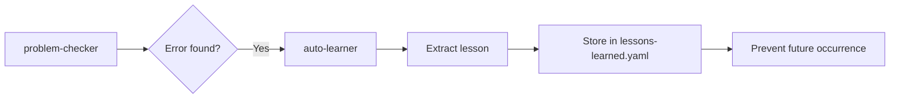

# auto-learner

> **Purpose:** Automatically detect failures and extract lessons for continuous improvement

---

## When to Invoke

| Trigger | Source | Action |
|---------|--------|--------|
| Task failure | Any skill fails | Extract lesson from error |
| User says "mistake" | User feedback | Analyze what went wrong |
| IDE errors after completion | problem-checker | Learn to avoid pattern |
| Regression | Tests that were passing now fail | Document what changed |

---

## Learning Protocol

### Step 1: Detect Failure

```
Failure detected?
├── Task completed with errors
├── User says it's wrong
├── Tests failing
└── Unexpected behavior
```

### Step 2: Analyze Root Cause

| Question | Purpose |
|----------|---------|
| What was attempted? | Understand intent |
| What went wrong? | Identify failure point |
| What should have been done? | Define correct behavior |
| How to prevent recurrence? | Create prevention rule |

### Step 3: Extract Lesson

```yaml
# Lesson format
- id: LEARN-XXX
  pattern: "The specific error pattern or anti-pattern"
  severity: CRITICAL | HIGH | MEDIUM | LOW
  message: |
    Detailed explanation of what to do/not do
    Including specific examples
  date: "YYYY-MM-DD"
  trigger: "What triggers this lesson"
  fix_applied: true | false
  example_fix: |
    // Code showing before/after
```

### Step 4: Store Lesson

Save to `.agent/knowledge/lessons-learned.yaml`

---

## Lesson Categories

| Category | ID Pattern | Example |
|----------|------------|---------|
| Safety violations | `SAFE-XXX` | Deleted file without confirmation |
| Code patterns | `CODE-XXX` | JSX.Element → ReactNode |
| Workflow errors | `FLOW-XXX` | Skipped problem check |
| Integration issues | `INT-XXX` | @import order in CSS |
| Performance | `PERF-XXX` | N+1 query detected |

---

## Integration with problem-checker



---

## Scripts

| Script | Purpose |
|--------|---------|
| `learn_from_failure.js` | Extract lesson from error context |

---

## Example Usage

### Input: User says "mistake"

```
User: "Đây là lỗi nghiêm trọng, bạn đã notify_user mà còn IDE errors"

auto-learner:
1. Analyze: Agent completed task with IDE errors
2. Root cause: Skipped @[current_problems] check
3. Extract lesson:
   - id: LEARN-001
   - pattern: "Completing task without checking @[current_problems]"
   - severity: CRITICAL
   - message: "MUST check @[current_problems] before ANY notify_user"
4. Store: lessons-learned.yaml
5. Confirm: "📚 Đã học: [LEARN-001] - Must check problems before completion"
```

### Input: TypeScript error after fix

```
Error: Cannot find namespace 'JSX'

auto-learner:
1. Analyze: JSX.Element used without import
2. Root cause: React 18+ doesn't expose JSX globally
3. Extract lesson:
   - id: CODE-002
   - pattern: "JSX.Element without React import"
   - severity: HIGH
   - message: "Use ReactNode from 'react' instead of JSX.Element"
4. Store: lessons-learned.yaml
```

---

## Success Metrics

| Metric | Target |
|--------|--------|
| Lesson extraction rate | 100% of failures |
| Repeat error rate | <5% (same error twice) |
| Time to learn | <30s after detection |
| Lesson quality | Actionable, specific |

---

## Confirmation Message

After learning, always confirm:

```
📚 Đã học: [LEARN-XXX] - {short summary}
```

This provides feedback that the lesson was stored.
