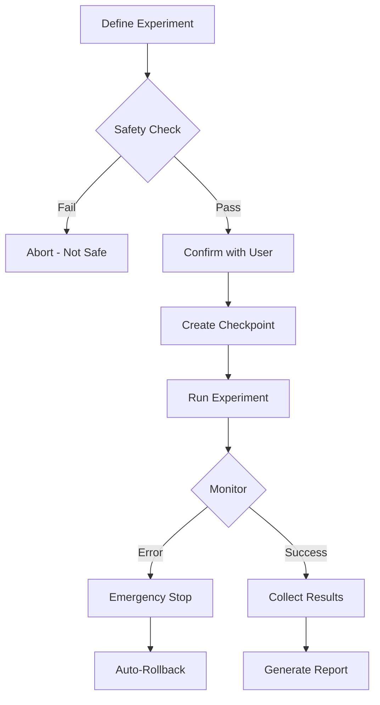

# Chaos Engineering Skill

> **Purpose:** Inject controlled failures to test system resilience before they happen in production.

---

## ⚠️ SAFETY FIRST

> [!CAUTION]
> Chaos experiments CAN break things. Safety guards are MANDATORY.

```json
{
  "safetyGuards": {
    "requireConfirmation": true,
    "maxDuration": "5m",
    "excludeProduction": true,
    "emergencyStop": "Ctrl+C",
    "rollbackOnPanic": true
  }
}
```

---

## 🎯 Experiments

| Experiment            | What It Tests                                  |
| --------------------- | ---------------------------------------------- |
| **Latency Injection** | How system handles slow responses              |
| **Network Failure**   | Graceful degradation when services unavailable |
| **Resource Stress**   | Behavior under CPU/memory pressure             |
| **Random Failures**   | Cascading failure prevention                   |
| **Database Timeout**  | Database connection pool exhaustion            |

---

## 🔧 Usage

### Latency Injection

```bash
# Add 500ms delay to API calls
npm run chaos:inject latency --target api --delay 500

# Add random latency (100-1000ms)
npm run chaos:inject latency --target api --delay 100-1000
```

### Network Failure

```bash
# Simulate service unavailable
npm run chaos:inject network-failure --target payment-service --duration 30s

# Simulate intermittent failures (50% of requests fail)
npm run chaos:inject network-failure --target auth --rate 50
```

### Resource Stress

```bash
# Consume 80% CPU for 60 seconds
npm run chaos:inject cpu-stress --percentage 80 --duration 60s

# Consume 500MB memory
npm run chaos:inject memory-stress --size 500MB --duration 30s
```

### Random Failures

```bash
# Kill random service every 5 minutes
npm run chaos:inject kill-service --random --interval 5m
```

---

## 📋 Experiment Configuration

### chaos-experiments.yaml

```yaml
experiments:
  api-latency:
    type: latency
    target: /api/*
    delay: 500ms
    percentage: 10 # Affect 10% of requests
    duration: 5m

  payment-failure:
    type: network-failure
    target: payment-service
    rate: 100 # 100% failure
    duration: 2m

  database-stress:
    type: connection-pool
    target: database
    exhaustPercentage: 90
    duration: 3m
```

---

## 🛡️ Safety Configuration

### .chaos-config.json

```json
{
  "safety": {
    "enabled": true,
    "maxDuration": "5m",
    "maxCpuPercent": 90,
    "maxMemoryMB": 1024,
    "excludeEnvironments": ["production", "prod"],
    "requireConfirmation": true,
    "alertOnStart": true,
    "autoStopOnError": true
  },
  "emergencyStop": {
    "signal": "SIGTERM",
    "timeout": 5000
  },
  "notifications": {
    "slack": null,
    "email": null
  }
}
```

---

## 📊 Experiment Workflow



---

## 🔗 Integration with Other Workflows

| Before Chaos                     | After Chaos                  |
| -------------------------------- | ---------------------------- |
| `/validate` - Ensure tests pass  | `/diagnose` - Debug failures |
| `/pulse` - Check health baseline | `/launch` - Deploy if passed |

---

## 📁 Files Reference

| File                           | Purpose               |
| ------------------------------ | --------------------- |
| `SKILL.md`                     | This documentation    |
| `scripts/chaos-injector.js`    | Main injection engine |
| `scripts/latency-injection.js` | Latency patterns      |
| `scripts/network-failure.js`   | Network chaos         |
| `config/safety-limits.json`    | Safety configuration  |

---

## ✅ Best Practices

1. **Start small** - 1% of traffic, short duration
2. **Monitor actively** - Watch metrics during experiment
3. **Have rollback ready** - One command to stop
4. **Document expectations** - Know what success looks like
5. **Never in production** - Use staging/dev only

---

## 🚨 Emergency Stop

**Ctrl+C** or:

```bash
npm run chaos:stop
```

This will:

1. Stop all running experiments
2. Restore original configuration
3. Clear any injected failures
4. Log the emergency stop
