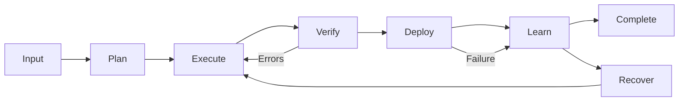

# lifecycle-orchestrator

> **Purpose:** Coordinate full task lifecycle from input to completion

---

## Lifecycle Phases



---

## Phase Management

| Phase | Owner | Success Criteria |
|-------|-------|------------------|
| **Input** | input-validator | Request validated |
| **Plan** | project-planner | PLAN.md approved |
| **Execute** | multi-agent | Code complete |
| **Verify** | problem-checker | 0 errors |
| **Deploy** | cicd-pipeline | Preview running |
| **Learn** | auto-learner | Lessons captured |
| **Recover** | state-rollback | State restored |

---

## Checkpoint Protocol

After each phase:

1. Log phase completion
2. Update TaskSummary
3. Check for blockers
4. Proceed or escalate

---

## Failure Handling

```
Phase fails?
├── Retry (max 2)
├── Recover state
├── Notify user
└── Log to auto-learner
```

---

## Integration

Activated by /autopilot and /build:

```
/autopilot → lifecycle-orchestrator → coordinates all skills
```
