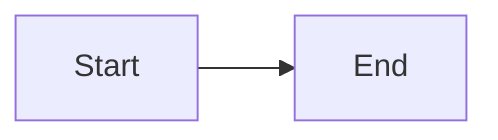

# Markdown Novel Viewer

> Universal viewer for markdown with book-like reading experience.

---

## Prerequisites

**Installation:**
```bash
cd .agent/skills/markdown-novel-viewer
npm install marked gray-matter
```

**Dependencies:** `marked` (markdown parser), `gray-matter` (frontmatter)

---

## When to Use

| Situation | Action |
|-----------|--------|
| Preview markdown | `/preview file.md` |
| Browse directory | `/preview docs/` |
| View plan phases | Auto-detected navigation |
| Render diagrams | Mermaid auto-renders |

---

## Quick Start

```bash
# View a file
node .agent/skills/markdown-novel-viewer/scripts/server.cjs \
  --file ./README.md \
  --open

# Browse a directory
node .agent/skills/markdown-novel-viewer/scripts/server.cjs \
  --dir ./docs \
  --open

# Remote access
node .agent/skills/markdown-novel-viewer/scripts/server.cjs \
  --file ./plan.md \
  --host 0.0.0.0 \
  --open

# Stop servers
node .agent/skills/markdown-novel-viewer/scripts/server.cjs --stop
```

---

## CLI Options

| Option | Description | Default |
|--------|-------------|---------|
| `--file <path>` | Markdown file | - |
| `--dir <path>` | Directory to browse | - |
| `--port <number>` | Server port | 3456 |
| `--host <addr>` | Host (`0.0.0.0` for remote) | localhost |
| `--open` | Auto-open browser | false |
| `--background` | Run in background | false |
| `--stop` | Stop all servers | - |

---

## Features

### Novel Theme

| Mode | Background | Accent |
|------|------------|--------|
| Light | Warm cream (#faf8f3) | Saddle brown |
| Dark | Near black (#1a1a1a) | Warm gold |

**Typography:**
- Libre Baskerville serif for headings
- Inter for body text
- JetBrains Mono for code
- 720px max content width

---

### Mermaid Diagrams

Auto-renders mermaid code blocks:

````markdown

````

**Supported:** Flowcharts, Sequence, Pie, Gantt, Mindmap

---

### Keyboard Shortcuts

| Key | Action |
|-----|--------|
| `T` | Toggle theme |
| `S` | Toggle sidebar |
| `←` `→` | Navigate phases |
| `Esc` | Close sidebar |

---

## HTTP Routes

| Route | Description |
|-------|-------------|
| `/view?file=<path>` | Markdown viewer |
| `/browse?dir=<path>` | Directory browser |
| `/assets/*` | Static assets |

---

## Architecture

```
scripts/
├── server.cjs           # Main entry
└── lib/
    ├── port-finder.cjs  # Port allocation
    ├── http-server.cjs  # HTTP routing
    └── markdown-renderer.cjs
```

---

## Troubleshooting

| Problem | Solution |
|---------|----------|
| Port in use | Auto-increments (3456-3500) |
| Images not loading | Use relative paths |
| Mermaid error | Check syntax at mermaid.live |
| Can't access remotely | Use `--host 0.0.0.0` |

---

## Best Practices

| Practice | Application |
|----------|-------------|
| Relative paths | Images load correctly |
| Test Mermaid | Validate at mermaid.live |
| Background mode | Keep server running |
| Keyboard shortcuts | `T` for theme |

---

## 🔗 Related

| Item | Type | Purpose |
|------|------|---------|
| `plans-kanban` | Skill | Dashboard view |
| `doc-templates` | Skill | Documentation structure |
| `/preview` | Workflow | Quick access |

---

⚡ PikaKit v3.9.67
