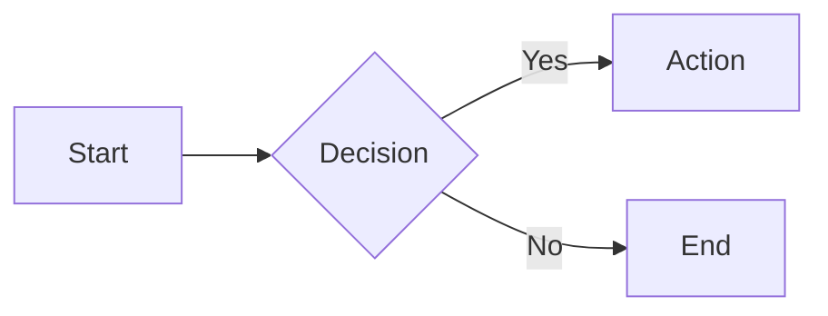
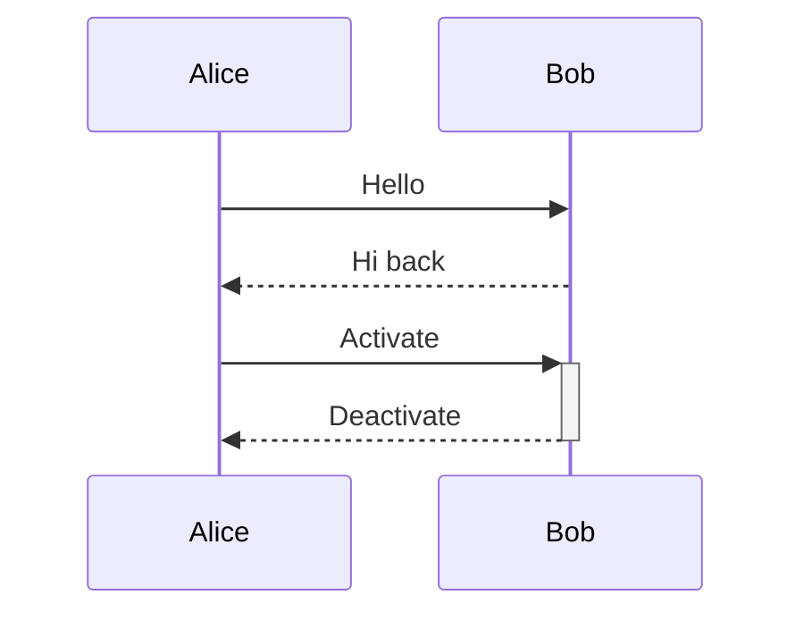
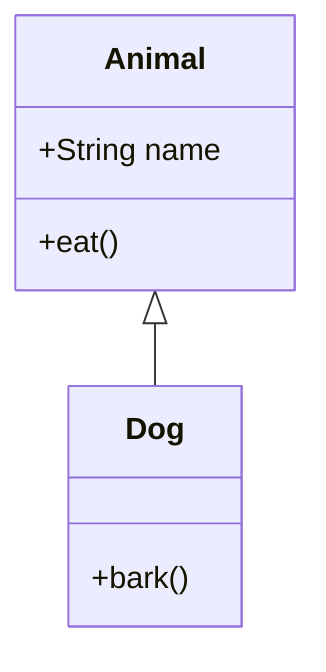
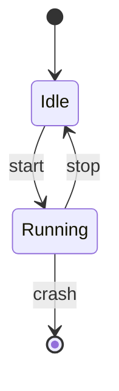
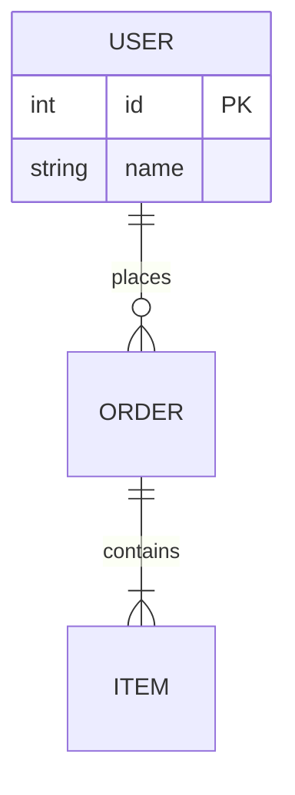
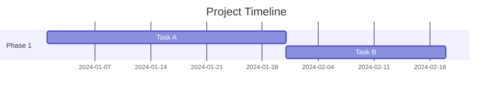
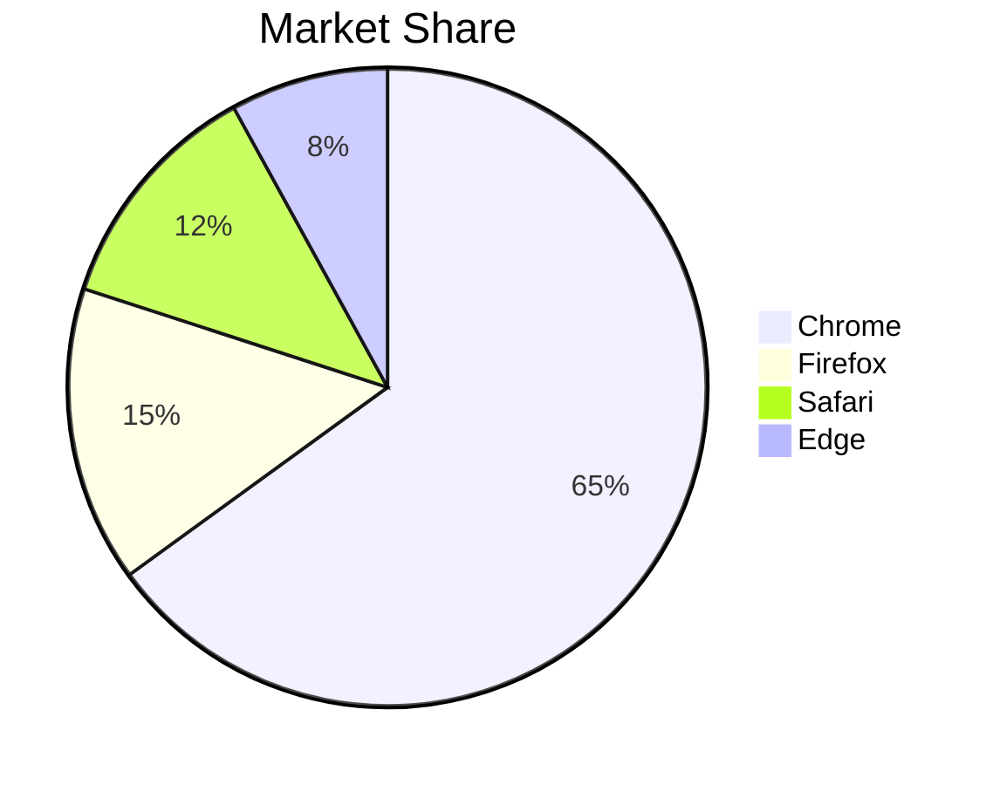
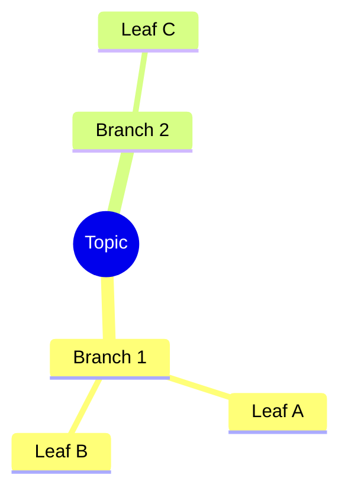
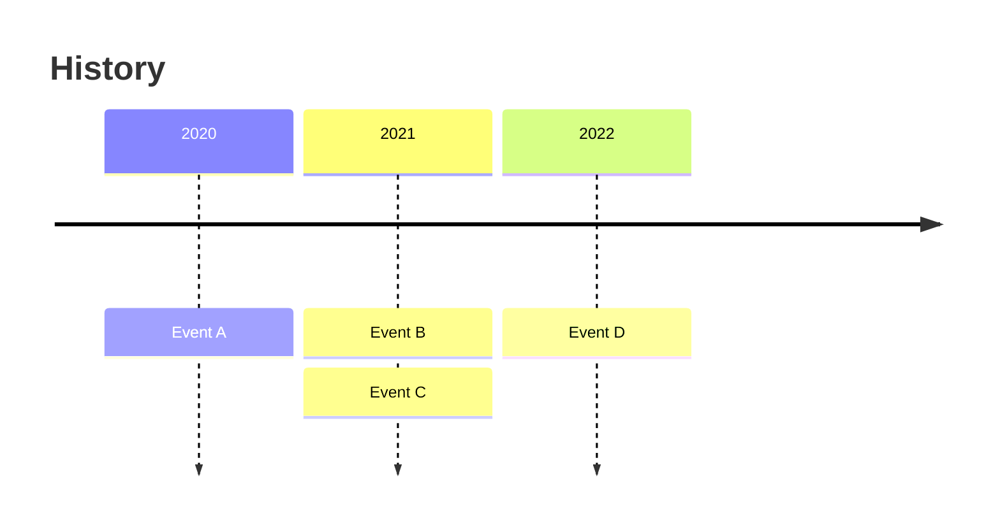
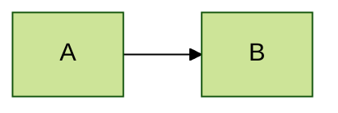

# Mermaid Diagram Reference

> Complete syntax and examples for all 9 supported diagram types.

---

## 1. Flowchart



**Node shapes:** `[rect]` `(round)` `{diamond}` `[[db]]` `[(cylinder)]` `((circle))`

**Arrows:** `-->` `-.->` `==>` `--text-->` `-->|label|`

---

## 2. Sequence Diagram



**Arrows:** `->>` `-->>` `-x` `-)`

**Notes:** `Note right of A: Text` `Note over A,B: Text`

---

## 3. Class Diagram



**Relations:** `<|--` `*--` `o--` `-->` `..>` `..|>`

**Visibility:** `+public` `-private` `#protected` `~package`

---

## 4. State Diagram



**Syntax:** `[*]` start/end, `-->` transition, `: label`

---

## 5. Entity Relationship (ER)



**Cardinality:** `||` one, `o{` zero or more, `|{` one or more

---

## 6. Gantt Chart



---

## 7. Pie Chart



---

## 8. Mindmap



---

## 9. Timeline



---

## Best Practices

| Practice | Example |
|----------|---------|
| Quote special chars | `id["Label (info)"]` |
| Use subgraphs | Group related nodes |
| Add direction | `flowchart LR` (left-right) |
| Theme setting | `%%{init: {'theme':'dark'}}%%` |

---

## CLI Export (mmdc)

```bash
# Install
npm install -g @mermaid-js/mermaid-cli

# Export
mmdc -i diagram.mmd -o diagram.svg
mmdc -i diagram.mmd -o diagram.png -t dark -b transparent

# Batch export
mmdc -i "*.mmd" -o output/
```

---

## Themes

`default` | `dark` | `forest` | `neutral` | `base`



---

⚡ PikaKit v3.9.80

---

## 🔗 Related

| File | When to Read |
|------|-------------|
| [../SKILL.md](../SKILL.md) | Quick start, CLI options, state transitions |
| [../scripts/editor-server.js](../scripts/editor-server.js) | Live editor server |
| [engineering-spec.md](engineering-spec.md) | Full engineering spec |
| `system-design` | Architecture diagrams |
| `markdown-novel-viewer` | Mermaid in markdown preview |
