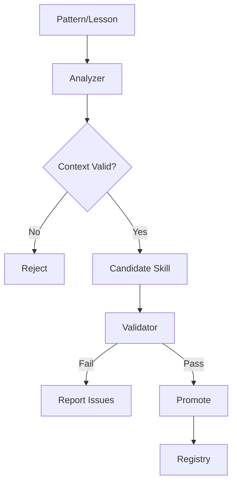

# skill-generator

> **Purpose:** Generate production-ready skills from patterns with validation

---

## When to Use

| Situation | Action |
|-----------|--------|
| High-confidence pattern detected | Generate candidate skill |
| 3+ occurrences of same fix | Consider skill generation |
| Need to codify learned pattern | Use `--from-pattern` |
| Validate new skill | Use `validate` command |

---

## 📂 Structure

```
skill-generator/
├── SKILL.md              # This file
├── scripts/
│   ├── generate.js       # Main CLI
│   └── dashboard-server.js
├── lib/
│   ├── pattern-analyzer.js
│   ├── skill-validator.js
│   ├── skill-template.js
│   └── dashboard/
└── tests/
    └── golden-test.js
```

---

## 🔧 Quick Reference

### Generate Candidate

```bash
agent skill-gen generate --from-pattern "pattern-name"
agent skill-gen generate --from-lesson LEARN-001
```

### Validate & Promote

```bash
agent skill-gen validate <skill-id>
agent skill-gen promote <skill-id>
agent skill-gen rollback <skill-id>
```

### List Skills

```bash
agent skill-gen list                    # All
agent skill-gen list --status candidate # Pending
agent skill-gen list --status approved  # In registry
```

---

## 🎯 Skill Contract

Generated skills must satisfy:

| Property | Requirement |
|----------|-------------|
| **Deterministic** | Input/Output defined, testable |
| **Reusable** | Context-independent |
| **Measurable** | Has success metrics |
| **Registrable** | Version + owner in registry |

---

## 🔄 Generation Flow



---

## 🛡️ Validator Checks

| Check | Description |
|-------|-------------|
| Interface | Input/Output defined |
| Naming | kebab-case, valid ID |
| Idempotency | Reproducible output |
| Side-effects | No destructive ops |
| SKILL_DESIGN_GUIDE | Frontmatter, <200 lines |

---

## 📊 Anti-Pattern Rules

Skills rejected if:

- Pattern only in failure path
- < 3 occurrences
- Only from hotfix/user correction

---

## 🔗 Related

| Item | Type | Purpose |
|------|------|---------|
| `problem-checker` | Skill | Error detection |
| `code-constitution` | Skill | Code standards |
| `/autopilot` | Workflow | Auto execution |

---

⚡ PikaKit v3.2.0
