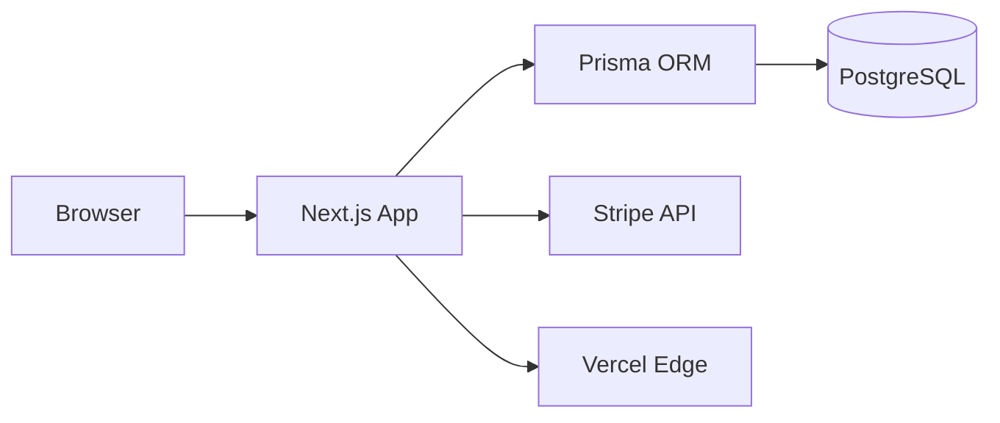
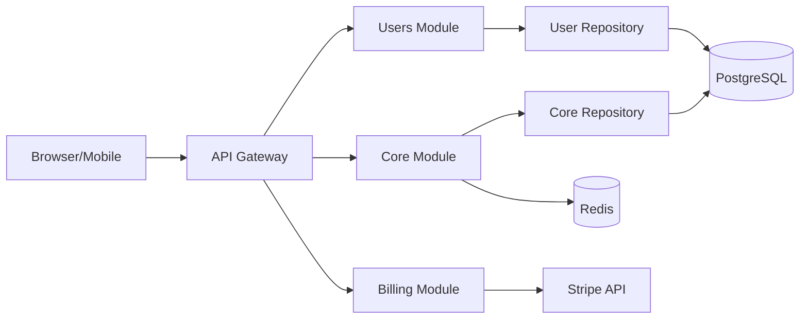
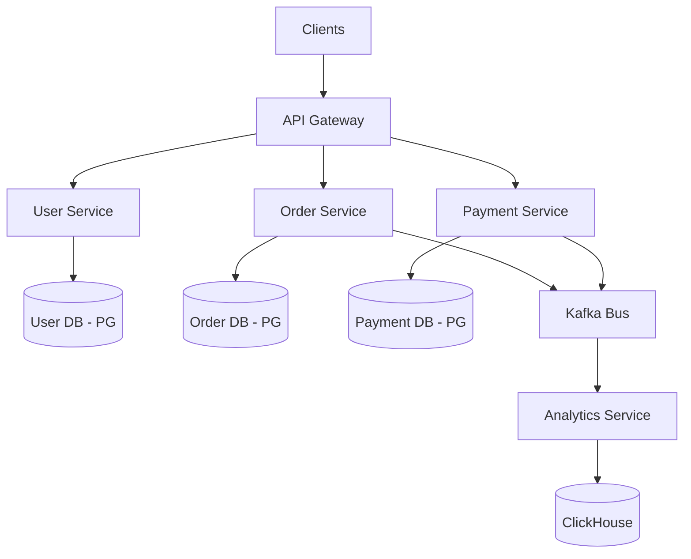

# System Design Full Agent Rules

> Deterministic compilation of 6 source rules for system-design v3.9.224. Do not edit directly.

## Rule Index

- [Architecture Context Discovery](#rule-context-discovery) (high, process, source: `rules/context-discovery.md`)
- [Architecture Decision Gate](#rule-engineering-spec) (high, process, source: `rules/engineering-spec.md`)
- [Architecture Examples](#rule-examples) (standard, reference, source: `rules/examples.md`)
- [Architecture Pattern Selection](#rule-pattern-selection) (high, decision, source: `rules/pattern-selection.md`)
- [Architecture Patterns Reference](#rule-patterns-reference) (standard, reference, source: `rules/patterns-reference.md`)
- [Trade-off Analysis and ADR](#rule-trade-off-analysis) (high, decision, source: `rules/trade-off-analysis.md`)

<a id="rule-context-discovery"></a>

## Architecture Context Discovery

**Impact:** high
**Kind:** process
**Source:** `rules/context-discovery.md`

# Context Discovery

> Before suggesting any architecture, gather context. Never assume scale, team, or constraints.

---

## Question Hierarchy (Ask User FIRST)

### 1. Scale

| Question | Why It Matters |
|----------|---------------|
| How many users? (10, 1K, 100K, 1M+) | Determines infrastructure complexity |
| Data volume? (MB, GB, TB) | Database selection, sharding |
| Transaction rate? (per second/minute) | Caching, queue, read/write split |
| Growth projection? (10x in 1 year?) | Over-provisioning vs auto-scaling |

### 2. Team

| Question | Why It Matters |
|----------|---------------|
| Solo developer or team? | Monolith vs modular decision |
| Team size and expertise? | Pattern complexity ceiling |
| Distributed or co-located? | Microservices viability |
| DevOps maturity? | Deployment complexity budget |

### 3. Timeline

| Question | Why It Matters |
|----------|---------------|
| MVP/Prototype or long-term product? | Architecture investment level |
| Time to market pressure? | Build vs buy decisions |
| Maintenance horizon? (1 year, 5 years) | Tech debt tolerance |

### 4. Domain

| Question | Why It Matters |
|----------|---------------|
| CRUD-heavy or business logic complex? | Transaction Script vs DDD |
| Real-time requirements? | Event-driven vs REST |
| Compliance/regulations? (GDPR, HIPAA) | Security, audit, data residency |
| Multi-tenancy? | Data isolation strategy |

### 5. Non-Functional Requirements (NFR)

| Requirement | Question | Impact |
|-------------|----------|--------|
| **Availability** | SLA target? (99.9% = 8.7h downtime/year) | Redundancy, failover |
| **Latency** | p99 target? (50ms, 200ms, 1s) | Caching, CDN, DB proximity |
| **Security** | Auth model? Data sensitivity? | Encryption, access control |
| **Observability** | Logging, tracing, alerting needs? | Stack selection |
| **Cost** | Cloud budget? Managed vs self-hosted? | Technology constraints |

---

## Project Classification Matrix

| Dimension | MVP | SaaS | Enterprise |
|-----------|-----|------|-----------|
| **Scale** | <1K users | 1K-100K users | 100K+ users |
| **Team** | Solo / 1-2 | 2-10 | 10+ |
| **Timeline** | Weeks | Months | Years |
| **Architecture** | Simple monolith | Modular monolith | Distributed / microservices |
| **Patterns** | Minimal | Selective | Comprehensive |
| **Database** | SQLite / single PG | PostgreSQL + Redis | Polyglot (right tool per job) |
| **Auth** | JWT simple | OAuth + JWT | OAuth + SAML + SSO |
| **Deployment** | Vercel / Railway | Docker + CI/CD | Kubernetes + Helm |
| **Monitoring** | Console logs | Structured logging | Full observability stack |
| **Example** | Next.js API routes | NestJS modular | Microservices + API Gateway |

---

## Discovery Output Template

After gathering context, produce this summary:

```markdown
## Architecture Context Summary

**Project type:** [MVP / SaaS / Enterprise]
**Scale:** [Current users] → [Projected users in 12 months]
**Team:** [Size] / [Expertise level] / [Co-located?]
**Timeline:** [Weeks/Months/Years] / [Hard deadline?]

### Key Constraints
- [Constraint 1: e.g., solo developer → no microservices]
- [Constraint 2: e.g., HIPAA → encryption + audit logs]

### NFR Targets
| Requirement | Target |
|-------------|--------|
| Availability | 99.9% |
| p99 Latency | <200ms |
| Data retention | 7 years (compliance) |

### Recommended Classification → [MVP / SaaS / Enterprise]
→ Read [pattern-selection.md](pattern-selection.md) for architecture patterns
```

---

## 🔗 Related

| File | When to Read |
|------|-------------|
| [pattern-selection.md](pattern-selection.md) | After classifying project |
| [trade-off-analysis.md](trade-off-analysis.md) | Documenting decisions |
| [examples.md](examples.md) | Reference implementations |

## Preconditions

- Name the decision, owner, stakeholders, deadline, and consequence of delay.
- Separate known facts, estimates, assumptions, and unknowns.
- Identify security, compliance, residency, accessibility, and operational obligations.

## Procedure

1. Capture critical user journeys and business invariants.
2. Quantify load, data, latency, availability, recovery, consistency, and growth ranges.
3. Map trust, data, ownership, dependency, and deployment boundaries.
4. Inventory current systems, team skills, budget, and migration constraints.
5. Rank quality attributes and state which trade-offs are acceptable.
6. Produce open questions and experiments for decision-changing unknowns.

## Rollback

Discovery is read-only. Reopen the context document when evidence invalidates an assumption; retain superseded assumptions for decision traceability.

## Exit Gate

Pass when every proposed architecture option can be evaluated against the same measurable requirements and unresolved high-impact unknowns have owners and validation plans.

<a id="rule-engineering-spec"></a>

## Architecture Decision Gate

**Impact:** high
**Kind:** process
**Source:** `rules/engineering-spec.md`

# Architecture Decision Gate

## Preconditions

- Name the decision owner, stakeholders, scope, deadline, and review trigger.
- Record functional requirements, quality attributes, scale assumptions, security, compliance, budget, and team constraints.
- Identify unknowns that could change the decision.

## Procedure

1. Model components, data, trust, ownership, traffic, and failure boundaries.
2. Establish the simplest viable baseline and at least one alternative.
3. Compare options using the same measurable criteria and evidence.
4. Evaluate overload, dependency loss, partial failure, data recovery, security abuse, operability, and cost.
5. Record the decision, rejected options, consequences, migration, rollback, and review trigger in an ADR.
6. Validate risky assumptions with a prototype, benchmark, failure exercise, or documented source.

## Rollback

Define the last reversible point, compatible data path, traffic switch, and owner before implementation. If a choice is irreversible, require explicit approval and a containment plan.

## Exit Gate

Pass when requirements trace to components, major risks have mitigations and owners, estimates show assumptions, operations and observability are designed, and the ADR is reviewable by a team not present in the discussion.

<a id="rule-examples"></a>

## Architecture Examples

**Impact:** standard
**Kind:** reference
**Source:** `rules/examples.md`

# Architecture Examples

> Real-world architecture decisions by project type. Each with rationale and migration paths.

---

## Example 1: MVP E-commerce (Solo Developer)

```
Requirements: <1K users, solo dev, 8 weeks, budget-conscious
```

| Decision | Choice | Rationale |
|----------|--------|-----------|
| Structure | Monolith | Solo dev, no team coordination needed |
| Framework | Next.js | Full-stack, fast to ship, Vercel deploy |
| Data Layer | Prisma direct | Simple CRUD, no over-abstraction |
| Auth | JWT (simple) | No social login initially |
| Payment | Stripe Checkout | Hosted, PCI compliant |
| Database | PostgreSQL | ACID for orders |
| Hosting | Vercel + Supabase | Free tier, managed |

### Component Diagram



### Trade-offs Accepted

| What We Give Up | Why It's OK |
|-----------------|------------|
| Independent scaling | Solo dev, <1K users |
| Repository pattern | Simple CRUD doesn't need it |
| Social login | Can add OAuth later |

### Migration Triggers

| When | Action |
|------|--------|
| Users > 10K | Extract payment service |
| Team > 3 | Add Repository pattern |
| Social login needed | Add NextAuth.js / OAuth |

---

## Example 2: SaaS Product (5-10 Developers)

```
Requirements: 1K-100K users, 5-10 devs, 12+ months, multi-domain
```

| Decision | Choice | Rationale |
|----------|--------|-----------|
| Structure | Modular Monolith | Team size optimal, clear boundaries |
| Framework | NestJS | Modular by design, TypeScript |
| Data Layer | Repository pattern | Testing, flexibility |
| Domain | Partial DDD | Rich entities, no full aggregates |
| Auth | OAuth + JWT | Social login, API tokens |
| Cache | Redis | Session, rate limit, pub/sub |
| Database | PostgreSQL | Relational, JSON support |
| Queue | BullMQ (Redis) | Background jobs |
| Deployment | Docker + GitHub Actions | Reproducible builds |

### Component Diagram



### Trade-offs Accepted

| What We Give Up | Why It's OK |
|-----------------|------------|
| Independent deployment | Monolith coupling acceptable at team size |
| Full DDD aggregates | No domain experts on team |
| Event sourcing | Simple state mutations sufficient |

### Migration Triggers

| When | Action |
|------|--------|
| Team > 10 | Extract services (billing first) |
| Domain conflicts | Split bounded contexts |
| Read perf issues | Add CQRS for read models |
| Async workloads | Add Kafka/RabbitMQ |

---

## Example 3: Enterprise Platform (100K+ Users)

```
Requirements: 100K+ users, 10+ devs, multiple domains, 24/7 availability
```

| Decision | Choice | Rationale |
|----------|--------|-----------|
| Structure | Microservices | Independent scale, team ownership |
| API Gateway | Kong / AWS API GW | Routing, rate limiting, auth |
| Domain | Full DDD | Complex business rules |
| Consistency | Event-driven (eventual) | Decoupled services |
| Message Bus | Kafka | High throughput, replay |
| Auth | OAuth + SAML | Enterprise SSO |
| Database | Polyglot | Right tool per service |
| CQRS | Selected services | Read/write divergence |
| Deployment | Kubernetes + Helm | Orchestration at scale |

### Component Diagram



### Operational Requirements

| Concern | Solution |
|---------|----------|
| Service mesh | Istio / Linkerd |
| Distributed tracing | Jaeger / Tempo |
| Centralized logging | ELK / Loki + Grafana |
| Circuit breakers | Resilience4j |
| Secrets management | HashiCorp Vault |

---

## Cross-Tier Comparison

| Aspect | MVP | SaaS | Enterprise |
|--------|-----|------|-----------|
| **Complexity** | Low | Medium | Very High |
| **Time to deploy** | Hours | Days | Weeks |
| **Ops overhead** | Minimal | Moderate | Significant |
| **Cost (monthly)** | $0-50 | $100-1K | $5K+ |
| **Team expertise** | Junior OK | Mid-Senior | Senior + DevOps |
| **Recovery** | Git revert | Blue/green deploy | Canary + rollback |

---

## 🔗 Related

| File | When to Read |
|------|-------------|
| [context-discovery.md](context-discovery.md) | Classify your project |
| [pattern-selection.md](pattern-selection.md) | Choose patterns |
| [trade-off-analysis.md](trade-off-analysis.md) | Document decisions |

## Scope

Use these examples as comparison prompts for small products, growing services, and regulated or high-scale systems. They are not reference architectures or capacity guarantees.

## Guidance

Replace every example assumption with project evidence. Preserve the useful pattern of recording context, options, decision, trade-offs, evolution trigger, rollback, and observability. Do not copy vendor, authentication, database, or topology choices without validating requirements.

## Verification

For any adapted example, trace each component to a current requirement, recalculate capacity and recovery assumptions, threat-model trust boundaries, and record differences in an ADR.

<a id="rule-pattern-selection"></a>

## Architecture Pattern Selection

**Impact:** high
**Kind:** decision
**Source:** `rules/pattern-selection.md`

# Pattern Selection Guidelines

> Decision trees for choosing architectural patterns. Always ask: Is there a simpler solution?

---

## The 3 Questions (Before ANY Pattern)

1. **Problem Solved**: What SPECIFIC problem does this pattern solve?
2. **Simpler Alternative**: Is there a simpler solution?
3. **Deferred Complexity**: Can we add this LATER when needed?

> If you can't answer #1 clearly → don't use the pattern.

---

## Main Decision Tree

```
START: What's your MAIN concern?

┌─ Data Access Complexity?
│  ├─ HIGH (complex queries, testing needed)
│  │  → Repository Pattern + Unit of Work
│  │  VALIDATE: Will data source change frequently?
│  │     ├─ YES → Repository worth the indirection
│  │     └─ NO  → Consider simpler ORM direct access
│  └─ LOW (simple CRUD, single database)
│     → ORM directly (Prisma, Drizzle)
│     Simpler = Better, Faster
│
├─ Business Rules Complexity?
│  ├─ HIGH (domain logic, rules vary by context)
│  │  → Domain-Driven Design
│  │  VALIDATE: Do you have domain experts on team?
│  │     ├─ YES → Full DDD (Aggregates, Value Objects)
│  │     └─ NO  → Partial DDD (rich entities, clear boundaries)
│  └─ LOW (mostly CRUD, simple validation)
│     → Transaction Script pattern
│     Simpler = Better, Faster
│
├─ Independent Scaling Needed?
│  ├─ YES (different components scale differently)
│  │  → Microservices WORTH the complexity
│  │  REQUIREMENTS (ALL must be true):
│  │    - Clear domain boundaries
│  │    - Team > 10 developers
│  │    - Different scaling needs per service
│  │  IF NOT ALL MET → Modular Monolith instead
│  └─ NO (everything scales together)
│     → Modular Monolith
│     Can extract services later when proven needed
│
└─ Real-time Requirements?
   ├─ HIGH (immediate updates, multi-user sync)
   │  → Event-Driven Architecture
   │  → Message Queue (RabbitMQ, Redis, Kafka)
   │  VALIDATE: Can you handle eventual consistency?
   │     ├─ YES → Event-driven valid
   │     └─ NO  → Synchronous with polling
   └─ LOW (eventual consistency acceptable)
      → Synchronous (REST/GraphQL)
      Simpler = Better, Faster
```

---

## Communication Pattern Selection

```
How do services communicate?

┌─ Synchronous (request-response)?
│  ├─ Public API → REST (standard, cacheable)
│  ├─ Internal services → gRPC (fast, typed)
│  ├─ Flexible queries → GraphQL (client-driven)
│  └─ Real-time bidirectional → WebSocket
│
└─ Asynchronous (fire-and-forget)?
   ├─ Simple job queue → BullMQ (Redis-based)
   ├─ Point-to-point → RabbitMQ (routing, reliability)
   ├─ High throughput stream → Kafka (log, replay)
   └─ Cloud-native → AWS SQS/SNS, GCP Pub/Sub
```

### Message Broker Selection

| Factor | BullMQ | RabbitMQ | Kafka |
|--------|--------|----------|-------|
| **Best for** | Background jobs | Task routing | Event streaming |
| **Throughput** | Medium | Medium | Very High |
| **Ordering** | Per queue | Per queue | Per partition |
| **Replay** | ❌ | ❌ | ✅ |
| **Complexity** | Low | Medium | High |
| **Persistence** | Redis | Disk | Disk (replicated) |
| **Use when** | <10K msgs/sec | Routing logic | >10K msgs/sec, audit |

---

## Red Flags (Anti-patterns)

| Pattern | Anti-pattern Signal | Simpler Alternative |
|---------|-------------------|---------------------|
| Microservices | "We might need to scale someday" | Start monolith, extract later |
| Clean/Hexagonal | Dozens of interfaces for simple CRUD | Concrete first, interfaces later |
| Event Sourcing | "Audit trail would be nice" | Append-only audit log table |
| CQRS | Read/write look the same | Single model, add CQRS when diverged |
| Repository | Single database, simple queries | ORM direct access |
| DDD | No domain experts, simple CRUD | Transaction Script |
| GraphQL | Single client, simple queries | REST |

---

## 🔗 Related

| File | When to Read |
|------|-------------|
| [context-discovery.md](context-discovery.md) | Classify project first |
| [patterns-reference.md](patterns-reference.md) | Quick pattern lookup |
| [trade-off-analysis.md](trade-off-analysis.md) | Document your choice |
| [examples.md](examples.md) | See real implementations |

## Decision

Adopt a pattern only for a named problem that the current simpler design cannot meet. Record the evidence, additional failure modes, ownership cost, and removal path.

## Use When

Use a repository, queue, cache, event stream, circuit breaker, or service boundary when tests or measurements demonstrate its specific benefit and the team can operate it.

## Avoid When

Avoid speculative abstraction, microservices without independent ownership, distributed transactions without invariant analysis, or resilience layers without timeout and retry budgets.

## Trade-offs

Patterns exchange one form of complexity for another. Decoupling adds coordination; caching adds invalidation; queues add eventual behavior; service boundaries add network and operational failure.

## Verification

Validate the motivating requirement, inject the new failure modes, measure the intended benefit, and confirm monitoring, rollback, and owner documentation.

<a id="rule-patterns-reference"></a>

## Architecture Patterns Reference

**Impact:** standard
**Kind:** reference
**Source:** `rules/patterns-reference.md`

# Architecture Patterns Reference

> Quick lookup for common patterns. Check When to Use vs When NOT to Use before adopting.

---

## Data Access Patterns

| Pattern | What It Does | When to Use | When NOT to Use | Complexity |
|---------|-------------|-------------|-----------------|:----------:|
| **Active Record** | Object = row, methods = queries | Simple CRUD, rapid prototyping | Complex queries, multiple sources | Low |
| **Repository** | Abstract data access behind interface | Testing, multiple sources, complex queries | Simple CRUD, single DB | Medium |
| **Unit of Work** | Track changes, commit as single transaction | Complex multi-entity writes | Simple single-table operations | High |
| **Data Mapper** | Separate domain from persistence | Rich domain model, performance tuning | Simple CRUD, rapid dev | High |

**Decision:** Start with Active Record / ORM direct. Add Repository when testing demands or source changes.

---

## Domain Logic Patterns

| Pattern | What It Does | When to Use | When NOT to Use | Complexity |
|---------|-------------|-------------|-----------------|:----------:|
| **Transaction Script** | Procedural — one function per operation | Simple CRUD, thin business logic | Complex rules, many edge cases | Low |
| **Table Module** | One class per table with record logic | Record-based validation | Rich behavior across entities | Low |
| **Domain Model** | Objects with behavior (OOP) | Complex business logic, state machines | Simple CRUD, no invariants | Medium |
| **DDD (Full)** | Aggregates, Value Objects, bounded contexts | Complex domain, domain experts available | Simple domain, no experts | High |

**Decision:** Transaction Script is default. Upgrade to Domain Model when rules exceed simple validation.

---

## Distributed System Patterns

| Pattern | What It Does | When to Use | When NOT to Use | Complexity |
|---------|-------------|-------------|-----------------|:----------:|
| **Modular Monolith** | Single deployment, internal module boundaries | Small-medium teams, unclear boundaries | Clear contexts, different scales | Medium |
| **Microservices** | Independent services, independent deploy | Different scales, large teams (10+) | Small teams, simple domain | Very High |
| **Event-Driven** | Publish events, subscribers react | Loose coupling, real-time, audit trail | Simple workflows, strong consistency required | High |
| **CQRS** | Separate read/write models | Read/write performance diverges | Same data shape for read/write | High |
| **Saga** | Distributed transactions via compensation | Cross-service transactions | Single database, simple ACID | High |
| **Event Sourcing** | Store events, derive state | Full audit trail, temporal queries | Simple state, no replay needs | Very High |

**Decision:** Modular Monolith is default. Extract microservices only when 3 criteria met (clear boundaries + team >10 + different scaling).

---

## Communication Patterns

| Pattern | What It Does | When to Use | When NOT to Use | Complexity |
|---------|-------------|-------------|-----------------|:----------:|
| **REST** | Resource-based HTTP API | Standard CRUD, public APIs, caching | Real-time, complex queries | Low |
| **GraphQL** | Client-driven queries, single endpoint | Multi-client, flexible queries | Simple CRUD, heavy caching | Medium |
| **gRPC** | Binary protocol, code-gen, streaming | Internal services, high perf | Public APIs, browser clients | Medium |
| **WebSocket** | Persistent bidirectional connection | Real-time updates, chat, collaboration | Simple request-response | Medium |
| **SSE** | Server-push, one-directional | Live feeds, notifications | Bidirectional communication | Low |

---

## Resilience Patterns

| Pattern | What It Does | When to Use |
|---------|-------------|-------------|
| **Circuit Breaker** | Stop calling failing service, fallback | External service calls |
| **Retry with Backoff** | Retry transient failures with delay | Network errors, 503s |
| **Bulkhead** | Isolate failure to prevent cascade | Multiple service dependencies |
| **Timeout** | Limit wait time for external calls | Every external call |
| **Rate Limiter** | Limit request throughput | API endpoints, external APIs |

---

## Observability Patterns

| Pattern | What It Does | Tool Examples |
|---------|-------------|---------------|
| **Structured Logging** | JSON logs with context | Pino, Winston → Loki |
| **Distributed Tracing** | Track requests across services | OpenTelemetry → Jaeger/Tempo |
| **Metrics** | Numeric measurements over time | Prometheus → Grafana |
| **Health Checks** | Endpoint reporting service health | `/health`, `/ready` |
| **Alerting** | Notify on threshold breach | PagerDuty, Grafana Alerting |

---

## Simplicity Principle

**"Start simple, add complexity only when proven necessary."**

- You can always add patterns later
- Removing complexity is MUCH harder than adding it
- When in doubt, choose the simpler option
- If you can't explain why you need a pattern in one sentence → you don't need it

---

## 🔗 Related

| File | When to Read |
|------|-------------|
| [pattern-selection.md](pattern-selection.md) | Decision trees |
| [examples.md](examples.md) | Real implementations |
| [trade-off-analysis.md](trade-off-analysis.md) | Document choices |

## Scope

Provide a vocabulary for data access, domain, communication, resilience, and observability patterns. The table summarizes forces; it does not prescribe implementation.

## Guidance

Read each pattern as problem, context, forces, consequences, and alternatives. Select against measured requirements and team ownership. Combine patterns only after analyzing their interacting retry, ordering, consistency, and failure semantics.

## Verification

Before adoption, write an ADR, prototype the highest-risk assumption, test overload and dependency loss, estimate operational cost, and define a reversible rollout.

<a id="rule-trade-off-analysis"></a>

## Trade-off Analysis and ADR

**Impact:** high
**Kind:** decision
**Source:** `rules/trade-off-analysis.md`

# Trade-off Analysis & ADR

> Document every architectural decision with trade-offs. Future-you will thank present-you.

---

## Common Trade-off Dimensions

| Dimension | Trade-off |
|-----------|-----------|
| **Simplicity ↔ Flexibility** | Simple code is rigid; flexible code is complex |
| **Speed ↔ Quality** | Ship fast = tech debt; polish = slower delivery |
| **Consistency ↔ Availability** | Strong consistency = lower availability (CAP) |
| **Coupling ↔ Complexity** | Tight coupling = simple; loose coupling = more infra |
| **Build ↔ Buy** | Build = control + maintenance; Buy = cost + vendor lock |
| **Monolith ↔ Microservices** | Monolith = simple ops; Micro = independent scale + deploy complexity |
| **SQL ↔ NoSQL** | SQL = consistency + joins; NoSQL = scale + flexibility |

---

## Decision Framework

For EACH architectural component, document:

```markdown
## Architecture Decision Record

### Context
- **Problem**: [What problem are we solving?]
- **Constraints**: [Team size, scale, timeline, budget]

### Options Considered

| Option | Pros | Cons | Complexity | When Valid |
|--------|------|------|------------|-----------|
| Option A | Benefit 1 | Cost 1 | Low | [Conditions] |
| Option B | Benefit 2 | Cost 2 | High | [Conditions] |

### Decision
**Chosen**: [Option X]

### Rationale
1. [Reason 1 — tied to constraints]
2. [Reason 2 — tied to requirements]

### Trade-offs Accepted
- [What we're giving up]
- [Why this is acceptable]

### Consequences
- **Positive**: [Benefits we gain]
- **Negative**: [Costs/risks we accept]
- **Mitigation**: [How we'll address negatives]

### Revisit Trigger
- [When to reconsider this decision]
```

---

## Filled Example: Database Selection

```markdown
# ADR-002: PostgreSQL over MongoDB

## Status
Accepted

## Context
E-commerce SaaS with orders, inventory, and user management.
Team of 5, all familiar with SQL. Need ACID for financial transactions.

## Options Considered

| Option | Pros | Cons | Complexity |
|--------|------|------|-----------|
| PostgreSQL | ACID, joins, mature, JSON support | Harder horizontal scale | Low |
| MongoDB | Flexible schema, horizontal scale | No joins, eventual consistency | Medium |
| CockroachDB | Distributed SQL, ACID | Newer, smaller ecosystem | High |

## Decision
**Chosen**: PostgreSQL

## Rationale
1. Financial transactions require ACID (orders + payments)
2. Team already proficient in SQL — no learning curve
3. JSON column covers semi-structured data needs
4. Supabase/Neon provide managed PG with good DX

## Trade-offs Accepted
- Horizontal scaling harder → acceptable at <100K users
- Single point of failure → mitigated by managed hosting + replicas

## Consequences
- **Positive**: Strong consistency for orders, familiar tooling, Prisma/Drizzle support
- **Negative**: Must shard manually if >100K concurrent writes
- **Mitigation**: Read replicas for read scaling, revisit if write-heavy

## Revisit Trigger
- Write throughput >10K/sec consistently
- Need geo-distributed database
- Schema flexibility becomes painful
```

---

## ADR Compact Template

```markdown
# ADR-[XXX]: [Decision Title]

## Status
Proposed | Accepted | Deprecated | Superseded by [ADR-YYY]

## Context
[What problem? What constraints?]

## Decision
[What we chose — be specific]

## Rationale
[Why — tie to requirements and constraints]

## Trade-offs
[What we're giving up — be honest]

## Consequences
- **Positive**: [Benefits]
- **Negative**: [Costs]
- **Mitigation**: [How to address]
```

---

## ADR Storage

```
docs/
└── architecture/
    ├── adr-001-use-nextjs.md
    ├── adr-002-postgresql-over-mongodb.md
    ├── adr-003-modular-monolith.md
    └── adr-004-jwt-over-session.md
```

**Rules:**
- Sequential numbering (never reuse numbers)
- Deprecated ADRs stay (append "Superseded by ADR-XXX")
- Review ADRs quarterly against revisit triggers

---

## 🔗 Related

| File | When to Read |
|------|-------------|
| [context-discovery.md](context-discovery.md) | Gather context first |
| [pattern-selection.md](pattern-selection.md) | Choose patterns |
| [patterns-reference.md](patterns-reference.md) | Pattern comparison |
| [examples.md](examples.md) | See full architecture examples |

## Use When

Use an ADR for decisions with meaningful alternatives, long-lived consequences, cross-team impact, or difficult reversal.

## Avoid When

Avoid ADR ceremony for trivial local choices or as a substitute for evidence. Do not conceal uncertainty behind numeric scores that lack defined measurements.

## Verification

Confirm every option is viable enough for fair comparison, criteria trace to requirements, assumptions cite evidence, consequences include operations and security, and the decision has a review or reversal trigger.
