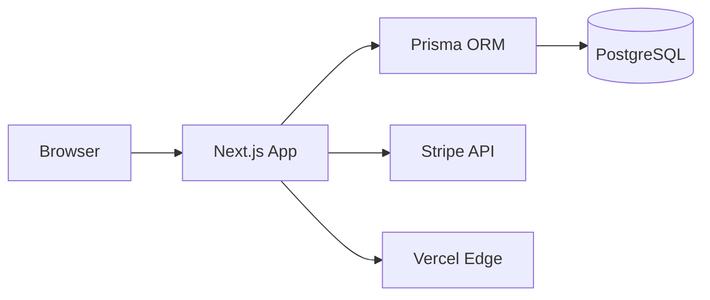
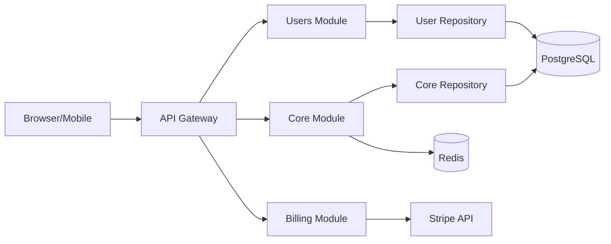
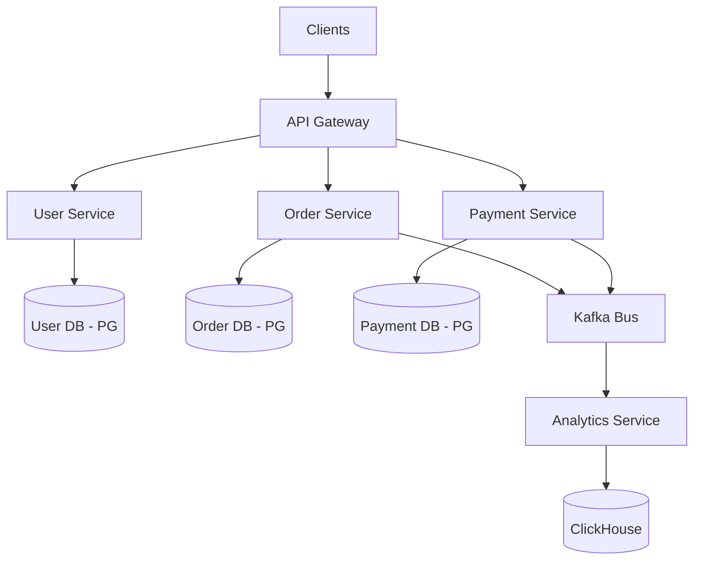

# Architecture Examples

> Real-world architecture decisions by project type. Each with rationale and migration paths.

---

## Example 1: MVP E-commerce (Solo Developer)

```
Requirements: <1K users, solo dev, 8 weeks, budget-conscious
```

| Decision | Choice | Rationale |
|----------|--------|-----------|
| Structure | Monolith | Solo dev, no team coordination needed |
| Framework | Next.js | Full-stack, fast to ship, Vercel deploy |
| Data Layer | Prisma direct | Simple CRUD, no over-abstraction |
| Auth | JWT (simple) | No social login initially |
| Payment | Stripe Checkout | Hosted, PCI compliant |
| Database | PostgreSQL | ACID for orders |
| Hosting | Vercel + Supabase | Free tier, managed |

### Component Diagram



### Trade-offs Accepted

| What We Give Up | Why It's OK |
|-----------------|------------|
| Independent scaling | Solo dev, <1K users |
| Repository pattern | Simple CRUD doesn't need it |
| Social login | Can add OAuth later |

### Migration Triggers

| When | Action |
|------|--------|
| Users > 10K | Extract payment service |
| Team > 3 | Add Repository pattern |
| Social login needed | Add NextAuth.js / OAuth |

---

## Example 2: SaaS Product (5-10 Developers)

```
Requirements: 1K-100K users, 5-10 devs, 12+ months, multi-domain
```

| Decision | Choice | Rationale |
|----------|--------|-----------|
| Structure | Modular Monolith | Team size optimal, clear boundaries |
| Framework | NestJS | Modular by design, TypeScript |
| Data Layer | Repository pattern | Testing, flexibility |
| Domain | Partial DDD | Rich entities, no full aggregates |
| Auth | OAuth + JWT | Social login, API tokens |
| Cache | Redis | Session, rate limit, pub/sub |
| Database | PostgreSQL | Relational, JSON support |
| Queue | BullMQ (Redis) | Background jobs |
| Deployment | Docker + GitHub Actions | Reproducible builds |

### Component Diagram



### Trade-offs Accepted

| What We Give Up | Why It's OK |
|-----------------|------------|
| Independent deployment | Monolith coupling acceptable at team size |
| Full DDD aggregates | No domain experts on team |
| Event sourcing | Simple state mutations sufficient |

### Migration Triggers

| When | Action |
|------|--------|
| Team > 10 | Extract services (billing first) |
| Domain conflicts | Split bounded contexts |
| Read perf issues | Add CQRS for read models |
| Async workloads | Add Kafka/RabbitMQ |

---

## Example 3: Enterprise Platform (100K+ Users)

```
Requirements: 100K+ users, 10+ devs, multiple domains, 24/7 availability
```

| Decision | Choice | Rationale |
|----------|--------|-----------|
| Structure | Microservices | Independent scale, team ownership |
| API Gateway | Kong / AWS API GW | Routing, rate limiting, auth |
| Domain | Full DDD | Complex business rules |
| Consistency | Event-driven (eventual) | Decoupled services |
| Message Bus | Kafka | High throughput, replay |
| Auth | OAuth + SAML | Enterprise SSO |
| Database | Polyglot | Right tool per service |
| CQRS | Selected services | Read/write divergence |
| Deployment | Kubernetes + Helm | Orchestration at scale |

### Component Diagram



### Operational Requirements

| Concern | Solution |
|---------|----------|
| Service mesh | Istio / Linkerd |
| Distributed tracing | Jaeger / Tempo |
| Centralized logging | ELK / Loki + Grafana |
| Circuit breakers | Resilience4j |
| Secrets management | HashiCorp Vault |

---

## Cross-Tier Comparison

| Aspect | MVP | SaaS | Enterprise |
|--------|-----|------|-----------|
| **Complexity** | Low | Medium | Very High |
| **Time to deploy** | Hours | Days | Weeks |
| **Ops overhead** | Minimal | Moderate | Significant |
| **Cost (monthly)** | $0-50 | $100-1K | $5K+ |
| **Team expertise** | Junior OK | Mid-Senior | Senior + DevOps |
| **Recovery** | Git revert | Blue/green deploy | Canary + rollback |

---

## 🔗 Related

| File | When to Read |
|------|-------------|
| [context-discovery.md](context-discovery.md) | Classify your project |
| [pattern-selection.md](pattern-selection.md) | Choose patterns |
| [trade-off-analysis.md](trade-off-analysis.md) | Document decisions |

---

⚡ PikaKit v3.9.158
