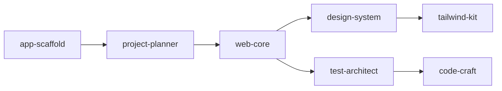

# Workflow Chains - Usage Guide

> 5 workflow chains with different execution modes for each use case

---

## What Are Workflow Chains?

**Workflow Chain** = Pre-configured skill sequences to solve complex tasks.

**Analogy:** Like a "combo" in games - 1 command triggers an entire action chain.

**Example:**

```bash
/build todo app
```

Automatically runs 7 skills: `app-scaffold` -> `project-planner` -> `web-core` -> `design-system` -> `tailwind-kit` -> `test-architect` -> `code-craft`

---

## 5 Workflow Chains

| Chain                 | Workflows                        | Skills | Purpose                      |
| --------------------- | -------------------------------- | ------ | ---------------------------- |
| **build-web-app**     | `/build`, `/boost`, `/autopilot` | 7      | Full-stack web development   |
| **security-audit**    | `/inspect`                       | 4      | Security review & pentesting |
| **debug-complex**     | `/diagnose`                      | 4      | Systematic debugging         |
| **deploy-production** | `/launch`                        | 5      | Production deployment        |
| **api-development**   | `/api`                           | 5      | API design & implementation  |

---

## Meta-Agents (Runtime Control)

All 22 workflows are integrated with **5 meta-agents** for enhanced autonomy:

| Agent | Role | When Invoked |
|-------|------|--------------|
| `orchestrator` | Runtime Control | Parallel execution, retry logic, health monitoring |
| `assessor` | Risk Analysis | Before risky operations, evaluate impact |
| `recovery` | State Safety | Save/restore state, auto-rollback on failure |
| `critic` | Conflict Resolution | Arbitrate agent disagreements (QA vs Speed) |
| `learner` | Continuous Learning | Extract lessons from failures, log patterns |

### Integration Example

```
/launch workflow:
orchestrator.init() -> assessor.evaluate(deployment_risk)
       |
recovery.save(current_state) -> deploy
       |
health_check_failed? -> recovery.restore()
       |
success -> learner.log(deployment_patterns)
```

### Meta-Agent Coverage (22/22 Workflows)

All workflows now include `## Meta-Agents Integration` section with:
- Phase-based agent invocation table
- Flow diagram showing agent coordination
- Rollback and learning hooks

## 1. build-web-app Chain

> **Purpose:** Build or upgrade full-stack web applications

### Skills (7)



**Skill Sequence:**

1. `app-scaffold` - Create project structure
2. `project-planner` - Plan architecture
3. `web-core` - Implement core logic
4. `design-system` - Setup design system
5. `tailwind-kit` - Configure Tailwind (optional)
6. `test-architect` - Setup testing
7. `code-craft` - Validate code quality

---

### 3 Workflows (Execution Modes)

#### `/build` - Interactive Build (For Beginners)

**Features:**

- [x] 100% user control
- [x] Agent asks 10-15 questions
- [x] Step-by-step with explanations
- Time: 10-15 minutes

**When to use:**

- First time building an app
- Want to learn how the agent works
- Need detailed customization

**Example:**

```bash
/build blog app with authentication

Agent:
? Framework?
   1. Next.js 15
   2. Vite + React
   3. Remix
-> You choose: 1

? Database?
   1. PostgreSQL + Prisma
   2. MongoDB
   3. Supabase
-> You choose: 3

? Styling?
   1. Tailwind CSS
   2. Styled Components
-> You choose: 1

... (10 more questions)

[OK] Created: blog-app/
   |-- app/ (Next.js 15)
   |-- components/
   |-- lib/supabase/
   +-- tests/
```

**Output:**

- Next.js 15 with App Router
- Supabase auth + database
- Tailwind CSS styling
- TypeScript setup
- Basic tests

---

#### `/boost` - Enhancement Mode (For Existing Projects)

**Features:**

- [x] Context-aware (reads current code)
- [x] Agent asks 2-3 confirmation questions
- [x] Does not break existing code
- Time: 5-7 minutes

**When to use:**

- Already have a project
- Adding new features
- Upgrading existing code

**Example:**

```bash
cd my-existing-blog
/boost add comment system with moderation

Agent:
[DETECT] Detected:
   - Framework: Next.js 14
   - Database: Supabase
   - Styling: Tailwind CSS

[PLAN] Plan:
   1. Add Comment model to Supabase
   2. Create CommentList component
   3. Add moderation API routes
   4. Setup admin panel

? Proceed? (Y/n) -> Y

[OK] Updated: my-existing-blog/
   |-- lib/supabase/schema.sql (UPDATED)
   |-- components/CommentList.tsx (NEW)
   |-- components/CommentForm.tsx (NEW)
   |-- app/api/comments/ (NEW)
   +-- app/admin/comments/ (NEW)
```

**Output:**

- Integrated seamlessly
- Matches existing code style
- No breaking changes

---

#### `/autopilot` - Fully Autonomous (For Prototypes/Demos)

**Features:**

- [x] Zero user input
- [x] 3+ agents collaboration
- [x] Automatic best practices
- Time: 3-5 minutes

**When to use:**

- Quick demos for clients
- Rapid prototyping
- POC (Proof of Concept)

**Example:**

```bash
/autopilot e-commerce with Stripe and admin dashboard

Agent (autonomous):
[00:00] [ORCH] Orchestrator: Planning architecture
[00:01] [FE] Frontend: Next.js 15 + TypeScript
[00:02] [BE] Backend: tRPC + Prisma
[00:03] [UI] Design: Tailwind + Shadcn UI
[00:04] [PAY] Stripe: Payment integration
[00:05] [ADMIN] Admin: Dashboard with RBAC
[00:06] [TEST] Tests: E2E with Playwright

[OK] DONE - Ready to deploy

Created: ecommerce-store/
   |-- app/ (Products, Cart, Checkout, Admin)
   |-- server/ (tRPC routers)
   |-- prisma/ (Product, Order, User models)
   |-- components/ (ProductCard, CartItem, etc.)
   |-- lib/stripe/ (Payment processing)
   |-- tests/e2e/ (Full user journey)
   +-- vercel.json (Deploy config)
```

**Output:**

- Full-stack production-ready app
- Stripe payments configured
- Admin dashboard included
- E2E tests written

---

### 3 Modes Comparison

| Aspect            | /build    | /boost            | /autopilot |
| ----------------- | --------- | ----------------- | ---------- |
| **Questions**     | 10-15     | 2-3               | 0          |
| **Control**       | 100%      | 60%               | 20%        |
| **Speed**         | 10-15 min | 5-7 min           | 3-5 min    |
| **Best For**      | Learning  | Existing projects | Demos      |
| **Agents**        | 1         | 1-2               | 3+         |
| **Customization** | High      | Medium            | Low        |

---

## 2. security-audit Chain

> **Purpose:** Comprehensive security review

### Skills (4)

1. `security-scanner` - Vulnerability scanning
2. `code-review` - Security-focused code review
3. `offensive-sec` - Penetration testing
4. `cicd-pipeline` - CI/CD security integration

### Workflow

#### `/inspect` - Security Audit

**Example:**

```bash
/inspect my-web-app

Agent:
[SCAN] Running security audit...

[1/4] Vulnerability Scan
   [OK] Dependencies: 0 critical, 2 high
   [WARN] Found: Outdated express 4.17.1

[2/4] Code Review
   [FAIL] SQL injection risk in /api/users
   [WARN] No input validation in auth routes

[3/4] Penetration Test
   [FAIL] XSS vulnerability in comments
   [OK] CSRF protection enabled

[4/4] CI/CD Integration
   [OK] Added security checks to GitHub Actions

[REPORT]:
   - Critical: 1 (SQL injection)
   - High: 3 (XSS, outdated deps)
   - Medium: 5
   - Recommendations: 12

[OK] Generated: security-report.md
```

**Use Cases:**

- Pre-deployment security check
- Regular security audits
- Compliance requirements (OWASP)

---

## 3. debug-complex Chain

> **Purpose:** Systematic debugging with root cause analysis

### Skills (4)

1. `debug-pro` - Initial analysis
2. `debug-pro` - Deep investigation
3. `idea-storm` - Hypothesis generation
4. `test-architect` - Fix verification

### Workflow

#### `/diagnose` - Deep Debug

**Example:**

```bash
/diagnose users can't login after deployment

Agent:
[1/4] Analysis Phase
   Symptoms:
      - Login fails with 500 error
      - Started after deploy v2.1
      - Only affects production

[2/4] Investigation
   Checked:
      - [OK] Database connection OK
      - [OK] API routes accessible
      - [FAIL] Environment variables mismatch

   Found: AUTH_SECRET not set in production

[3/4] Hypothesis
   Root Cause:
      - AUTH_SECRET missing in .env.production
      - JWT tokens can not be verified
      - Login fails silently

[4/4] Verification
   Test Plan:
      1. Add AUTH_SECRET to production
      2. Test login flow
      3. Add monitoring alert

   [OK] Fix applied and verified

[DONE] Created: debug-report.md
   - Root cause
   - Fix applied
   - Prevention suggestions
```

**Use Cases:**

- Hard-to-reproduce bugs
- Production issues
- Performance problems

---

## 4. deploy-production Chain

> **Purpose:** Safe production deployment with pre-flight checks

### Skills (5)

1. `security-scanner` - Security pre-check
2. `perf-optimizer` - Performance optimization
3. `e2e-automation` - E2E tests
4. `cicd-pipeline` - Deployment execution
5. `cicd-pipeline` - Gradual rollout (optional)

### Workflow

#### `/launch` - Production Deploy

**Example:**

```bash
/launch to production

Agent:
[1/5] Security Pre-Check
   [OK] No critical vulnerabilities
   [OK] Dependencies up to date
   [OK] Secrets properly configured

[2/5] Performance Optimization
   [OK] Bundle size: 245KB (optimized from 380KB)
   [OK] Lighthouse score: 95/100
   [OK] Core Web Vitals: PASS

[3/5] E2E Tests
   [OK] User flows: 15/15 passed
   [OK] Payment flow: PASS
   [OK] Admin panel: PASS

[4/5] Deployment
   [OK] Built successfully
   [OK] Deployed to Vercel
   [OK] Health check: PASS
   [LIVE] https://app.example.com

[5/5] Feature Flags (optional)
   [OK] New checkout: 10% rollout
   [OK] Monitoring enabled

[SUMMARY]:
   - Version: v2.2.0
   - Deploy time: 3m 42s
   - Status: SUCCESS
   - Rollback available: Yes
```

**Use Cases:**

- Production deployments
- Staging deployments
- Hotfix releases

---

## 5. api-development Chain

> **Purpose:** API design & implementation

### Skills (5)

1. `api-architect` - API design (REST/GraphQL/tRPC)
2. `data-modeler` - Database schema
3. `nodejs-pro` - Node.js implementation
4. `test-architect` - API testing
5. `security-scanner` - API security

### Workflow

#### `/api` - API Development

**Example:**

```bash
/api user management with RBAC

Agent:
[1/5] API Design
   [OK] Designed RESTful endpoints:
      - POST /api/auth/register
      - POST /api/auth/login
      - GET /api/users (admin only)
      - PATCH /api/users/:id
      - DELETE /api/users/:id

[2/5] Database Schema
   [OK] Created Prisma models:
      - User (id, email, role, createdAt)
      - Role (id, name, permissions)
      - Session (id, userId, token)

[3/5] Implementation
   [OK] Implemented with Express.js
   [OK] JWT authentication
   [OK] Role-based middleware
   [OK] Input validation with Zod

[4/5] Testing
   [OK] Unit tests: 24/24 passed
   [OK] Integration tests: 12/12 passed
   [OK] API docs generated (Swagger)

[5/5] Security
   [OK] Rate limiting enabled
   [OK] CORS configured
   [OK] SQL injection prevention
   [OK] XSS protection

[DONE] Created: api/
   |-- routes/
   |-- middleware/
   |-- controllers/
   |-- tests/
   |-- prisma/
   +-- swagger.yaml
```

**Use Cases:**

- Backend API development
- Microservices
- Mobile app backends

---

## Which Chain to Choose?

### Decision Tree

```
What do you want to do?
|
|-- Build web app?
|   |-- New project? -> /build
|   |-- Add features? -> /boost
|   +-- Quick demo? -> /autopilot
|
|-- Check security? -> /inspect
|
|-- Debug issue? -> /diagnose
|
|-- Deploy app? -> /launch
|
+-- Build API? -> /api
```

---

## Best Practices

### 1. Workflow Progression (Recommended)

**Week 1:** Learning

```bash
/build my-first-app
-> Learn how the agent works
-> Understand tech decisions
```

**Week 2-4:** Development

```bash
cd my-first-app
/boost add feature 1
/boost add feature 2
/boost add feature 3
-> Incremental improvements
```

**Week 5:** QA & Deploy

```bash
/inspect  # Security check
/diagnose # Fix any issues
/launch   # Deploy to production
```

### 2. Combine Workflows

```bash
# Build backend
/api user management

# Build frontend
/build admin dashboard

# Security check
/inspect both projects

# Deploy
/launch to staging
```

### 3. Iterative Development

```bash
# Iteration 1: MVP
/autopilot basic todo app

# Iteration 2: Enhancements
/boost add categories
/boost add due dates
/boost add notifications

# Iteration 3: Polish
/inspect             # Security
/diagnose slow queries  # Performance
/launch              # Deploy
```

---

## Advanced Usage

### Chain Customization

Chains can be customized via:

**1. Execution Strategy:**

```json
{
  "execution": {
    "strategy": "dag",
    "parallelism": {
      "enabled": true,
      "maxConcurrent": 3
    }
  }
}
```

**2. Success Criteria:**

```json
{
  "successCriteria": {
    "required": ["all-skills-completed", "tests-passing"],
    "optional": ["performance-benchmark"]
  }
}
```

**3. Retry Policy:**

```json
{
  "retryPolicy": {
    "maxRetries": 2,
    "backoffMs": 1000
  }
}
```

---

## FAQ

**Q: /build vs /autopilot - When to use which?**

A:
- `/build`: When you want to LEARN and CONTROL
- `/autopilot`: When you need SPEED and TRUST the agent

**Q: Can /boost be used for non-Next.js projects?**

A: Yes! The agent detects the framework and adapts:

```bash
cd my-vue-app
/boost add authentication
-> Agent will use Vue patterns
```

**Q: Can chains run in parallel?**

A: Yes (depends on chain):
- `build-web-app`: DAG (parallel skills)
- `deploy-production`: DAG (parallel pre-checks)
- `debug-complex`: Sequential only

**Q: How to rollback when /launch fails?**

A: Agent automatically handles:

```bash
/launch
[FAIL] Deployment failed

Rollback options:
   1. Auto-rollback to previous version
   2. Manual rollback
   3. Debug and retry

-> Choose: 1
[OK] Rolled back to v2.1.0
```

---

## Additional Documentation

- [Workflow Chains Schema v2.0](./workflow-chains-schema-v2.md)
- [ARCHITECTURE.md](../ARCHITECTURE.md) - System overview
- [CHANGELOG.md](../../CHANGELOG.md) - Recent updates

---

**Version:** 1.0.0  
**Last Updated:** 2026-02-04  
**Schema:** v2.0 (FAANG-compliant)
