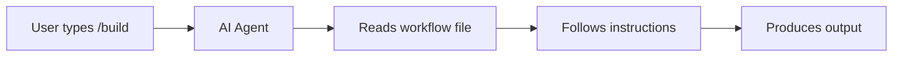

# Workflows (Slash Commands)

> **These are instruction guides for AI agents, not automated scripts.**

## 🎯 How They Work



1. **User invokes** slash command (e.g., `/build`, `/studio`)
2. **AI reads** corresponding `.md` file from this directory
3. **AI follows** the structured phases and instructions
4. **Result** is produced through manual agent execution

## 📂 Available Workflows (15)

| Command      | File         | Purpose                                  |
| ------------ | ------------ | ---------------------------------------- |
| `/think`     | think.md     | Brainstorm 3+ alternatives before coding |
| `/architect` | architect.md | Generate detailed implementation plan    |
| `/build`     | build.md     | Full-stack application factory           |
| `/studio`    | studio.md    | UI design with 95+ color palettes        |
| `/validate`  | validate.md  | Test automation suite                    |
| `/diagnose`  | diagnose.md  | Root cause debugging                     |
| `/launch`    | launch.md    | Zero-downtime deployment                 |
| `/autopilot` | autopilot.md | Multi-agent autonomous coordination      |
| `/boost`     | boost.md     | Feature enhancement for existing apps    |
| `/chronicle` | chronicle.md | Auto-documentation generator             |
| `/forge`     | forge.md     | Skill creation wizard                    |
| `/inspect`   | inspect.md   | Defense-in-depth code review             |
| `/pulse`     | pulse.md     | Project health dashboard                 |
| `/stage`     | stage.md     | Development sandbox control              |
| `/agent`     | agent.md     | Launch interactive Agent CLI             |

## 📋 Workflow Structure

Each workflow follows this format:

```yaml
---
description: Brief description for command listing
---

# /command - Title

$ARGUMENTS  # Placeholder for user input

## Phase 1: First Step
// turbo  # Annotation for auto-run commands
Instructions...

## Phase 2: Next Step
...
```

### Special Annotations

| Annotation     | Meaning                               |
| -------------- | ------------------------------------- |
| `$ARGUMENTS`   | User's original request text          |
| `// turbo`     | AI can auto-approve command execution |
| `// turbo-all` | All commands in workflow can auto-run |

## ⚠️ Important Notes

### Not Automated Scripts

- ❌ No code parses or executes these files
- ❌ No workflow engine runs automatically
- ✅ AI agent reads and interprets manually
- ✅ AI follows structured instructions

### Think: Recipes, Not Robots

**Workflows = Cookbook recipes**

- Recipes don't cook automatically
- Chef (AI agent) reads and follows
- Produces consistent, high-quality results

### Best Practices

1. **Be specific** in your request after the slash command
2. **Answer questions** when AI asks for clarification
3. **Trust the phases** - they're designed for optimal flow
4. **Provide feedback** if results don't match expectations

## 🔗 Related Documentation

- [ARCHITECTURE.md](../ARCHITECTURE.md) - System overview
- [GEMINI.md](../GEMINI.md) - AI behavior rules
- [README.md](../../README.md) - Project overview

---

_Last updated: January 2026 (v3.2.0)_
