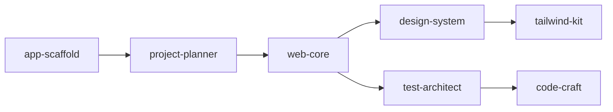

# Workflow Chains - HÆ°á»›ng Dẫn Sá»­ Dụng

> 5 workflow chains với execution modes khác nhau cho từng use case

---

## 📚 Workflow Chains Là Gì?

**Workflow Chain** = Chuỗi skills được cấu hình sẵn để giải quyết các tác vụ phức tạp.

**Analogy:** Giống như "combo" trong game - 1 command kích hoạt cả chuỗi hành động.

**Ví dụ:**

```bash
/build todo app
```

→ Tự động chạy 7 skills: `app-scaffold` → `project-planner` → `web-core` → `design-system` → `tailwind-kit` → `test-architect` → `code-craft`

---

## 🎯 5 Workflow Chains

| Chain                 | Workflows                        | Skills | Mục Đích                     |
| --------------------- | -------------------------------- | ------ | ---------------------------- |
| **build-web-app**     | `/build`, `/boost`, `/autopilot` | 7      | Full-stack web development   |
| **security-audit**    | `/inspect`                       | 4      | Security review & pentesting |
| **debug-complex**     | `/diagnose`                      | 4      | Systematic debugging         |
| **deploy-production** | `/launch`                        | 5      | Production deployment        |
| **api-development**   | `/api`                           | 5      | API design & implementation  |

---

## 🤖 Meta-Agents (Runtime Control)

All 22 workflows are integrated with **5 meta-agents** for enhanced autonomy:

| Agent | Role | When Invoked |
|-------|------|--------------|
| `orchestrator` | Runtime Control | Parallel execution, retry logic, health monitoring |
| `assessor` | Risk Analysis | Before risky operations, evaluate impact |
| `recovery` | State Safety | Save/restore state, auto-rollback on failure |
| `critic` | Conflict Resolution | Arbitrate agent disagreements (QA vs Speed) |
| `learner` | Continuous Learning | Extract lessons from failures, log patterns |

### Integration Example

```
/launch workflow:
orchestrator.init() → assessor.evaluate(deployment_risk)
       ↓
recovery.save(current_state) → deploy
       ↓
health_check_failed? → recovery.restore()
       ↓
success → learner.log(deployment_patterns)
```

### Meta-Agent Coverage (22/22 Workflows)

All workflows now include `## 🤖 Meta-Agents Integration` section with:
- Phase-based agent invocation table
- Flow diagram showing agent coordination
- Rollback and learning hooks

## 1️⃣ build-web-app Chain

> **Mục đích:** Xây dựng hoặc nâng cấp ứng dụng web full-stack

### 🔧 Skills (7)



**Skill Sequence:**

1. `app-scaffold` - Tạo cấu trúc project
2. `project-planner` - Plan architecture
3. `web-core` - Implement core logic
4. `design-system` - Setup design system
5. `tailwind-kit` - Configure Tailwind (optional)
6. `test-architect` - Setup testing
7. `code-craft` - Validate code quality

---

### 🚀 3 Workflows (Execution Modes)

#### `/build` - Interactive Build (Cho Người Mới)

**Đặc điểm:**

- ✅ User control 100%
- ✅ Agent hỏi 10-15 câu
- ✅ Step-by-step, giải thích từng bước
- ⏱️ 10-15 phút

**Khi nào dùng:**

- Lần đầu build app
- Muốn học cách agent làm việc
- Cần customize chi tiết

**Example:**

```bash
/build blog app with authentication

Agent:
❓ Framework?
   1. Next.js 15
   2. Vite + React
   3. Remix
→ Bạn chọn: 1

❓ Database?
   1. PostgreSQL + Prisma
   2. MongoDB
   3. Supabase
→ Bạn chọn: 3

❓ Styling?
   1. Tailwind CSS
   2. Styled Components
→ Bạn chọn: 1

... (10 more questions)

✅ Created: blog-app/
   ├── app/ (Next.js 15)
   ├── components/
   ├── lib/supabase/
   └── tests/
```

**Output:**

- Next.js 15 vá»›i App Router
- Supabase auth + database
- Tailwind CSS styling
- TypeScript setup
- Basic tests

---

#### `/boost` - Enhancement Mode (Cho Project Có Sẵn)

**Đặc điểm:**

- ✅ Context-aware (đọc code hiện tại)
- ✅ Agent hỏi 2-3 câu xác nhận
- ✅ Không phá code cũ
- ⏱️ 5-7 phút

**Khi nào dùng:**

- Đã có project
- Thêm features mới
- Nâng cấp existing code

**Example:**

```bash
cd my-existing-blog
/boost add comment system with moderation

Agent:
🔍 Detected:
   - Framework: Next.js 14
   - Database: Supabase
   - Styling: Tailwind CSS

📝 Plan:
   1. Add Comment model to Supabase
   2. Create CommentList component
   3. Add moderation API routes
   4. Setup admin panel

❓ Proceed? (Y/n) → Y

✅ Updated: my-existing-blog/
   ├── lib/supabase/schema.sql (UPDATED)
   ├── components/CommentList.tsx (NEW)
   ├── components/CommentForm.tsx (NEW)
   ├── app/api/comments/ (NEW)
   └── app/admin/comments/ (NEW)
```

**Output:**

- Integrated seamlessly
- Matches existing code style
- No breaking changes

---

#### `/autopilot` - Fully Autonomous (Cho Prototype/Demo)

**Đặc điểm:**

- ✅ Zero user input
- ✅ 3+ agents collaboration
- ✅ Best practices tự động
- ⏱️ 3-5 phút

**Khi nào dùng:**

- Demo nhanh cho client
- Rapid prototyping
- POC (Proof of Concept)

**Example:**

```bash
/autopilot e-commerce with Stripe and admin dashboard

Agent (autonomous):
[00:00] 🤖 Orchestrator: Planning architecture
[00:01] 📐 Frontend: Next.js 15 + TypeScript
[00:02] 🗄️ Backend: tRPC + Prisma
[00:03] 🎨 Design: Tailwind + Shadcn UI
[00:04] 💳 Stripe: Payment integration
[00:05] 👨‍💼 Admin: Dashboard with RBAC
[00:06] 🧪 Tests: E2E with Playwright

✅ DONE - Ready to deploy

Created: ecommerce-store/
   ├── app/ (Products, Cart, Checkout, Admin)
   ├── server/ (tRPC routers)
   ├── prisma/ (Product, Order, User models)
   ├── components/ (ProductCard, CartItem, etc.)
   ├── lib/stripe/ (Payment processing)
   ├── tests/e2e/ (Full user journey)
   └── vercel.json (Deploy config)
```

**Output:**

- Full-stack production-ready app
- Stripe payments configured
- Admin dashboard included
- E2E tests written

---

### 📊 So Sánh 3 Modes

| Aspect            | /build    | /boost            | /autopilot |
| ----------------- | --------- | ----------------- | ---------- |
| **Questions**     | 10-15     | 2-3               | 0          |
| **Control**       | 100%      | 60%               | 20%        |
| **Speed**         | 10-15 min | 5-7 min           | 3-5 min    |
| **Best For**      | Learning  | Existing projects | Demos      |
| **Agents**        | 1         | 1-2               | 3+         |
| **Customization** | High      | Medium            | Low        |

---

## 2️⃣ security-audit Chain

> **Mục đích:** Comprehensive security review

### 🔧 Skills (4)

1. `security-scanner` - Vulnerability scanning
2. `code-review` - Security-focused code review
3. `offensive-sec` - Penetration testing
4. `cicd-pipeline` - CI/CD security integration

### 🚀 Workflow

#### `/inspect` - Security Audit

**Example:**

```bash
/inspect my-web-app

Agent:
🔍 Running security audit...

[1/4] 🛡️ Vulnerability Scan
   ✅ Dependencies: 0 critical, 2 high
   ⚠️ Found: Outdated express 4.17.1

[2/4] 👀 Code Review
   ❌ SQL injection risk in /api/users
   ⚠️ No input validation in auth routes

[3/4] 🎯 Penetration Test
   ❌ XSS vulnerability in comments
   ✅ CSRF protection enabled

[4/4] 🔧 CI/CD Integration
   ✅ Added security checks to GitHub Actions

📊 Report:
   - Critical: 1 (SQL injection)
   - High: 3 (XSS, outdated deps)
   - Medium: 5
   - Recommendations: 12

✅ Generated: security-report.md
```

**Use Cases:**

- Pre-deployment security check
- Regular security audits
- Compliance requirements (OWASP)

---

## 3️⃣ debug-complex Chain

> **Mục đích:** Systematic debugging với root cause analysis

### 🔧 Skills (4)

1. `debug-pro` - Initial analysis
2. `debug-pro` - Deep investigation
3. `idea-storm` - Hypothesis generation
4. `test-architect` - Fix verification

### 🚀 Workflow

#### `/diagnose` - Deep Debug

**Example:**

```bash
/diagnose users can't login after deployment

Agent:
[1/4] 🔍 Analysis Phase
   📋 Symptoms:
      - Login fails with 500 error
      - Started after deploy v2.1
      - Only affects production

[2/4] 🛠️ Investigation
   🔎 Checked:
      - ✅ Database connection OK
      - ✅ API routes accessible
      - ❌ Environment variables mismatch

   🎯 Found: AUTH_SECRET not set in production

[3/4] 🧠 Hypothesis
   💡 Root Cause:
      - AUTH_SECRET missing in .env.production
      - JWT tokens can't be verified
      - Login fails silently

[4/4] ✅ Verification
   🧪 Test Plan:
      1. Add AUTH_SECRET to production
      2. Test login flow
      3. Add monitoring alert

   ✅ Fix applied and verified

📝 Created: debug-report.md
   - Root cause
   - Fix applied
   - Prevention suggestions
```

**Use Cases:**

- Hard-to-reproduce bugs
- Production issues
- Performance problems

---

## 4️⃣ deploy-production Chain

> **Mục đích:** Safe production deployment với pre-flight checks

### 🔧 Skills (5)

1. `security-scanner` - Security pre-check
2. `perf-optimizer` - Performance optimization
3. `e2e-automation` - E2E tests
4. `cicd-pipeline` - Deployment execution
5. `cicd-pipeline` - Gradual rollout (optional)

### 🚀 Workflow

#### `/launch` - Production Deploy

**Example:**

```bash
/launch to production

Agent:
[1/5] 🛡️ Security Pre-Check
   ✅ No critical vulnerabilities
   ✅ Dependencies up to date
   ✅ Secrets properly configured

[2/5] âš¡ Performance Optimization
   ✅ Bundle size: 245KB (optimized from 380KB)
   ✅ Lighthouse score: 95/100
   ✅ Core Web Vitals: PASS

[3/5] 🧪 E2E Tests
   ✅ User flows: 15/15 passed
   ✅ Payment flow: PASS
   ✅ Admin panel: PASS

[4/5] 🚀 Deployment
   ✅ Built successfully
   ✅ Deployed to Vercel
   ✅ Health check: PASS
   🌐 Live: https://app.example.com

[5/5] 🚩 Feature Flags (optional)
   ✅ New checkout: 10% rollout
   ✅ Monitoring enabled

📊 Deployment Summary:
   - Version: v2.2.0
   - Deploy time: 3m 42s
   - Status: SUCCESS
   - Rollback available: Yes
```

**Use Cases:**

- Production deployments
- Staging deployments
- Hotfix releases

---

## 5️⃣ api-development Chain

> **Mục đích:** API design & implementation

### 🔧 Skills (5)

1. `api-architect` - API design (REST/GraphQL/tRPC)
2. `data-modeler` - Database schema
3. `nodejs-pro` - Node.js implementation
4. `test-architect` - API testing
5. `security-scanner` - API security

### 🚀 Workflow

#### `/api` - API Development

**Example:**

```bash
/api user management with RBAC

Agent:
[1/5] 📐 API Design
   ✅ Designed RESTful endpoints:
      - POST /api/auth/register
      - POST /api/auth/login
      - GET /api/users (admin only)
      - PATCH /api/users/:id
      - DELETE /api/users/:id

[2/5] 🗄️ Database Schema
   ✅ Created Prisma models:
      - User (id, email, role, createdAt)
      - Role (id, name, permissions)
      - Session (id, userId, token)

[3/5] 💻 Implementation
   ✅ Implemented with Express.js
   ✅ JWT authentication
   ✅ Role-based middleware
   ✅ Input validation with Zod

[4/5] 🧪 Testing
   ✅ Unit tests: 24/24 passed
   ✅ Integration tests: 12/12 passed
   ✅ API docs generated (Swagger)

[5/5] 🛡️ Security
   ✅ Rate limiting enabled
   ✅ CORS configured
   ✅ SQL injection prevention
   ✅ XSS protection

📦 Created: api/
   ├── routes/
   ├── middleware/
   ├── controllers/
   ├── tests/
   ├── prisma/
   └── swagger.yaml
```

**Use Cases:**

- Backend API development
- Microservices
- Mobile app backends

---

## 🎯 Chọn Chain Nào?

### Decision Tree

```
Bạn muốn làm gì?
│
├─ Xây web app?
│  ├─ New project? → /build
│  ├─ Add features? → /boost
│  └─ Quick demo? → /autopilot
│
├─ Check security? → /inspect
│
├─ Debug issue? → /diagnose
│
├─ Deploy app? → /launch
│
└─ Build API? → /api
```

---

## 💡 Best Practices

### 1. Workflow Progression (Recommended)

**Week 1:** Learning

```bash
/build my-first-app
→ Học cách agent work
→ Hiểu tech decisions
```

**Week 2-4:** Development

```bash
cd my-first-app
/boost add feature 1
/boost add feature 2
/boost add feature 3
→ Incremental improvements
```

**Week 5:** QA & Deploy

```bash
/inspect  # Security check
/diagnose # Fix any issues
/launch   # Deploy to production
```

### 2. Combine Workflows

```bash
# Build backend
/api user management

# Build frontend
/build admin dashboard

# Security check
/inspect both projects

# Deploy
/launch to staging
```

### 3. Iterative Development

```bash
# Iteration 1: MVP
/autopilot basic todo app

# Iteration 2: Enhancements
/boost add categories
/boost add due dates
/boost add notifications

# Iteration 3: Polish
/inspect             # Security
/diagnose slow queries  # Performance
/launch              # Deploy
```

---

## 🔧 Advanced Usage

### Chain Customization

Chains có thể customize qua:

**1. Execution Strategy:**

```json
{
  "execution": {
    "strategy": "dag", // or "sequential"
    "parallelism": {
      "enabled": true,
      "maxConcurrent": 3
    }
  }
}
```

**2. Success Criteria:**

```json
{
  "successCriteria": {
    "required": ["all-skills-completed", "tests-passing"],
    "optional": ["performance-benchmark"]
  }
}
```

**3. Retry Policy:**

```json
{
  "retryPolicy": {
    "maxRetries": 2,
    "backoffMs": 1000
  }
}
```

---

## ❓ FAQ

**Q: /build vs /autopilot - Khi nào dùng gì?**

A:

- `/build`: Khi bạn muốn LEARN và CONTROL
- `/autopilot`: Khi bạn cần SPEED và TRUST agent

**Q: /boost có thể dùng cho project không phải Next.js?**

A: Có! Agent detect framework và adapt:

```bash
cd my-vue-app
/boost add authentication
→ Agent sẽ dùng Vue patterns
```

**Q: Chain có thể chạy parallel không?**

A: Có (tùy chain):

- `build-web-app`: DAG (parallel skills)
- `deploy-production`: DAG (parallel pre-checks)
- `debug-complex`: Sequential only

**Q: Làm sao rollback khi /launch fail?**

A: Agent tá»± Ä‘á»™ng:

```bash
/launch
❌ Deployment failed

🔙 Rollback options:
   1. Auto-rollback to previous version
   2. Manual rollback
   3. Debug and retry

→ Choose: 1
✅ Rolled back to v2.1.0
```

---

## 📚 Tài Liệu Thêm

- [Workflow Chains Schema v2.0](./workflow-chains-schema-v2.md)
- [ARCHITECTURE.md](../ARCHITECTURE.md) - System overview
- [CHANGELOG.md](../../CHANGELOG.md) - Recent updates

---

**Version:** 1.0.0  
**Last Updated:** 2026-01-29  
**Schema:** v2.0 (FAANG-compliant)

