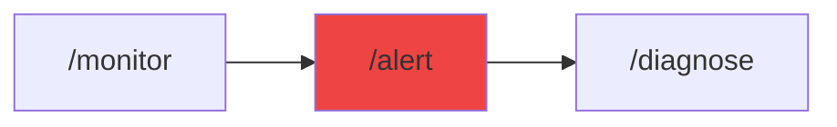

# /alert - Alert & Incident Response Configuration

$ARGUMENTS

---

## Purpose

Configure production-grade alert rules, notification channels (Slack/PagerDuty/email), thresholds, runbooks, and test alert delivery. **Combines `observability` for alerting infrastructure with `server-ops` for incident response — turning monitoring data into actionable alerts with automated runbooks.**

---

## 🤖 Meta-Agents Integration

| Phase | Agent | Action |
| ----- | ----- | ------ |
| **Alert Analysis** | `learner` | Learn from past incident patterns to reduce noise |
| **Threshold Tuning** | `assessor` | Evaluate alert sensitivity vs noise ratio |
| **Response Planning** | `orchestrator` | Coordinate multi-team incident response |
| **Post-Setup** | `recovery` | Save alert configuration state for rollback |

```
Flow:
learner.analyze(past_incidents) → assessor.tune(thresholds)
       ↓
configure alerts → recovery.save(config_state)
       ↓
incident? → orchestrator.coordinate(runbook)
       ↓
resolved? → learner.log(pattern)
```

---

## 🔴 MANDATORY: Alert Configuration Protocol

### Phase 1: Application Analysis

| Field | Value |
|-------|-------|
| **INPUT** | $ARGUMENTS (user request — service type, environment, SLA requirements) |
| **OUTPUT** | Service profile: type, traffic patterns, critical endpoints, existing monitoring |
| **AGENTS** | `devops-engineer` |
| **SKILLS** | `observability`, `server-ops` |

1. Detect service type (API, web app, microservice, background jobs)
2. Review current traffic patterns and baseline metrics
3. Identify critical endpoints and dependencies
4. Check existing monitoring setup (Prometheus, Datadog, etc.)
5. Determine SLA requirements (latency, uptime, error budget)

```
ASK if not specified:
□ Service type (API/web/microservice/background)
□ Environment (staging/production)
□ Expected traffic volume
□ SLA requirements
□ Notification preferences (Slack/PagerDuty/email)
```

### Phase 2: Alert Rules Configuration

| Field | Value |
|-------|-------|
| **INPUT** | Service profile from Phase 1 |
| **OUTPUT** | `alerts.yml` with configured rules per severity |
| **AGENTS** | `devops-engineer` |
| **SKILLS** | `observability` |

Configure rules by priority tier:

**P0 — Critical (Page immediately):**

```yaml
- High Error Rate (>0.5% for APIs, >1% for web)
- API/Service Down (health check failed 3x)
- Database Connection Failed
- Authentication Service Down
```

**P1 — High (Slack + escalation):**

```yaml
- High Latency (p95 >300ms API, >500ms web)
- Slow Database Queries (>1s)
- High Memory Usage (>90%)
- Cache Miss Rate High (>30%)
```

**P2 — Medium (Slack only, no page):**

```yaml
- CPU Usage High (>80%)
- Disk Usage High (>85%)
- High Network Latency
- SSL Certificate Expiring (<30 days)
```

**Threshold Reference by Service Type:**

| Metric | API Services | Web Apps | Background Jobs |
|--------|-------------|----------|-----------------|
| Error Rate | >0.5% | >1% | >5% |
| Latency p95 | >200ms | >300ms | N/A |
| Latency p99 | >500ms | >1000ms | N/A |
| Queue Length | N/A | N/A | >1000 |
| Processing Time | N/A | N/A | >30s |

**Threshold Reference by Environment:**

| Environment | Error Threshold | Latency Threshold |
|-------------|-----------------|-------------------|
| Development | N/A (no alerts) | N/A |
| Staging | >5% | >1000ms |
| Production | >0.5% | >200ms |

### Phase 3: Notification Channel Setup

| Field | Value |
|-------|-------|
| **INPUT** | Alert rules from Phase 2 + user notification preferences |
| **OUTPUT** | Configured channels: Slack webhooks, PagerDuty services, email routing |
| **AGENTS** | `devops-engineer` |
| **SKILLS** | `observability`, `server-ops` |

**Severity-Based Routing:**

| Severity | Notify | Escalate After |
|----------|--------|----------------|
| **Critical (P0)** | Slack + PagerDuty | 15 minutes |
| **High (P1)** | Slack only | 30 minutes |
| **Medium (P2)** | Slack (low-priority) | Never |

**Time-Based Routing:**

| Period | P0 | P1 | P2 |
|--------|-----|-----|-----|
| Business Hours (9am-6pm) | Slack + Page | Slack | Slack |
| Off Hours (6pm-9am) | Page immediately | Slack, review next day | Batched daily summary |

### Phase 4: Runbook Generation

| Field | Value |
|-------|-------|
| **INPUT** | Alert rules from Phase 2 |
| **OUTPUT** | `docs/runbooks/*.md` — one runbook per alert type + post-mortem template |
| **AGENTS** | `documentation-writer` |
| **SKILLS** | `doc-templates`, `observability` |

Generate for each alert:

1. **Investigation Steps** — what to check first
2. **Common Root Causes** — known failure modes
3. **Remediation Actions** — how to fix
4. **Escalation Path** — who to contact when
5. **Post-Mortem Template** — incident review format

### Phase 5: Alert Testing & Verification

| Field | Value |
|-------|-------|
| **INPUT** | Configured alerts + channels from Phases 2-3 |
| **OUTPUT** | Test results: all channels verified, alerts firing correctly |
| **AGENTS** | `test-engineer` |
| **SKILLS** | `observability` |

1. Send test alert to each Slack channel
2. Verify PagerDuty routing and on-call assignment
3. Test escalation policies (simulate timeout)
4. Verify alert auto-resolve behavior
5. Confirm runbook links in alert payloads

---

## 🎨 Alert Rule Examples

### High Error Rate

```yaml
name: HighErrorRate
condition: |
  (sum(rate(http_errors_total[5m])) / 
   sum(rate(http_requests_total[5m]))) > 0.005
severity: critical
description: Error rate exceeded 0.5% in last 5 minutes
notify:
  - slack: "#oncall"
  - pagerduty: "production-alerts"
runbook: docs/runbooks/high-error-rate.md
```

### High Latency

```yaml
name: HighLatency
condition: |
  histogram_quantile(0.95, 
    http_request_duration_ms_bucket) > 300
severity: high
description: p95 latency above 300ms
notify:
  - slack: "#engineering"
runbook: docs/runbooks/high-latency.md
```

### Database Connection Pool Exhausted

```yaml
name: DatabasePoolExhausted
condition: |
  db_connection_pool_active / 
  db_connection_pool_max > 0.9
severity: critical
description: Database connection pool at 90%+ capacity
notify:
  - slack: "#oncall"
  - pagerduty: "production-alerts"
runbook: docs/runbooks/database-pool.md
```

---

## 💡 Alert Design Principles

**Alert Fatigue Prevention:**

- Start with conservative thresholds, tighten gradually
- Use anomaly detection (not just static thresholds)
- Group related alerts (don't page for every instance)
- Auto-resolve when issue clears
- Weekly alert review and tuning

**Good Alert Properties:**

| Property | Description |
|----------|-------------|
| **Actionable** | Clear what to do — runbook linked |
| **Specific** | Not "something is wrong" — includes metric + threshold |
| **Timely** | Catch issues before users notice |
| **Documented** | Runbook exists with remediation steps |

**Bad Alerts (avoid):**

❌ Alerts that fire constantly → tune thresholds
❌ Alerts with no runbook → always link runbook
❌ Alerts that auto-resolve in <1 min → increase evaluation window
❌ "Just FYI" alerts → use reports/dashboards instead

---

## ⛔ MANDATORY: Problem Verification Before Completion

> **CRITICAL:** This check MUST be performed before any `notify_user` or task completion.

### Check @[current_problems]

```
1. Read @[current_problems] from IDE
2. If errors/warnings > 0:
   a. Auto-fix: YAML syntax, missing fields, lint errors
   b. Re-check @[current_problems]
   c. If still > 0 → STOP → Notify user
3. If count = 0 → Proceed to completion
```

### Auto-Fixable

| Type | Fix |
|------|-----|
| YAML syntax error | Fix indentation/quoting |
| Missing alert field | Add required field with default |
| Invalid severity level | Map to P0/P1/P2 |

> **Rule:** Never mark complete with errors in `@[current_problems]`.

---

## ✅ Success Criteria

After running `/alert`, verify:

- [ ] **Alert Rules** — Configured with correct thresholds per service type
- [ ] **Slack Integration** — Test alert delivered successfully
- [ ] **PagerDuty Integration** — On-call routing configured + tested
- [ ] **Runbooks** — One runbook per alert type + post-mortem template
- [ ] **Escalation Policy** — Clear escalation path per severity
- [ ] **Alert Testing** — All channels verified working
- [ ] **No Alert Fatigue** — Thresholds tuned, auto-resolve configured

---

## Output Format

```markdown
## 🚨 Alert Configuration Complete

### Configuration Summary

| Aspect | Value |
|--------|-------|
| Service Type | [API/web/microservice] |
| Environment | [staging/production] |
| Alert Rules | [X] rules configured |
| Channels | Slack + PagerDuty + Email |
| Runbooks | [X] generated |

### Alert Rules

| Alert | Severity | Threshold | Channel |
|-------|----------|-----------|---------|
| High Error Rate | P0 | >0.5% | Slack + PagerDuty |
| High Latency | P1 | p95 >300ms | Slack |
| High CPU | P2 | >80% | Slack (low-priority) |

### Notification Channels

| Channel | Status | Target |
|---------|--------|--------|
| Slack | ✅ Verified | #oncall |
| PagerDuty | ✅ Verified | production-alerts |
| Email | ✅ Verified | oncall@example.com |

### Runbooks Generated

- ✅ `docs/runbooks/high-error-rate.md`
- ✅ `docs/runbooks/high-latency.md`
- ✅ `docs/runbooks/database-timeout.md`
- ✅ `docs/runbooks/memory-leak.md`
- ✅ Post-mortem template

### Next Steps

- [ ] Review `alerts.yml` and adjust thresholds for your SLAs
- [ ] Add team members to PagerDuty on-call rotation
- [ ] Test alerts in staging before production
- [ ] Update runbooks with team-specific procedures
- [ ] Schedule weekly alert review
```

---

## Examples

```
/alert configure for production API with Slack and PagerDuty
/alert configure for high-traffic web app (10K+ users)
/alert configure with custom thresholds: error 0.5%, latency p95 300ms, CPU 80%
/alert test all notification channels
/alert generate runbooks for existing alerts
```

---

## Key Principles

- **Signal over noise** — every alert must be actionable with a linked runbook
- **SLA-driven thresholds** — derive alert thresholds from SLA requirements, not arbitrary numbers
- **Escalation by severity** — P0 pages immediately, P2 is informational only
- **Test before production** — always verify alert delivery in staging first
- **Continuous tuning** — schedule weekly alert review to reduce fatigue

---

## 🔗 Workflow Chain

**Skills Loaded (3):**

- `observability` - Alert rules, Slack/PagerDuty integration, monitoring infrastructure
- `server-ops` - Server health monitoring and incident response patterns
- `doc-templates` - Runbook generation and documentation templates



| After /alert | Run | Purpose |
|--------------|-----|---------|
| Need monitoring first | `/monitor` | Setup full-stack observability |
| Alert fires in production | `/diagnose` | Investigate root cause |
| Ready to deploy with alerts | `/launch` | Deploy with alerting enabled |
| Need to test alert response | `/validate` | Verify alert delivery end-to-end |

**Handoff to /diagnose:**

```markdown
✅ Alerting configured with [X] rules across [Y] channels.
Run `/diagnose` when an alert fires to investigate root cause.
Runbooks available at docs/runbooks/ for each alert type.
```
