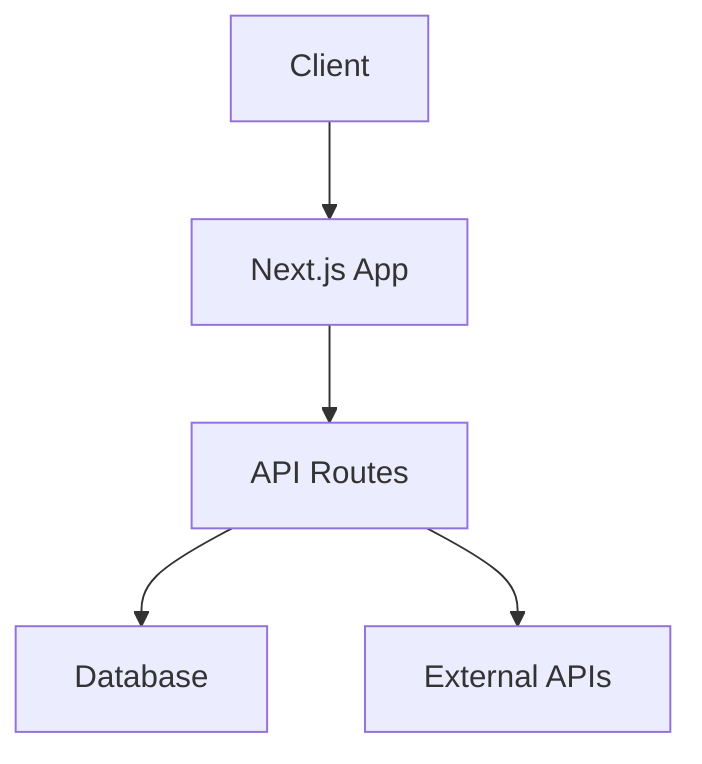
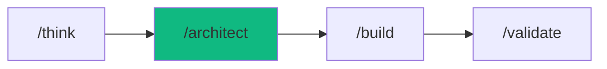

# /architect - Project Blueprint

$ARGUMENTS

---

## Purpose

Create comprehensive project plans with task breakdown, architecture decisions, and agent assignments. **NO CODE - only planning artifacts.**

---

## 🔴 MANDATORY: 4-Phase Planning

### Phase 1: Requirements Discovery
Ask these if not provided:
```
1. What is the GOAL? (one sentence)
2. Who are the USERS? (persona)
3. What are MUST-HAVE features? (3-5 items)
4. What are NICE-TO-HAVE? (optional)
5. What is the TIMELINE? (deadline)
6. What are CONSTRAINTS? (budget, tech, team)
```

### Phase 2: Architecture Decision
| Decision | Options | Recommendation |
|----------|---------|----------------|
| Frontend | Next.js / Vite / SPA | [Choice + Why] |
| Backend | Hono / Express / FastAPI | [Choice + Why] |
| Database | PostgreSQL / MongoDB / Supabase | [Choice + Why] |
| Auth | Clerk / NextAuth / Custom | [Choice + Why] |
| Hosting | Vercel / Railway / AWS | [Choice + Why] |

### Phase 3: Task Breakdown
```
Level 1: Epics (major features)
Level 2: Stories (user-facing items)
Level 3: Tasks (technical work)
Level 4: Subtasks (atomic units)
```

### Phase 4: Agent Assignment
| Task | Agent | Dependency | Estimate |
|------|-------|------------|----------|
| Schema design | database-architect | None | 30m |
| API routes | backend-specialist | Schema | 2h |
| UI components | frontend-specialist | API | 3h |
| Tests | test-engineer | All | 1h |

---

## Output: PLAN.md

Generated file: `docs/PLAN-{slug}.md`

```markdown
# Project Plan: [Name]

## Overview
| Aspect | Value |
|--------|-------|
| Goal | [One sentence] |
| Timeline | [X days/weeks] |
| Complexity | Low/Medium/High |
| Team | [Agents involved] |

## Stack Decision

| Layer | Choice | Rationale |
|-------|--------|-----------|
| Frontend | Next.js 15 | SSR, Vercel integration |
| Styling | Tailwind + shadcn/ui | Rapid development |
| Backend | Hono on Edge | Type-safe, fast |
| Database | PostgreSQL (Supabase) | Free tier, realtime |
| Auth | Clerk | Social login, fast setup |

## Architecture



## Task Breakdown

### Epic 1: [Feature Name]
- [ ] Story 1.1: [Description]
  - [ ] Task 1.1.1: [Technical work]
  - [ ] Task 1.1.2: [Technical work]
- [ ] Story 1.2: [Description]

### Epic 2: [Feature Name]
- [ ] Story 2.1: [Description]

## Agent Execution Plan

| Phase | Agent | Task | Duration |
|-------|-------|------|----------|
| 1 | database-architect | Schema + migrations | 30m |
| 2 | backend-specialist | API endpoints | 2h |
| 3 | frontend-specialist | UI components | 3h |
| 4 | test-engineer | E2E tests | 1h |

## Verification Checklist

- [ ] All features implemented
- [ ] Tests passing
- [ ] Security scan clean
- [ ] Performance acceptable
- [ ] Documentation complete

## Next Steps

After plan approval:
1. Run `/build` to start implementation
2. Or modify this plan as needed
```

---

## Naming Convention

| Request | Generated File |
|---------|----------------|
| `/architect e-commerce app` | `docs/PLAN-ecommerce-app.md` |
| `/architect user dashboard` | `docs/PLAN-user-dashboard.md` |
| `/architect mobile API` | `docs/PLAN-mobile-api.md` |

Rules:
- Lowercase
- Hyphen-separated
- Max 30 characters
- No special characters

---

## Examples

```
/architect SaaS analytics dashboard
/architect e-commerce with payments
/architect mobile app backend
/architect real-time chat system
/architect portfolio website
```

---

## Key Principles

1. **No code** - plan only, build later
2. **User approval** - get sign-off before building
3. **Realistic estimates** - include buffer time
4. **Clear dependencies** - order tasks correctly
5. **Verifiable** - each task has completion criteria

---

## 🔗 Workflow Chain



### After Planning

```markdown
✅ Plan created: docs/PLAN-{slug}.md

Next steps:
- Review the architecture decisions
- Adjust task breakdown if needed
- Run `/build` to start implementation
```

| After /architect | Run | Purpose |
|------------------|-----|---------|
| Plan approved | `/build` | Start implementation |
| Need changes | Edit PLAN.md | Modify plan |
| Complex project | `/autopilot` | Full orchestration |

**Handoff to /build:**
```markdown
Plan approved. Run /build with context:
- PLAN: docs/PLAN-{slug}.md
- Stack: [selected stack]
- Priority: [first epic]
```
