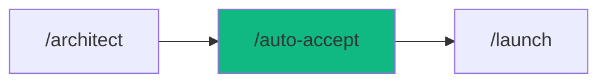

# /auto-accept-process - Autonomous Execution

$ARGUMENTS

---

## Purpose

```
User Request → PLAN.md (approve once) → Agent runs automatically → Done
```

**Instead of:** User having to approve each command, each file edit.

---

## 🤖 Meta-Agents Integration

| Phase | Agent | Action |
| ----- | ----- | ------ |
| **Pre-Execution** | `assessor` | Evaluate auto-execution risk level |
| **Pre-Execution** | `recovery` | Save state before auto-run |
| **During Execution** | `orchestrator` | Control parallel execution, retry |
| **On Failure** | `recovery` | Auto-rollback to saved state |
| **Post-Execution** | `learner` | Learn from execution patterns |

```
Flow:
PLAN.md approved → assessor.evaluate(risk)
       ↓
recovery.save() → orchestrator.execute(phases)
       ↓
each phase → auto-accept if in allowPatterns
       ↓
failure? → recovery.restore() → learner.log()
       ↓
success → learner.log(patterns)
```

---

## 📋 3-Phase Process

### Phase 1: Planning (1 Checkpoint)

```markdown
1. User: "Build feature X"
2. Agent: Create PLAN.md with full details
3. ⛔ **SINGLE CHECKPOINT**: User approves PLAN.md
4. User: "Approved" or "Proceed"
```

**PLAN.md must have:**

- [ ] Clear objectives
- [ ] List of files to create/edit
- [ ] Commands to run
- [ ] Verification steps

### Phase 2: Execution (Auto-Accept)

```markdown
// turbo-all ← Magic annotation

5. Agent creates files (no prompts)
6. Agent runs commands (auto-accept if safe)
7. Agent fixes errors if any
```

**Auto-Accept Conditions:**

| Command Type          | Auto-Accept?      |
| --------------------- | ----------------- |
| `npm run *`           | ✅ Yes            |
| `npm test`            | ✅ Yes            |
| `git status/diff/log` | ✅ Yes            |
| `node .agent/*`       | ✅ Yes            |
| `git push`            | ❌ No (deny list) |
| `rm -rf`              | ❌ Never          |

### Phase 3: Verification (Auto)

```markdown
8. Agent runs tests
9. Agent runs lint/security scan
10. Agent reports results
```

---

## 🔑 Magic Annotations

### In Workflow Files

```markdown
// turbo ← Auto-accept NEXT step
// turbo-all ← Auto-accept ALL steps in workflow
```

### In Code Blocks

````markdown
// @auto @safe ← Mark command as safe

```bash
npm run test
```
````

````

---

## ⚙️ Config: execution-policy.json

```json
{
  "autoAccept": {
    "enabled": true,
    "defaultMode": "prompt",
    "requiredAnnotations": ["auto", "safe"],

    "allowPatterns": [
      { "pattern": "^npm run [a-z0-9:-]+$", "type": "regex" },
      { "pattern": "node .agent/", "type": "prefix" },
      { "pattern": "git status", "type": "exact" }
    ],

    "denyPatterns": [
      { "pattern": "rm -rf", "type": "contains", "severity": "critical" },
      { "pattern": "git push", "type": "prefix", "severity": "high" }
    ]
  },

  "phaseGate": {
    "requirePlanApproval": true
  }
}
````

---

## 📝 Template: User Request Format

**To trigger auto-accept mode:**

```markdown
/autopilot Build [feature description]

Requirements:

1. [Detailed requirements]
2. [Constraints/preferences]

AUTO-APPROVE: After PLAN.md approval, proceed without asking.
```

**Or simply:**

```markdown
/build [feature] --auto
```

---

## 🔄 Flow Diagram

```
┌─────────────────┐
│  User Request   │
└────────┬────────┘
         ▼
┌─────────────────┐
│   PLAN.md       │
│   Generation    │
└────────┬────────┘
         ▼
┌─────────────────┐
│ ⛔ USER APPROVE │  ← Single checkpoint
└────────┬────────┘
         ▼
┌─────────────────────────────────────┐
│         AUTO-EXECUTION              │
│  ┌─────┐ ┌─────┐ ┌─────┐ ┌─────┐   │
│  │File │ │Cmd  │ │Test │ │Fix  │   │
│  │Edit │→│Run  │→│Run  │→│Errs │   │
│  └─────┘ └─────┘ └─────┘ └─────┘   │
│         (All // turbo-all)          │
└────────┬────────────────────────────┘
         ▼
┌─────────────────┐
│    REPORT       │
│    to User      │
└─────────────────┘
```

---

## ✅ Checklist to Enable Auto-Accept

1. [ ] Workflow file has `// turbo-all` annotation
2. [ ] Commands are in policy `allowPatterns`
3. [ ] User has approved PLAN.md
4. [ ] No commands in `denyPatterns`

---

## Examples

```
/auto-accept build authentication system
/auto-accept refactor user module --auto
/auto-accept create REST API with tests
/autopilot build dashboard --auto-approve
```

---

## 🚀 Real Example

**User:**

```
/autopilot Build authentication system with JWT

AUTO-APPROVE: After PLAN.md, proceed automatically.
```

**Agent Response:**

```
📋 PLAN.md created. Includes:
- auth.service.ts (JWT logic)
- auth.controller.ts (endpoints)
- auth.middleware.ts (guards)
- 12 test cases

⛔ Approve to proceed?
```

**User:**

```
Proceed
```

**Agent (Auto from here):**

```
✅ Created auth.service.ts
✅ Created auth.controller.ts
✅ Created auth.middleware.ts
✅ npm run test → 12/12 passed
✅ npm run lint → No errors
✅ Security scan → Clean

🎉 Authentication system complete!
```

---

## 📁 Related Files

| File                                    | Purpose              |
| --------------------------------------- | -------------------- |
| `.agent/config/execution-policy.json`   | Allow/deny rules     |
| `.agent/workflows/*.md`                 | Workflow definitions |
| `.agent/scripts-js/execution-policy.js` | Policy engine        |
| `.agent/scripts-js/workflow-engine.js`  | Workflow executor    |

---

## 🛡️ Safety Guarantees

1. **Plan Approval Required**: Won't run without approved PLAN.md
2. **Deny List Protected**: Dangerous commands always blocked
3. **Execution History**: All commands logged
4. **Rollback Ready**: Git commits before each phase

## Output Format

```markdown
## 🤖 Auto-Accept Execution Complete

### Execution Summary
| Phase | Status |
|-------|--------|
| Planning | ✅ PLAN.md approved |
| Execution | ✅ All commands auto-run |
| Verification | ✅ Tests passed |

### Next Steps
- [ ] Review final output
- [ ] Test user flows
- [ ] Deploy when ready
```

---

## 🔗 Workflow Chain



| After /auto-accept | Run | Purpose |
|-------------------|-----|---------|
| Need full orchestration | `/autopilot` | Multi-agent coordination |
| Ready to deploy | `/launch` | Production deployment |
| Issues found | `/diagnose` | Debug problems |

**Handoff:**
```markdown
✅ Auto-execution complete! All phases finished automatically.
```

---

_Version 1.0 | PikaKit_
