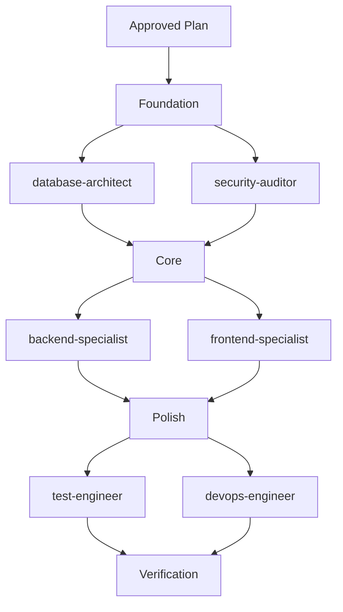
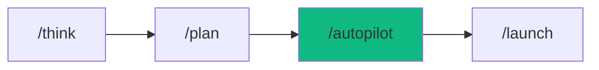

---
description: Autonomous multi-agent orchestration — coordinate 3+ specialist agents in parallel with automated verification, conflict resolution, and continuous execution.
chain: build-web-app
skills: [lifecycle-orchestrator, execution-reporter, context-engineering, project-planner, studio, problem-checker, idea-storm, design-system, test-architect, security-scanner, auto-learner]
agents: [orchestrator, assessor, recovery, critic, learner, project-planner, frontend-specialist, backend-specialist, database-architect, security-auditor, test-engineer, devops-engineer, mobile-developer]
---

# /autopilot - Multi-Agent Command Center

$ARGUMENTS

---

## Purpose

Coordinate 3+ specialist agents for complex multi-domain tasks — planning through parallel execution to verification. **Differs from `/build` (sequential new-app creation) and `/cook` (single-scope targeted tasks) by orchestrating multiple specialists simultaneously.** Uses all 5 meta-agents.

> **MINIMUM 3 SPECIALISTS.** Fewer than 3 → use direct delegation.

---

## 🤖 Meta-Agents Integration

| Phase | Agent | Action |
| ----- | ----- | ------ |
| **Pre-Flight** | `assessor` | Evaluate plan risk level and auto-learned context |
| **Execution** | `orchestrator` / `critic` | Coordinate parallel execution and resolve agent conflicts |
| **Safety** | `recovery` | Save state and recover from execution failures |
| **Post-Autopilot** | `learner` | Log execution metrics and success/failure patterns |

```
Flow:
orchestrator.init() → assessor.evaluate(plan)
       ↓
recovery.save(state) → execute phases in parallel
       ↓
conflict? → critic.arbitrate(safety > correctness > convenience)
       ↓
failure? → recovery.restore() → learner.log(failure)
       ↓
success → learner.log(patterns)
```

---

## 🔴 MANDATORY: Multi-Agent Orchestration Protocol

### Phase 1: Pre-flight & Auto-Learned Context

> **Rule 0.5-K:** Auto-learned pattern check.

1. Read `.agent/skills/auto-learned/patterns/` for past failures before proceeding.
2. Trigger `recovery` agent to run Checkpoint (`git commit -m "chore(checkpoint): pre-autopilot"`).

### Phase 2: Planning & Agent Selection

| Field | Value |
|-------|-------|
| **INPUT** | $ARGUMENTS (user request — feature/app description) |
| **OUTPUT** | PLAN.md with task breakdown, agent assignments, dependency graph |
| **AGENTS** | `project-planner`, `assessor` |
| **SKILLS** | `project-planner`, `idea-storm`, `context-engineering` |

// turbo — telemetry: phase-2-planning

1. Identify required domains → select agents:

| Domain | Agent |
|--------|-------|
| Backend/API | `nodejs-pro` |
| Frontend/UI | `react-pro` |
| Database | `data-modeler` |
| Security | `security-scanner` |
| Testing | `test-architect` |
| DevOps | `cicd-pipeline` |
| Mobile | `mobile-developer` |

2. Select minimum 3 agents
3. Create PLAN.md with assignments and parallel groups

> 🔴 Only `project-planner` during planning.

**⛔ CHECKPOINT: User approval required before Phase 3**

### Phase 3: Pre-Flight Safety

| Field | Value |
|-------|-------|
| **INPUT** | Approved PLAN.md |
| **OUTPUT** | Risk assessment + state checkpoint |
| **AGENTS** | `assessor`, `recovery` |
| **SKILLS** | `lifecycle-orchestrator` |

// turbo — telemetry: phase-3-safety

1. `assessor` evaluates plan risk:

| Risk Level | Criteria | Action |
|------------|----------|--------|
| **Low** | Read-only, npm scripts, lint | Auto-proceed |
| **Medium** | File creation, config changes | Proceed with checkpoint |
| **High** | DB migrations, multi-file refactor | Extra checkpoints |
| **Critical** | Auth changes, production deploy | Require explicit user confirmation |

2. `recovery` creates state checkpoint for all affected files

### Phase 4: Design System (UI Apps Only)

| Field | Value |
|-------|-------|
| **INPUT** | Approved PLAN.md (if app has UI) |
| **OUTPUT** | Design tokens (colors, typography, effects) |
| **AGENTS** | `react-pro`, `orchestrator` |
| **SKILLS** | `studio`, `design-system` |

> **Skip this phase** if the task has no UI component.

// turbo — telemetry: phase-4-studio-search
```bash
npx cross-env OTEL_SERVICE_NAME="workflow:autopilot" TRACE_ID="$TRACE_ID" node .agent/skills/studio/scripts/search.ts "<app_type> <style> <keywords>" --design-system -p "<Project Name>"
```

Apply design tokens (colors, typography, effects) before building components.

### Phase 5: Parallel Execution

| Field | Value |
|-------|-------|
| **INPUT** | Approved plan + design system tokens (if applicable) |
| **OUTPUT** | All project artifacts: routes, components, schemas, configs |
| **AGENTS** | `orchestrator`, `critic`, 3+ domain specialists per plan |
| **SKILLS** | Per agent specialization |

// turbo — telemetry: phase-5-execution



| Parallel Group | Agents | Runs After |
|----------------|--------|------------|
| **Foundation** | `data-modeler`, `security-scanner` | Plan approved |
| **Core** | `nodejs-pro`, `react-pro` | Foundation complete |
| **Polish** | `test-architect`, `cicd-pipeline` | Core complete |

**Agent Selection:** Match task type to specialists. Web → frontend + backend + test. API → backend + security + test. Full Stack → all core agents.

**Context Passing (MANDATORY):** Every sub-agent must receive: original request, decisions made, previous work summary, current plan link, and specific task.

> ⚠️ Invoking agent without context = wrong assumptions!

### Phase 6: Verification & Exit Gate

| Field | Value |
|-------|-------|
| **INPUT** | All artifacts from Phase 5 |
| **OUTPUT** | Verification report: tests, lint, types, security scan |
| **AGENTS** | `test-architect`, `learner` |
| **SKILLS** | `test-architect`, `problem-checker`, `security-scanner`, `auto-learner` |

// turbo — telemetry: phase-6-test
```bash
npx cross-env OTEL_SERVICE_NAME="workflow:autopilot" TRACE_ID="$TRACE_ID" npm test
```

// turbo — telemetry: phase-6-lint-typecheck
```bash
npx cross-env OTEL_SERVICE_NAME="workflow:autopilot" TRACE_ID="$TRACE_ID" npm run lint; npx cross-env OTEL_SERVICE_NAME="workflow:autopilot" TRACE_ID="$TRACE_ID" npx tsc --noEmit
```

**Exit Gate — ALL must pass:**

| Check | Target | How to Verify |
|-------|--------|---------------|
| Agent Count | ≥ 3 | Count unique agents invoked |
| IDE Problems | 0 | `@[current_problems]` check |
| Security Scan | Pass | `security-scanner` output |
| Lint/Types | 0 errors | ESLint + TypeScript |
| Tests | All passing | `npm test` output |
| Preview Running | Yes | `npm run dev` active |

**Exit Decision:** IDE problems > 0 → auto-fix or notify. Security failed → block. All deliverables complete → generate report.

---

## 🚀 Auto-Execution Policy

**CONTINUOUS EXECUTION** after plan approval. All commands auto-run. Only stop for: blocking errors, decision forks, plan completion.

---

## ⛔ MANDATORY: Problem Verification Before Completion

> **CRITICAL:** This check MUST be performed before any `notify_user` or task completion.

### Check @[current_problems]

```
1. Read @[current_problems] from IDE
2. If errors/warnings > 0:
   a. Auto-fix: imports, types, lint errors
   b. Re-check @[current_problems]
   c. If still > 0 → STOP → Notify user
3. If count = 0 → Proceed to completion
```

### Auto-Fixable

| Type | Fix |
|------|-----|
| Missing import | Add import statement |
| JSX namespace | Import from 'react' |
| Unused variable | Remove or prefix `_` |
| Lint errors | Run eslint --fix |
| Type mismatch | Fix type annotation |

> **Rule:** Never mark complete with errors in `@[current_problems]`.

---

## 🔙 Rollback & Recovery

If the Exit Gates fail and cannot be resolved automatically:
1. Restore to pre-autopilot checkpoint (`git checkout -- .` or `git stash pop`).
2. Log failure via `learner` meta-agent.
3. Notify user with failure context and recovery options.

---

## Output Format

```markdown
## 🎼 Autopilot Report

### Mission
[Original task summary]

### Agent Coordination

| Agent | Task | Duration | Status |
|-------|------|----------|--------|
| `project-planner` | Task breakdown | 2m | ✅ Complete |
| `data-modeler` | Schema design | 3m | ✅ Complete |
| `nodejs-pro` | API routes | 5m | ✅ Complete |
| `react-pro` | UI components | 7m | ✅ Complete |
| `test-architect` | E2E tests | 4m | ✅ Complete |

### Execution Metrics

| Metric | Target | Actual | Status |
|--------|--------|--------|--------|
| Agents invoked | ≥ 3 | [X] | ✅/❌ |
| IDE problems | 0 | [X] | ✅/❌ |
| Total execution | < 5min | [X]m | ✅/❌ |
| Auto-fix rate | > 85% | [X]% | ✅/❌ |

### Deliverables
- [x] PLAN.md created
- [x] Database schema
- [x] API endpoints ([X] routes)
- [x] UI components ([X] pages)
- [x] Tests ([X] cases passing)
- [x] Preview running at localhost:3000

### Next Steps
- [ ] Review generated code
- [ ] Test user flows
- [ ] `/launch` when ready to deploy
```

---

## Examples

```
/autopilot build a SaaS dashboard with analytics and auth
/autopilot create REST API with rate limiting and comprehensive tests
/autopilot refactor monolith to microservices architecture
/autopilot add real-time notifications to existing app
/autopilot security audit + fix vulnerabilities + add test coverage
```

---

## Key Principles

- **Minimum 3 agents** — autopilot means multi-specialist coordination, not single-agent delegation
- **Plan first, execute after** — no execution without approved PLAN.md
- **Parallel by default** — independent agents run simultaneously to reduce total time
- **Context passing mandatory** — every sub-agent receives full context (request, decisions, prior work)
- **Exit gate enforced** — IDE problems = 0, security scan passed, all tests green before completion

---

## 🔗 Workflow Chain

**Skills Loaded (11):**

- `lifecycle-orchestrator` - Multi-phase execution with checkpoint/restore
- `execution-reporter` - Agent routing and skill loading transparency
- `context-engineering` - Token optimization and agent architecture
- `project-planner` - Task breakdown and plan generation
- `studio` - Design system generation for UI apps
- `problem-checker` - IDE error detection and auto-fix
- `idea-storm` - Brainstorming and alternative analysis
- `design-system` - UI/UX standards and theme tokens
- `test-architect` - Testing strategy and suite generation
- `security-scanner` - Automated vulnerability detection
- `auto-learner` - Learning and logging execution patterns



| After /autopilot | Run | Purpose |
|-----------------|-----|---------|
| All phases complete | `/launch` | Deploy to production |
| Issues found | `/diagnose` | Root cause investigation |
| Need more features | `/build` | Enhance existing app |
| Need test coverage | `/validate` | Comprehensive test suite |

**Handoff to /launch:**

```markdown
✅ Autopilot complete! [X] agents finished, [Y] tests passing. Preview running at localhost:3000.
Run `/launch` when ready to deploy to production.
```
