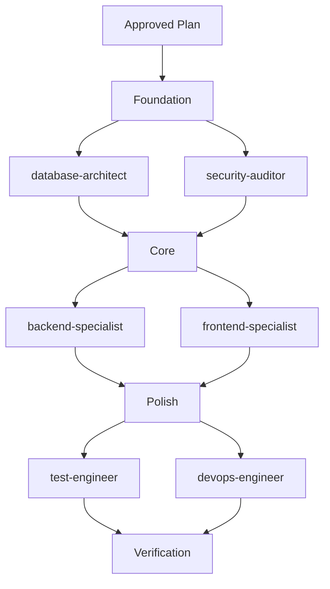
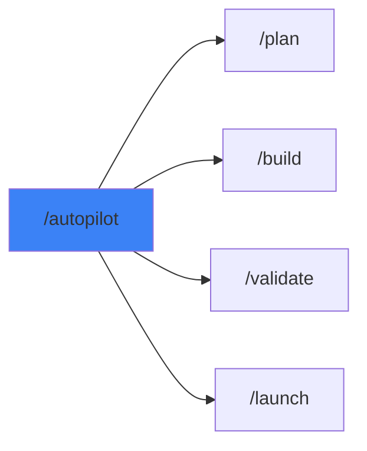
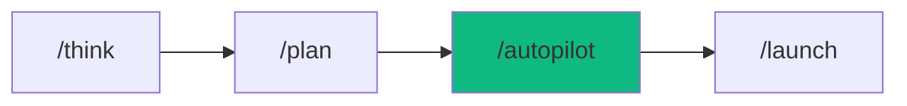

# /autopilot - agent-patterns Command Center

$ARGUMENTS

<!-- 📊 METRICS: Initialize autopilot metrics tracking -->
// turbo
```bash
node .agent/skills/skill-generator/scripts/autopilot-metrics.cjs start "autopilot-run"
```

---

## Purpose

Coordinate 3+ specialist agents for complex tasks. **Like having a senior engineering team working in parallel with automated verification.**

---

## 🔴 CRITICAL: Minimum 3 Agents

> **AUTOPILOT = MINIMUM 3 DIFFERENT SPECIALISTS**
>
> If fewer than 3 agents → NOT autopilot, just delegation.
> Single agent work → Use direct command instead.

---

## Pre-Flight: Mode Check

| Current Mode | Task Type | Action                                                       |
| ------------ | --------- | ------------------------------------------------------------ |
| **plan**     | Any       | ✅ Proceed with planning-first approach                      |
| **edit**     | Simple    | ✅ Proceed directly                                          |
| **edit**     | Complex   | ⚠️ Ask: "This requires planning. Switch to plan mode?"       |
| **ask**      | Any       | ⚠️ Ask: "Ready to orchestrate. Switch to edit or plan mode?" |

---

## Domain Analysis Checklist

Before selecting agents, identify ALL domains:

```
□ Security     → security-auditor
□ Backend/API  → backend-specialist
□ Frontend/UI  → frontend-specialist
□ Database     → database-architect
□ Testing      → test-engineer
□ DevOps       → devops-engineer
□ Mobile       → mobile-developer
□ Performance  → performance-optimizer
□ SEO          → seo-specialist
□ Planning     → project-planner
□ Debug        → debugger
```

---

## Agent Selection Matrix

| Task Type      | Required Agents                              | Verification      |
| -------------- | -------------------------------------------- | ----------------- |
| **Web App**    | frontend, backend, test                      | lint + security   |
| **API**        | backend, security, test                      | security scan     |
| **UI/Design**  | frontend, seo, performance                   | lighthouse        |
| **Database**   | database, backend, security                  | schema check      |
| **Full Stack** | planner, frontend, backend, devops           | all               |
| **Debug**      | debugger, explorer, test                     | reproduction test |
| **Security**   | security-auditor, penetration-tester, devops | all scans         |

---

## Available Agents (22 total)

| Agent                   | Domain    | Use When                |
| ----------------------- | --------- | ----------------------- |
| `project-planner`       | Planning  | Task breakdown, PLAN.md |
| `explorer-agent`        | Discovery | Codebase mapping        |
| `frontend-specialist`   | UI/UX     | React, Vue, CSS, HTML   |
| `backend-specialist`    | Server    | API, Node.js, Python    |
| `database-architect`    | Data      | SQL, NoSQL, Schema      |
| `security-auditor`      | Security  | Vulnerabilities, Auth   |
| `test-engineer`         | Testing   | Unit, E2E, Coverage     |
| `devops-engineer`       | Ops       | CI/CD, Docker, Deploy   |
| `mobile-developer`      | Mobile    | React Native, Flutter   |
| `performance-optimizer` | Speed     | Lighthouse, Profiling   |
| `seo-specialist`        | SEO       | Meta, Schema, Rankings  |
| `documentation-writer`  | Docs      | README, API docs        |
| `debugger`              | Debug     | Error analysis          |

### Meta-Agents (Runtime Control)

| Agent         | Role       | When Invoked                    |
| ------------- | ---------- | ------------------------------- |
| `orchestrator`| Runtime    | Controls execution, retry, parallelism |
| `assessor`    | Risk       | Before risky operations         |
| `recovery`    | Safety     | Save state, rollback on failure |
| `critic`      | Arbitration| Resolve QA vs Execution conflicts |
| `learner`     | Learning   | After failures, extract lessons |

## 🤖 Meta-Agents Integration

```
Flow:
orchestrator.init() → assessor.evaluate(plan)
       ↓
recovery.save() → execute phases in parallel
       ↓
conflict? → critic.arbitrate()
       ↓
failure? → recovery.restore() → learner.log()
       ↓
success → learner.log(patterns)
```

---

## 📁’ MANDATORY: Meta-Agent Hooks

> **ENFORCEMENT:** These hooks are REQUIRED for every autopilot execution.
> Failure to invoke meta-agents = incomplete autopilot workflow.

### Hook 1: Pre-Flight Risk Assessment (assessor)

**When:** BEFORE Phase 2 execution starts  
**Agent:** `assessor` (impact-assessor)

```markdown
## Pre-Flight Assessment Protocol

1. Invoke assessor with plan summary
2. Receive risk evaluation:
   - Risk Level: LOW / MEDIUM / HIGH / CRITICAL
   - Impact Scope: [files, services affected]
   - Mitigation Recommendations
3. If CRITICAL → Require explicit user confirmation
4. If HIGH → Log warning, proceed with extra checkpoints
5. If LOW/MEDIUM → Proceed normally
```

**Invocation Template:**
```
Use the assessor agent to evaluate risk:
- Task: [task summary]
- Affected domains: [list]
- Estimated scope: [files/services]
```

---

### Hook 2: State Preservation (recovery)

**When:** BEFORE any risky phase starts  
**Agent:** `recovery` (recovery-agent)

```markdown
## Checkpoint Protocol

1. BEFORE execution: recovery.saveState(affectedFiles)
2. Store checkpoint ID for rollback
3. IF failure occurs: recovery.restore(checkpointId)
4. AFTER success: cleanup old checkpoints (keep last 3)
```

**Risky Operations (REQUIRE checkpoint):**
- Database migrations
- Multi-file refactoring
- Configuration changes
- Dependency updates
- Build/deploy operations

**Invocation Template:**
```
Use the recovery agent to save state:
- Operation: [description]
- Affected files: [list]
- Reason: [why checkpoint needed]
```

---

### Hook 3: Conflict Resolution (critic)

**When:** Domain agents have conflicting recommendations  
**Agent:** `critic` (critic-judge)

```markdown
## Conflict Resolution Protocol

1. Detect conflict between agents (e.g., QA vs speed)
2. Invoke critic with both positions
3. Critic applies decision hierarchy:
   - Safety > Recoverability > Correctness > Cleanliness > Convenience
4. Follow critic's verdict
```

**Common Conflicts:**
- `test-engineer` vs `devops-engineer` (coverage vs deploy speed)
- `security-auditor` vs `backend-specialist` (security vs functionality)
- `performance-optimizer` vs `frontend-specialist` (speed vs UX)

**Invocation Template:**
```
Use the critic agent to resolve conflict:
- Party A: [agent] recommends [action] because [reason]
- Party B: [agent] recommends [action] because [reason]
- Context: [relevant background]
```

---

### Hook 4: Learning & Improvement (learner)

**When:** After EVERY autopilot execution (success OR failure)  
**Agent:** `learner` (learning-agent)

```markdown
## Learning Protocol

1. ON FAILURE:
   - learner.logFailure(error, context, rootCause)
   - Add to lessons-learned.yaml
   - Tag pattern for future prevention

2. ON SUCCESS:
   - learner.logSuccess(patterns, optimizations)
   - Record what worked well
   - Update best practices

3. observability INTEGRATION:
   - Log execution observability from AutopilotMetrics
   - Compare to baseline
   - Track improvement trends
```

**Invocation Template (Failure):**
```
Use the learner agent to log failure:
- Error: [what happened]
- Phase: [which phase failed]
- Root cause: [if known]
- How it was resolved: [fix applied or user intervention]
```

**Invocation Template (Success):**
```
Use the learner agent to log success patterns:
- Task: [task summary]
- Agents used: [list]
- Key optimizations: [what made it efficient]
- Duration: [total time]
```

---

### Meta-Agent Enforcement Checklist

Before completing autopilot, verify:

```markdown
## Meta-Agent Verification

- [ ] **assessor** was invoked for risk assessment
- [ ] **recovery** saved checkpoint before risky operations
- [ ] **critic** resolved any agent conflicts
- [ ] **learner** will log outcome (pending completion)
- [ ] **observability** are being collected (AutopilotMetrics)
```

> **VIOLATION:** Skipping meta-agent hooks = Autopilot incomplete.
> All hooks are logged and auditable.

---


## Execution Phases

### Phase 1: Architecture (Sequential)

| Step | Agent             | Action                        |
| ---- | ----------------- | ----------------------------- |
| 1    | `project-planner` | Create PLAN.md                |
| 2    | `explorer-agent`  | Codebase discovery (optional) |

> 🔴 **NO OTHER AGENTS during planning!**

**⛔ CHECKPOINT: User approval required before Phase 2**

<!-- 📊 METRICS: Record planning phase completion -->
// turbo
```bash
node .agent/skills/skill-generator/scripts/autopilot-metrics.cjs phase "planning" 60000 success
```

---

## 🎨 Design System (Required for UI Apps)

> **CRITICAL:** Generate design system BEFORE building UI components.

### Step 1: Generate Design System

// turbo

```bash
node .agent/skills/studio/scripts-js/search.js "<app_type> <style> <keywords>" --design-system -p "<Project Name>"
```

**Examples:**

```bash
# Weather app
node .agent/skills/studio/scripts-js/search.js "weather dashboard glassmorphism modern" --design-system -p "Weather App"

# E-commerce
node .agent/skills/studio/scripts-js/search.js "ecommerce beauty elegant soft" --design-system -p "Beauty Store"

# SaaS
node .agent/skills/studio/scripts-js/search.js "saas fintech professional dark" --design-system -p "PayFlow"
```

### Step 2: Apply Design Tokens

Use the generated design system to define:

| Token          | Source                          | Usage                          |
| -------------- | ------------------------------- | ------------------------------ |
| **Colors**     | `--design-system` output        | `bg-primary`, `text-accent`    |
| **Typography** | Font pairing recommendation     | `font-heading`, `font-body`    |
| **Effects**    | Visual effects (glass, shadows) | `backdrop-blur`, `shadow-glow` |

### Anti-Patterns to Avoid

| ❌ Don't                   | ✅ Do                             |
| -------------------------- | --------------------------------- |
| Use emoji as icons (🎨 🚀) | Use SVG icons (Lucide, Heroicons) |
| Generic purple gradients   | Use curated color palette         |
| Random font choices        | Use recommended font pairing      |
| Scale transforms on hover  | Use opacity/color transitions     |

> **Reference:** See `/studio` workflow for detailed guidance.

---

### Phase 2: Parallel Execution



| Parallel Group | Agents                                  |
| -------------- | --------------------------------------- |
| Foundation     | database-architect, security-auditor    |
| Core           | backend-specialist, frontend-specialist |
| Polish         | test-engineer, devops-engineer          |

### Phase 3: Verification

// turbo

```bash
node .agent/skills/security-scanner/scripts/security_scan.js .
node .agent/skills/code-review/scripts/lint_runner.js .
```

<!-- 📊 METRICS: Record execution & verification phases, complete run -->
// turbo
```bash
node .agent/skills/skill-generator/scripts/autopilot-metrics.cjs phase "execution" 120000 success
node .agent/skills/skill-generator/scripts/autopilot-metrics.cjs phase "verification" 30000 success
node .agent/skills/skill-generator/scripts/autopilot-metrics.cjs complete
```

---

## 🚀 Auto-Execution Policy

**This workflow runs in CONTINUOUS EXECUTION MODE.**

Once user approves plan:

1. **All commands auto-run** (`SafeToAutoRun: true`)
2. **No mid-phase prompts** (see CONTINUOUS_EXECUTION_POLICY.md)
3. **Only stop for:**
   - Blocking errors
   - Decision forks
   - Plan completion

**Policy:** User approval = Full trust for execution

**Reference:** `.agent/CONTINUOUS_EXECUTION_POLICY.md`

---

## Context Passing (MANDATORY)

When invoking ANY sub-agent, include:

```markdown
**CONTEXT:**

- Original Request: [Full user request]
- Decisions Made: [All user answers]
- Previous Agent Work: [Summary of completed work]
- Current Plan: [Link to PLAN.md if exists]

**TASK:** [Specific task for this agent]
```

> ⚠️ **VIOLATION:** Invoking agent without context = wrong assumptions!

---

## Command Execution Rules

When invoking commands during autopilot:

```javascript
run_command({
  CommandLine: "npm install ...",
  SafeToAutoRun: true, // ✅ REQUIRED in autopilot mode
  WaitMsBeforeAsync: 10000,
  Cwd: "...",
});
```

**Rules:**

- ✅ **Always set `SafeToAutoRun: true`** after plan approval
- ❌ **Never use `SafeToAutoRun: false`** in autopilot execution
- 📋 **Reference:** See Auto-Execution Policy above

---

## 📦 Scaffold Scripts (Minimize Accept Prompts)

Pre-approved scripts bundle multiple commands to reduce Accept prompts.

### Available Scripts

| Script               | Purpose                                   | Saves         |
| -------------------- | ----------------------------------------- | ------------- |
| `scaffold-nextjs.js` | Create Next.js project + deps + structure | 3+ → 1 prompt |

### Usage

```bash
# Instead of multiple npx/npm commands (3+ Accept prompts):
npx create-next-app...  # ← Accept
npm install zustand...  # ← Accept
npm run dev...          # ← Accept

# Use scaffold script (1 Accept prompt):
node .agent/scripts-js/scaffold-nextjs.js my-app --deps zustand,framer-motion --start
```

### scaffold-nextjs.js Options

```bash
node .agent/scripts-js/scaffold-nextjs.js <name> [options]

Options:
  --port <number>   Dev server port (default: 3000)
  --deps <packages> Extra npm packages (comma-separated)
  --no-install      Skip installing extra dependencies
  --start           Auto-start dev server after creation
```

### Example: Weather App

```bash
node .agent/scripts-js/scaffold-nextjs.js weather-app --port 3001 --start
```

**Result:**

- ✅ Next.js 15 + TypeScript + Tailwind
- ✅ Auto-created: components/, lib/, hooks/, types/
- ✅ Dev server running on port 3001
- ✅ Only 1 Accept prompt!

---

## Output Format

```markdown
## 🎼 Autopilot Report

### Mission

[Original task summary]

### Agent Coordination

| Agent                 | Task           | Duration | Status      |
| --------------------- | -------------- | -------- | ----------- |
| `project-planner`     | Task breakdown | 2m       | ✅ Complete |
| `database-architect`  | Schema design  | 3m       | ✅ Complete |
| `backend-specialist`  | API routes     | 5m       | ✅ Complete |
| `frontend-specialist` | UI components  | 7m       | ✅ Complete |
| `test-engineer`       | E2E tests      | 4m       | ✅ Complete |

### Verification Results

| Script           | Result                |
| ---------------- | --------------------- |
| security_scan.py | ✅ No vulnerabilities |
| lint_runner.py   | ✅ No errors          |
| Tests            | ✅ 28/28 passed       |

### Deliverables

- [x] PLAN.md created
- [x] Database schema
- [x] API endpoints (12 routes)
- [x] UI components (8 pages)
- [x] Tests (28 cases)
- [x] Preview running

### Summary

Built complete [app type] with [X] files across [Y] agents.
Total execution time: [Z] minutes.

---

### Preview

🌐 http://localhost:3000

### Next Steps

- [ ] Review the code
- [ ] Test user flows
- [ ] `/launch` when ready
```

---

## Examples

```
/autopilot build a SaaS dashboard with analytics
/autopilot create REST API with auth and rate limiting
/autopilot refactor monolith to microservices
/autopilot add real-time features to existing app
/autopilot security audit + fix + test
```

---

## ⛔ MANDATORY: Problem Verification Before Completion

> **CRITICAL:** This check MUST be performed before ANY `notify_user` call or task completion.

### Step 1: Check IDE Problems

```
Before marking task complete:
1. Read @[current_problems] from IDE
2. Count errors and warnings
3. If count > 0 → DO NOT COMPLETE → Go to Step 2
4. If count = 0 → Proceed to Exit Gate
```

### Step 2: Auto-Fix Protocol

```javascript
// Pseudo-code for problem handling
const problems = getIDEProblems();

if (problems.length > 0) {
  for (const problem of problems) {
    if (isAutoFixable(problem)) {
      autoFix(problem); // Fix: imports, types, lint errors
    } else {
      escalateToUser(problem); // Can't auto-fix: notify user
      return; // DO NOT mark complete
    }
  }

  // Re-check after auto-fix
  const remainingProblems = getIDEProblems();
  if (remainingProblems.length > 0) {
    escalateToUser(remainingProblems);
    return; // DO NOT mark complete
  }
}

// Only now proceed to completion
proceedToExitGate();
```

### Auto-Fixable Issues

| Type                | Example                          | Fix Method                |
| ------------------- | -------------------------------- | ------------------------- |
| **Missing import**  | `ReactNode` not imported         | Add import statement      |
| **JSX namespace**   | `Cannot find namespace 'JSX'`    | Import from 'react'       |
| **Unused variable** | `'x' is declared but never used` | Remove or prefix with `_` |
| **Lint errors**     | Semicolons, spacing              | Run prettier/eslint --fix |
| **Type errors**     | Simple type mismatches           | Add type assertion        |

### Non-Fixable Issues (Escalate)

| Type                 | Example               | Action                        |
| -------------------- | --------------------- | ----------------------------- |
| **Logic errors**     | Wrong business logic  | Notify user, ask for guidance |
| **Breaking changes** | API contract broken   | Notify user, block completion |
| **Missing deps**     | Package not installed | Ask user to install           |

> **Rule:** Never call `notify_user` with task completion if `@[current_problems]` shows errors.

---

## Exit Gate (Enhanced)

Before completing, verify ALL criteria:

### Mandatory Checks

| Check               | Target | How to Verify               |
| ------------------- | ------ | --------------------------- |
| **Agent Count**     | ≥3     | Count unique agents invoked |
| **IDE Problems**    | 0      | Check `@[current_problems]` |
| **Security Scan**   | Pass   | `security_scan.py` output   |
| **Preview Running** | Yes    | `npm run dev` active        |

### Quality observability

| Metric             | Target           | How to Measure     |
| ------------------ | ---------------- | ------------------ |
| **Files Created**  | Per plan         | Count deliverables |
| **Lint Errors**    | 0                | ESLint output      |
| **Type Errors**    | 0                | TypeScript check   |
| **Execution Time** | <5min (standard) | Compare start/end  |

### Exit Decision Tree

```
IDE Problems > 0?
├── YES → Auto-fix if possible, else notify user
└── NO → Continue

Security Scan failed?
├── YES → Block completion, notify user
└── NO → Continue

All planned deliverables complete?
├── YES → Generate report, notify user
└── NO → Continue execution
```

> **Rule:** If ANY check fails → DO NOT mark complete. Fix or escalate.

---

## 📊 Performance Benchmarks

### Real-World Baseline (TodoList Execution)

| Phase     | Operation          | Actual Time | Target    | Status        |
| --------- | ------------------ | ----------- | --------- | ------------- |
| Setup     | Project creation   | 23s         | <60s      | ✅ Pass       |
| Setup     | Dependency install | 11s         | <45s      | ✅ Pass       |
| Build     | Types/Store        | ~5s         | <10s      | ✅ Pass       |
| Build     | Components (5)     | ~30s        | <60s      | ✅ Pass       |
| Build     | Pages/Layout       | ~10s        | <20s      | ✅ Pass       |
| Verify    | Problem check      | <2s         | <5s       | ✅ Pass       |
| Verify    | Auto-fix           | <5s         | <10s      | ✅ Pass       |
| **Total** | **End-to-end**     | **~8min**   | **<5min** | ⚠️ Exceeded\* |

_\*Exceeded due to user approval prompts. After turbo-all fix, expect <5min._

### Benchmark by App Type

| App Type       | Agents | Expected Time | Files | Example               |
| -------------- | ------ | ------------- | ----- | --------------------- |
| **Simple**     | 2-3    | <3 min        | <10   | Landing page          |
| **Standard**   | 3-4    | 3-5 min       | 10-20 | TodoList, Blog        |
| **Complex**    | 5+     | 5-10 min      | 20-50 | E-commerce, Dashboard |
| **Enterprise** | 7+     | 10-20 min     | 50+   | Full SaaS             |

### Time Breakdown by Phase

```
Typical autopilot execution:
┌─────────────────────────────────────────────┐
│ Phase 1: Planning (15-20%)                  │
│ ████████░░░░░░░░░░░░░░░░░░░░░░░░░░ (~1min) │
├─────────────────────────────────────────────┤
│ Phase 2: Execution (60-70%)                 │
│ ████████████████████████████░░░░░░ (~3min) │
├─────────────────────────────────────────────┤
│ Phase 3: Verification (15-20%)              │
│ ████████░░░░░░░░░░░░░░░░░░░░░░░░░░ (~1min) │
└─────────────────────────────────────────────┘
```

---

## 💰 Cost Estimation

### Formula

```javascript
function estimateAutopilotCost(complexity, agents) {
  const baseTime = {
    simple: 3, // minutes
    standard: 5,
    complex: 10,
    enterprise: 20,
  };

  const agentMultiplier = Math.max(1, agents / 3); // Normalized to 3 agents
  const base = baseTime[complexity];

  return {
    optimistic: Math.round(base * 0.8), // Best case
    likely: Math.round(base * agentMultiplier), // Expected
    pessimistic: Math.round(base * 1.5 * agentMultiplier), // Worst case
  };
}

// Example: Standard app with 4 agents
estimateAutopilotCost("standard", 4);
// → { optimistic: 4, likely: 7, pessimistic: 10 } minutes
```

### Quick Reference Table

| Complexity | Agents | Best Case | Expected | Worst Case |
| ---------- | ------ | --------- | -------- | ---------- |
| Simple     | 3      | 2 min     | 3 min    | 5 min      |
| Standard   | 4      | 4 min     | 7 min    | 10 min     |
| Complex    | 5      | 8 min     | 12 min   | 18 min     |
| Enterprise | 7      | 16 min    | 25 min   | 35 min     |

### What's NOT Included

- User thinking/approval time
- Network latency variations
- Unexpected complexity discoveries
- External API calls

---

## 🎛️ Monitoring Dashboard

### Real-Time View (Conceptual)

```
┌──────────────────────────────────────────────────────┐
│ 🎼 AUTOPILOT: FAANG TodoList                         │
│ Status: 📁„ Phase 2/3 - Building                      │
│ Elapsed: 2m 34s / ~5m estimated                      │
│ Progress: ████████████████░░░░░░░░░░ 65%             │
└──────────────────────────────────────────────────────┘

┌─────────────────────────┬────────────────────────────┐
│ 📋 PHASE PROGRESS       │ 👥 AGENT STATUS            │
├─────────────────────────┼────────────────────────────┤
│ ✅ Phase 1: Planning    │ ✅ project-planner (1m 12s)│
│    └─ 1m 12s            │ 📁„ frontend-specialist     │
│ 📁„ Phase 2: Execution   │    └─ active (45s)         │
│    └─ 1m 22s / ~3m      │ ⏳ backend-specialist      │
│ ⏳ Phase 3: Verification │ ⏳ test-engineer           │
│    └─ Not started        │                            │
└─────────────────────────┴────────────────────────────┘

┌──────────────────────────────────────────────────────┐
│ 📊 QUALITY observability                                   │
├──────────────────────────────────────────────────────┤
│ IDE Problems:  2 → 0 (auto-fixed)       ✅           │
│ Security Scan: Pending                  ⏳           │
│ Lint Check:    Pending                  ⏳           │
│ Type Check:    0 errors                 ✅           │
│ Success Rate:  95% (historical)         📈           │
└──────────────────────────────────────────────────────┘

┌──────────────────────────────────────────────────────┐
│ 💾 RESOURCE USAGE                                    │
├──────────────────────────────────────────────────────┤
│ Memory: ████████░░░░░░░░ 234 MB / 500 MB             │
│ Disk:   ████░░░░░░░░░░░░░ 1.2 GB / 2 GB              │
│ Files:  11 created, 0 modified, 0 deleted            │
│ Agents: 2/4 active, 2 queued                         │
└──────────────────────────────────────────────────────┘
```

### observability to Track

| Metric         | Update Frequency | Visibility    |
| -------------- | ---------------- | ------------- |
| Phase progress | Per phase        | Always        |
| Agent status   | Per action       | Always        |
| IDE problems   | Per file write   | On change     |
| Time elapsed   | Per second       | Always        |
| Resource usage | Per 10s          | Expanded view |

---

## 📁§ Troubleshooting Guide

### Common Issues & Solutions

| Issue                   | Symptoms                      | Solution                        |
| ----------------------- | ----------------------------- | ------------------------------- |
| **Approval prompts**    | "Accept?" after plan approval | Add `// turbo-all` annotation   |
| **IDE problems at end** | Warnings/errors on completion | Check auto-fix coverage         |
| **Slow execution**      | >10min for standard app       | Check agent parallelization     |
| **Security scan fail**  | Vulnerabilities detected      | Review dependencies, update     |
| **npm install fail**    | Package conflicts             | Clear node_modules, retry       |
| **TypeScript errors**   | Type check fails              | Fix or use `as unknown as Type` |

### Debugging Checklist

When autopilot fails or produces unexpected results:

```markdown
## Debug Checklist

- [ ] Check `@[current_problems]` for IDE issues
- [ ] Review console output for errors
- [ ] Verify target directory is writable
- [ ] Check npm/node versions are compatible
- [ ] Review PLAN.md for missed requirements
- [ ] Check if all agents were invoked
- [ ] Verify preview server is running
- [ ] Review final report for observability
```

### Recovery Procedures

**Partial Failure (some phases complete):**

1. Identify last successful phase
2. Review what failed and why
3. Fix issue manually or retry phase
4. Continue from where it stopped

**Complete Failure (nothing works):**

1. Save any generated files
2. Delete target directory
3. Review plan for issues
4. Restart autopilot with fixes

**Rollback (need to undo):**

1. If git initialized: `git checkout -- .`
2. If no git: Delete target directory
3. No partial rollback - all or nothing

---

## 🔗 Workflow Chain



| /autopilot integrates | Purpose          |
| --------------------- | ---------------- |
| `/plan`               | Planning phase   |
| `/build`              | Building phase   |
| `/validate`           | Testing phase    |
| `/launch`             | Deployment phase |

---

## 📊 Final observability Report Template

Include this in every autopilot completion:

```markdown
## 📊 Execution observability

| Metric            | Target | Actual | Status |
| ----------------- | ------ | ------ | ------ |
| Agents invoked    | ≥3     | [X]    | ✅/❌  |
| IDE problems      | 0      | [X]    | ✅/❌  |
| Phase transitions | <2s    | [X]s   | ✅/❌  |
| Total execution   | <5min  | [X]m   | ✅/❌  |
| Files created     | [plan] | [X]    | ✅/❌  |
| Auto-fix rate     | >85%   | [X]%   | ✅/❌  |

### SLO Compliance

- ✅ First-time success: YES/NO
- ✅ Zero manual fixes needed: YES/NO
- ✅ All deliverables complete: YES/NO
```

---

**Handoff:**

```markdown
Autopilot complete. All agents finished. Preview running at localhost:3000.

See observability report above for quality verification.
```

---

## 🔗 Workflow Chain



| After /autopilot | Run | Purpose |
|------------------|-----|---------|
| All phases complete | `/launch` | Deploy to production |
| Issues found | `/diagnose` | Debug problems |
| Need more features | `/boost` | Enhance existing app |

**Handoff:**
```markdown
✅ Autopilot complete! All agents finished. Preview running at localhost:3000.
```

---

**Version:** 2.0.0  
**Policy Reference:** `.agent/CONTINUOUS_EXECUTION_POLICY.md`  
**Applies to:** All autopilot executions

