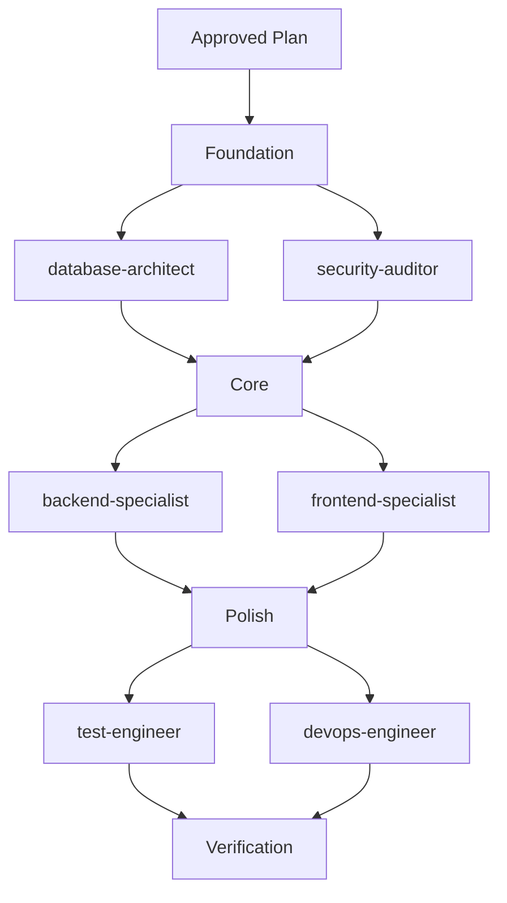
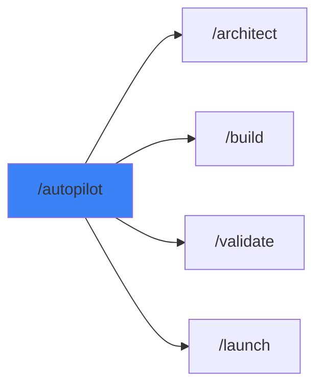

# /autopilot - Multi-Agent Command Center

$ARGUMENTS

---

## Purpose

Coordinate 3+ specialist agents for complex tasks. **Like having a senior engineering team working in parallel with automated verification.**

---

## 🔴 CRITICAL: Minimum 3 Agents

> **AUTOPILOT = MINIMUM 3 DIFFERENT SPECIALISTS**
> 
> If fewer than 3 agents → NOT autopilot, just delegation.
> Single agent work → Use direct command instead.

---

## Pre-Flight: Mode Check

| Current Mode | Task Type | Action |
|--------------|-----------|--------|
| **plan** | Any | ✅ Proceed with planning-first approach |
| **edit** | Simple | ✅ Proceed directly |
| **edit** | Complex | ⚠️ Ask: "This requires planning. Switch to plan mode?" |
| **ask** | Any | ⚠️ Ask: "Ready to orchestrate. Switch to edit or plan mode?" |

---

## Domain Analysis Checklist

Before selecting agents, identify ALL domains:

```
□ Security     → security-auditor
□ Backend/API  → backend-specialist
□ Frontend/UI  → frontend-specialist
□ Database     → database-architect
□ Testing      → test-engineer
□ DevOps       → devops-engineer
□ Mobile       → mobile-developer
□ Performance  → performance-optimizer
□ SEO          → seo-specialist
□ Planning     → project-planner
□ Debug        → debugger
```

---

## Agent Selection Matrix

| Task Type | Required Agents | Verification |
|-----------|-----------------|--------------| 
| **Web App** | frontend, backend, test | lint + security |
| **API** | backend, security, test | security scan |
| **UI/Design** | frontend, seo, performance | lighthouse |
| **Database** | database, backend, security | schema check |
| **Full Stack** | planner, frontend, backend, devops | all |
| **Debug** | debugger, explorer, test | reproduction test |
| **Security** | security-auditor, penetration-tester, devops | all scans |

---

## Available Agents (17 total)

| Agent | Domain | Use When |
|-------|--------|----------|
| `project-planner` | Planning | Task breakdown, PLAN.md |
| `explorer-agent` | Discovery | Codebase mapping |
| `frontend-specialist` | UI/UX | React, Vue, CSS, HTML |
| `backend-specialist` | Server | API, Node.js, Python |
| `database-architect` | Data | SQL, NoSQL, Schema |
| `security-auditor` | Security | Vulnerabilities, Auth |
| `test-engineer` | Testing | Unit, E2E, Coverage |
| `devops-engineer` | Ops | CI/CD, Docker, Deploy |
| `mobile-developer` | Mobile | React Native, Flutter |
| `performance-optimizer` | Speed | Lighthouse, Profiling |
| `seo-specialist` | SEO | Meta, Schema, Rankings |
| `documentation-writer` | Docs | README, API docs |
| `debugger` | Debug | Error analysis |

---

## Execution Phases

### Phase 1: Architecture (Sequential)

| Step | Agent | Action |
|------|-------|--------|
| 1 | `project-planner` | Create PLAN.md |
| 2 | `explorer-agent` | Codebase discovery (optional) |

> 🔴 **NO OTHER AGENTS during planning!**

**⛔ CHECKPOINT: User approval required before Phase 2**

### Phase 2: Parallel Execution



| Parallel Group | Agents |
|----------------|--------|
| Foundation | database-architect, security-auditor |
| Core | backend-specialist, frontend-specialist |
| Polish | test-engineer, devops-engineer |

### Phase 3: Verification
// turbo
```bash
python .agent/skills/SecurityScanner/scripts/security_scan.py .
python .agent/skills/CodeQuality/scripts/lint_runner.py .
```

---

## Context Passing (MANDATORY)

When invoking ANY sub-agent, include:

```markdown
**CONTEXT:**
- Original Request: [Full user request]
- Decisions Made: [All user answers]
- Previous Agent Work: [Summary of completed work]
- Current Plan: [Link to PLAN.md if exists]

**TASK:** [Specific task for this agent]
```

> ⚠️ **VIOLATION:** Invoking agent without context = wrong assumptions!

---

## Output Format

```markdown
## 🎼 Autopilot Report

### Mission
[Original task summary]

### Agent Coordination

| Agent | Task | Duration | Status |
|-------|------|----------|--------|
| `project-planner` | Task breakdown | 2m | ✅ Complete |
| `database-architect` | Schema design | 3m | ✅ Complete |
| `backend-specialist` | API routes | 5m | ✅ Complete |
| `frontend-specialist` | UI components | 7m | ✅ Complete |
| `test-engineer` | E2E tests | 4m | ✅ Complete |

### Verification Results

| Script | Result |
|--------|--------|
| security_scan.py | ✅ No vulnerabilities |
| lint_runner.py | ✅ No errors |
| Tests | ✅ 28/28 passed |

### Deliverables

- [x] PLAN.md created
- [x] Database schema
- [x] API endpoints (12 routes)
- [x] UI components (8 pages)
- [x] Tests (28 cases)
- [x] Preview running

### Summary
Built complete [app type] with [X] files across [Y] agents.
Total execution time: [Z] minutes.

---

### Preview
🌐 http://localhost:3000

### Next Steps
- [ ] Review the code
- [ ] Test user flows
- [ ] `/launch` when ready
```

---

## Examples

```
/autopilot build a SaaS dashboard with analytics
/autopilot create REST API with auth and rate limiting
/autopilot refactor monolith to microservices
/autopilot add real-time features to existing app
/autopilot security audit + fix + test
```

---

## Exit Gate

Before completing, verify:

- [ ] **Agent Count:** invoked_agents >= 3
- [ ] **Scripts Executed:** At least security_scan.py ran
- [ ] **Report Generated:** All agents listed with status
- [ ] **Deliverables:** All planned items completed

> If any check fails → DO NOT mark complete. Invoke more agents or run scripts.

---

## 🔗 Workflow Chain



| /autopilot integrates | Purpose |
|-----------------------|---------|
| `/architect` | Planning phase |
| `/build` | Building phase |
| `/validate` | Testing phase |
| `/launch` | Deployment phase |

**Handoff:**
```markdown
Autopilot complete. All agents finished. Preview running.
```
