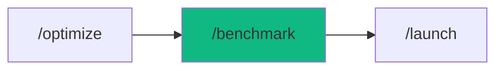

# /benchmark - Performance Load Testing

$ARGUMENTS

---

## Purpose

Run realistic load tests against APIs and web applications to measure throughput, latency percentiles, and error rates under pressure. **Differs from `/optimize` (which fixes performance issues) by focusing exclusively on measurement and bottleneck identification.** Uses `backend-specialist` for test script generation and analysis, with `perf-optimizer` for benchmark methodology and `observability` for metrics collection.

---

## 🤖 Meta-Agents Integration

| Phase | Agent | Action |
| ----- | ----- | ------ |
| **Pre-Test** | `recovery` | Save current performance baseline |
| **Post-Test** | `learner` | Learn bottleneck patterns for reuse |
| **Analysis** | `assessor` | Evaluate production-readiness risk (go/no-go) |

```
Flow:
recovery.save(baseline) → generate test script
       ↓
execute load test → collect metrics
       ↓
analyze results → learner.log(bottlenecks)
       ↓
assessor.evaluate(production_risk) → go/no-go decision
```

---

## 🔴 MANDATORY: Load Testing Protocol

### Phase 1: Test Configuration

| Field | Value |
|-------|-------|
| **INPUT** | $ARGUMENTS (target description — API URL, user count, scenario type) |
| **OUTPUT** | Load test script (`benchmark/load-test.js`) with scenarios and thresholds |
| **AGENTS** | `backend-specialist` |
| **SKILLS** | `perf-optimizer` |

1. Identify target endpoints and user scenarios
2. Select test type based on goal:

| Test Type | Pattern | Duration | Use When |
|-----------|---------|----------|----------|
| **Smoke** | 1-5 users | 1 min | Verify test works |
| **Load** | Ramp 100 → 1K → 5K → 10K | 16 min | Standard benchmark |
| **Spike** | 100 → 10K (1 min) | 5 min | Burst handling |
| **Soak** | 1K sustained | 3 hours | Memory leak detection |
| **Stress** | Increment until failure | Variable | Find breaking point |

3. Generate k6 or Artillery script with:
   - Realistic user scenarios (browse, search, checkout)
   - Staged ramp-up pattern
   - Performance thresholds (p95 < 200ms, error rate < 1%)
   - Think time between requests

### Phase 2: Test Execution

| Field | Value |
|-------|-------|
| **INPUT** | Load test script from Phase 1 |
| **OUTPUT** | Raw test results (JSON + console output) |
| **AGENTS** | `backend-specialist` |
| **SKILLS** | `perf-optimizer` |

1. Save current performance baseline via `recovery`
2. Execute load test with real-time monitoring

// turbo
```bash
npx k6 run benchmark/load-test.js --out json=benchmark/results.json
```

3. Monitor during execution:
   - Active virtual users
   - Request rate (rps)
   - Error count
   - Response time distribution

### Phase 3: Analysis & Reporting

| Field | Value |
|-------|-------|
| **INPUT** | Raw test results from Phase 2 |
| **OUTPUT** | Performance report with bottleneck analysis and recommendations |
| **AGENTS** | `backend-specialist` |
| **SKILLS** | `perf-optimizer`, `observability` |

1. Parse results and calculate metrics:

| Metric | Target | Description |
|--------|--------|-------------|
| p50 Latency | < 100ms | Median response time |
| p95 Latency | < 200ms | 95th percentile |
| p99 Latency | < 500ms | 99th percentile |
| Error Rate | < 1% | Failed requests percentage |
| Throughput | 1,000+ rps | Requests per second |
| Max Users | 10,000+ | Concurrent user capacity |

2. Identify bottlenecks:

| Symptom | Likely Cause | Recommended Fix |
|---------|-------------|-----------------|
| Timeouts at load | Connection pool exhausted | Increase pool size |
| Memory spikes | Memory leak | Fix resource cleanup |
| High latency | Slow queries | Add indexes, caching |
| 500 errors | Resource limits | Scale horizontally |
| CPU > 80% | Compute-bound | Optimize algorithms |

3. Generate go/no-go recommendation via `assessor`:
   - **GO:** All targets met → ready for production
   - **NO-GO:** Critical metrics failed → fix before deploy

4. Log patterns via `learner` for future benchmarks

---

## ⛔ MANDATORY: Problem Verification Before Completion

> **CRITICAL:** This check MUST be performed before any `notify_user` or task completion.

### Check @[current_problems]

```
1. Read @[current_problems] from IDE
2. If errors/warnings > 0:
   a. Auto-fix: imports, types, lint errors
   b. Re-check @[current_problems]
   c. If still > 0 → STOP → Notify user
3. If count = 0 → Proceed to completion
```

### Auto-Fixable

| Type | Fix |
|------|-----|
| Missing import | Add import statement |
| Unused variable | Remove or prefix `_` |
| Lint errors | Run eslint --fix |

> **Rule:** Never mark complete with errors in `@[current_problems]`.

---

## Output Format

```markdown
## 📊 Benchmark Results

### Performance Summary

| Metric | Value | Target | Status |
|--------|-------|--------|--------|
| p50 Latency | [X]ms | < 100ms | ✅/❌ |
| p95 Latency | [X]ms | < 200ms | ✅/❌ |
| p99 Latency | [X]ms | < 500ms | ✅/❌ |
| Error Rate | [X]% | < 1% | ✅/❌ |
| Throughput | [X] rps | 1000+ | ✅/❌ |
| Max Users | [X] | 10,000+ | ✅/❌ |

### Bottlenecks Detected

| Component | Issue | Severity | Fix |
|-----------|-------|----------|-----|
| Database | Pool exhausted (20/20) | 🔴 High | Increase to 50 |
| Memory | Usage at 90% | 🟡 Medium | Profile allocations |

### Production Readiness

| Decision | Reason |
|----------|--------|
| ✅ GO / ❌ NO-GO | [Summary of critical metrics] |

### Next Steps

- [ ] Apply bottleneck fixes
- [ ] Re-run benchmark after optimizations
- [ ] Deploy to production: `/launch`
```

---

## Examples

```
/benchmark my-api 10K concurrent users
/benchmark production checkout flow with spike test
/benchmark REST API soak test for 3 hours at 1K users
/benchmark stress test to find breaking point
/benchmark compare before/after optimization results
```

---

## Key Principles

- **Realistic scenarios** — test actual user journeys, not synthetic endpoints
- **Gradual ramp-up** — staged load increase reveals bottlenecks at each tier
- **Multiple runs** — single runs are noisy, average 3+ runs for consistency
- **Monitor infrastructure** — observe CPU, memory, disk I/O, network during test
- **Go/no-go decision** — every benchmark ends with a clear production readiness verdict

---

## 🔗 Workflow Chain

**Skills Loaded (2):**

- `perf-optimizer` - k6/Artillery load testing, Core Web Vitals, performance profiling
- `observability` - Metrics collection, monitoring, instrumentation



| After /benchmark | Run | Purpose |
|-----------------|-----|---------|
| Bottlenecks found | `/optimize` | Fix performance issues, then re-benchmark |
| All targets met | `/launch` | Deploy to production |
| Need ongoing monitoring | `/monitor` | Setup production observability |

**Handoff to /optimize:**

```markdown
📊 Benchmark complete! p95=[X]ms, error rate=[X]%, throughput=[X]rps.
Bottlenecks: [list]. Run `/optimize` to fix, then re-benchmark.
```
