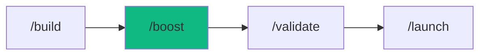

# /boost - Feature Enhancer

$ARGUMENTS

---

## Purpose

Add features or upgrades to existing applications with dependency-aware impact analysis — analyzing current architecture before making changes to prevent conflicts and regressions. **Differs from `/build` (creates new apps) and `/cook` (quick task execution) by focusing on incremental enhancement of existing codebases with full impact assessment.** Uses `backend-specialist` or `frontend-specialist` for implementation (based on change domain), with `assessor` for risk evaluation and `recovery` for safe rollback.

---

## 🤖 Meta-Agents Integration

| Phase | Agent | Action |
| ----- | ----- | ------ |
| **Pre-Change** | `assessor` | Evaluate impact and risk level |
| **Pre-Change** | `recovery` | Save affected files state |
| **On Conflict** | `critic` | Resolve breaking change decisions |
| **On Failure** | `recovery` | Restore to pre-boost state |
| **Post-Boost** | `learner` | Log patterns for future boosts |

```
Flow:
assessor.evaluate(change_scope) → risk level?
   ↓
CRITICAL → require user approval → recovery.save()
MEDIUM → recovery.save() → proceed
LOW → proceed directly
   ↓
execute boost → test → success?
   ↓ NO
recovery.restore() → learner.log(failure)
   ↓ YES
learner.log(patterns)
```

---

## 🔴 MANDATORY: Feature Enhancement Protocol

### Phase 1: Impact Analysis

| Field | Value |
|-------|-------|
| **INPUT** | $ARGUMENTS (feature description — what to add/change) |
| **OUTPUT** | Impact report: affected files, dependencies, risk level, change plan |
| **AGENTS** | `backend-specialist` or `frontend-specialist` (auto-detected) |
| **SKILLS** | `code-craft`, `code-review` |

1. Analyze the existing codebase to understand current architecture
2. Map dependencies:

```
Identify:
□ Direct dependencies (what the target file imports)
□ Reverse dependencies (what imports the target file)
□ External packages affected
□ Database schema changes needed
□ Test files affected
```

3. Classify change impact:

| Change Size | Criteria | Action Required |
|-------------|----------|-----------------|
| **Small** | 1-3 files, no deps | Proceed directly |
| **Medium** | 4-10 files, minor deps | Show plan, get approval |
| **Large** | 10+ files, breaking changes | Create PLAN.md first via `/plan` |

4. `assessor` evaluates risk level
5. If MEDIUM or LARGE → present impact report to user for approval

**⛔ CHECKPOINT: User approval required for Medium/Large changes**

### Phase 2: Implementation

| Field | Value |
|-------|-------|
| **INPUT** | Approved impact plan from Phase 1 |
| **OUTPUT** | Modified/created files per plan |
| **AGENTS** | `backend-specialist` and/or `frontend-specialist` |
| **SKILLS** | `code-craft`, `code-review` |

1. `recovery` saves state checkpoint of all affected files
2. Implement changes incrementally:
   - Create new files as needed
   - Modify existing files with minimal diff
   - Update imports and dependencies
   - Add/update types and interfaces
3. Preserve existing functionality — don't break what works

### Phase 3: Verification

| Field | Value |
|-------|-------|
| **INPUT** | All modified/created files from Phase 2 |
| **OUTPUT** | Verification report: tests passing, lint clean, types valid |
| **AGENTS** | `test-engineer` |
| **SKILLS** | `test-architect`, `problem-checker` |

1. Run existing tests to check for regressions
2. Add new tests for the feature

// turbo
```bash
npm test
```

// turbo
```bash
npm run lint && npx tsc --noEmit
```

3. Check `@[current_problems]` and auto-fix
4. If tests fail or regressions detected:
   - Auto-fix if possible
   - If unfixable → `recovery.restore()` → notify user

---

## ⛔ MANDATORY: Problem Verification Before Completion

> **CRITICAL:** This check MUST be performed before any `notify_user` or task completion.

### Check @[current_problems]

```
1. Read @[current_problems] from IDE
2. If errors/warnings > 0:
   a. Auto-fix: imports, types, lint errors
   b. Re-check @[current_problems]
   c. If still > 0 → STOP → Notify user
3. If count = 0 → Proceed to completion
```

### Auto-Fixable

| Type | Fix |
|------|-----|
| Missing import | Add import statement |
| Unused variable | Remove or prefix `_` |
| Type mismatch | Fix type annotation |
| Lint errors | Run eslint --fix |

> **Rule:** Never mark complete with errors in `@[current_problems]`.

---

## Output Format

```markdown
## 🚀 Boost Complete: [Feature Name]

### Impact Assessment

| Metric | Value |
|--------|-------|
| Files Created | [X] |
| Files Modified | [Y] |
| Tests Added | [Z] |
| Breaking Changes | None / [details] |

### Changes Made

| File | Change | Risk |
|------|--------|------|
| `src/services/user.ts` | ✅ Added method | Low |
| `src/routes/api.ts` | ✅ New endpoint | Low |
| `prisma/schema.prisma` | ✅ Added field | Medium |

### Verification

| Check | Result |
|-------|--------|
| Existing tests | ✅ All passing (no regressions) |
| New tests | ✅ [X] added |
| Lint | ✅ No errors |
| Types | ✅ No errors |

### Next Steps

- [ ] Review changes in modified files
- [ ] Test the feature manually
- [ ] Run `/validate` for full test suite
- [ ] Deploy when ready: `/launch`
```

---

## Examples

```
/boost add dark mode toggle with localStorage persistence
/boost integrate Stripe payments for subscription billing
/boost add real-time notifications with WebSocket
/boost make the dashboard mobile responsive
/boost add search with filters and pagination
```

---

## Key Principles

- **Analyze before changing** — understand impact and dependencies before modifying code
- **Preserve existing functionality** — don't break what works, test for regressions
- **Incremental changes** — commit frequently, keep diffs small and reviewable
- **Risk-proportional approval** — small changes proceed, large changes require explicit plan
- **Rollback ready** — state checkpoint before every boost, instant recovery on failure

---

## 🔗 Workflow Chain

**Skills Loaded (4):**

- `code-craft` - Pragmatic coding standards and clean code
- `code-review` - Quality control, linting, and best practices
- `test-architect` - Testing strategies for regression prevention
- `problem-checker` - IDE error detection and auto-fix



| After /boost | Run | Purpose |
|-------------|-----|---------|
| Feature added | `/validate` | Run full test suite |
| Ready to deploy | `/launch` | Deploy to production |
| Found issues | `/diagnose` | Debug problems |
| Need performance check | `/benchmark` | Load test the enhancement |

**Handoff to /validate:**

```markdown
✅ Boost complete! [X] files created, [Y] files modified, [Z] new tests added.
No regressions detected. Run `/validate` for full test suite verification.
```
