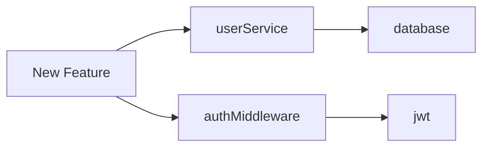
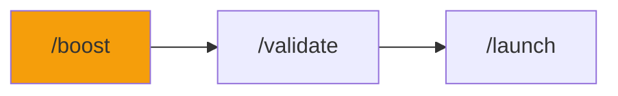

# /boost - Feature Enhancer

$ARGUMENTS

---

## Purpose

Add features or upgrades to existing applications. **Analyzes current architecture before making changes to prevent conflicts.**

---

## 🔴 MANDATORY: Impact Assessment

Before ANY change:

### Step 1: Project Analysis
// turbo
```bash
python .agent/scripts/session_manager.py info
```

### Step 2: Security Check
// turbo
```bash
python .agent/skills/vulnerability-scanner/scripts/security_scan.py .
```

### Step 3: Dependency Map
```
Identify:
□ Direct dependencies (what this file imports)
□ Reverse dependencies (what imports this file)
□ External packages affected
□ Database schema changes needed
```

---

## Impact Classification

| Change Size | Criteria | Action Required |
|-------------|----------|-----------------|
| **Small** | 1-3 files, no deps | Proceed directly |
| **Medium** | 4-10 files, minor deps | Show plan, get approval |
| **Large** | 10+ files, breaking changes | Create PLAN.md first |

---

## Output Format

```markdown
## 🚀 Boost: [Feature Name]

### Impact Assessment

| Metric | Value |
|--------|-------|
| Files Created | 5 |
| Files Modified | 3 |
| Tests Affected | 2 |
| Breaking Changes | None |

### Dependency Analysis



### Changes Required

| File | Change | Risk |
|------|--------|------|
| `src/services/user.ts` | Add method | Low |
| `src/routes/api.ts` | New endpoint | Low |
| `prisma/schema.prisma` | Add field | Medium |

### Approval Required?
⚠️ **Medium change** - 8 files affected

Proceed? (y/n)
```

---

## After Approval

```markdown
## ✅ Boost Complete

### Summary
| Metric | Value |
|--------|-------|
| Files Created | 5 |
| Files Modified | 3 |
| Time | 4m 32s |

### Changes Made
1. ✅ Added `darkMode` field to user preferences
2. ✅ Created toggle component
3. ✅ Updated CSS variables
4. ✅ Added localStorage persistence

### Tests
✅ 3 new tests added
✅ All tests passing

### Preview
Hot reload applied - refresh to see changes.
```

---

## Examples

```
/boost add dark mode toggle
/boost integrate Stripe payments
/boost add user notifications
/boost make mobile responsive
/boost add search with filters
/boost upgrade to React 19
```

---

## Key Principles

1. **Analyze before changing** - understand impact
2. **Preserve existing** - don't break what works
3. **Incremental changes** - commit frequently
4. **Test affected code** - don't skip tests
5. **Document changes** - update README if needed

---

## 🔗 Workflow Chain



| After /boost | Run | Purpose |
|--------------|-----|---------|
| Feature added | `/validate` | Test changes |
| Ready to deploy | `/launch` | Deploy |
| Found issues | `/diagnose` | Debug |

**Handoff to /validate:**
```markdown
Feature added. Run /validate to test changes.
```
