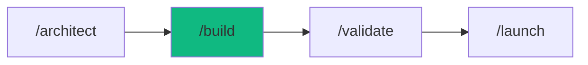

# /build - Application Factory

$ARGUMENTS

---

## Purpose

Ship production-ready applications from natural language descriptions. **Coordinates 4+ specialist agents with automated verification.**

---

## 🔴 MANDATORY: Build Pipeline

### Phase 1: Requirements Discovery
// turbo
Ask these questions if not answered:
```
1. What TYPE of app? (web/mobile/api/cli)
2. Who are the USERS? (consumers/business/developers)
3. What are the CORE FEATURES? (list 3-5 must-haves)
4. What STACK preferences? (or let me choose)
5. What is the TIMELINE? (MVP/full product)
```

### Phase 2: Tech Stack Selection

**AI-Powered Stack Recommendation:**

| App Type | Recommended Stack | Agents Invoked |
|----------|-------------------|----------------|
| **Web SaaS** | Next.js + Prisma + PostgreSQL | frontend, backend, database |
| **E-commerce** | Next.js + Stripe + Supabase | frontend, backend, security |
| **Mobile** | React Native + Expo + Firebase | mobile, backend, test |
| **API** | Hono + Prisma + Railway | backend, database, devops |
| **Dashboard** | Next.js + Tremor + Chart.js | frontend, backend |

### Phase 3: Project Scaffolding
// turbo
```bash
# Auto-detect and scaffold
python .agent/scripts/session_manager.py create --name "$PROJECT_NAME" --stack "$STACK"
```

### Phase 4: Multi-Agent Build

```mermaid
graph TD
    A[/build request] --> B[project-planner]
    B --> C[Create PLAN.md]
    C --> D{User Approval?}
    D -->|Yes| E[Parallel Build]
    D -->|No| B
    E --> F[database-architect]
    E --> G[backend-specialist]
    E --> H[frontend-specialist]
    F --> I[Schema + Migrations]
    G --> J[API Endpoints]
    H --> K[UI Components]
    I --> L[Integration]
    J --> L
    K --> L
    L --> M[test-engineer]
    M --> N[Preview Deploy]
```

### Phase 5: Preview & Iterate
// turbo
```bash
python .agent/scripts/auto_preview.py start
```

---

## Output Format

```markdown
## 🏗️ Building: [App Name]

### Stack Decision
| Layer | Choice | Reason |
|-------|--------|--------|
| Frontend | Next.js 15 | SSR, App Router, Vercel deploy |
| Backend | Hono + Prisma | Type-safe, edge-ready |
| Database | PostgreSQL | Relational, Supabase hosting |
| Auth | Clerk | Fast integration, social login |
| Styling | Tailwind + shadcn/ui | Rapid UI development |

### Agent Coordination

| Agent | Task | Status |
|-------|------|--------|
| `database-architect` | Schema design | ✅ Complete |
| `backend-specialist` | API routes | 🔄 In progress |
| `frontend-specialist` | UI components | ⏳ Waiting |
| `test-engineer` | E2E tests | ⏳ Waiting |

### Files Created
```
src/
├── app/
│   ├── page.tsx
│   ├── layout.tsx
│   └── api/
├── components/
├── lib/
├── prisma/
│   └── schema.prisma
└── tests/
```

### Preview
🌐 **URL:** http://localhost:3000
📊 **Status:** Running

### Next Steps
- [ ] Review the code
- [ ] Test core features
- [ ] Request changes or `/launch` to deploy
```

---

## Examples

```
/build SaaS dashboard with user analytics
/build e-commerce app with Stripe payments
/build blog with MDX and CMS
/build real-time chat app
/build portfolio with project gallery
/build REST API for mobile app
```

---

## Smart Defaults

If user doesn't specify, use these:

| Aspect | Default |
|--------|---------|
| Framework | Next.js 15 |
| Styling | Tailwind + shadcn/ui |
| Database | PostgreSQL (Supabase) |
| Auth | Clerk |
| Deployment | Vercel |
| Testing | Vitest + Playwright |

---

## Quality Gates

Before marking complete, verify:

- [ ] All files compile without errors
- [ ] Database schema is valid
- [ ] API endpoints respond correctly
- [ ] UI renders without errors
- [ ] Preview server is running
- [ ] User can test the app

**NEVER mark complete without a working preview.**

---

## 🔗 Workflow Chain



| After /build | Run | Purpose |
|--------------|-----|---------|
| Build complete | `/validate` | Run tests |
| Needs testing | `/stage` | Start preview server |
| Ready to deploy | `/launch` | Deploy to production |
| Found bugs | `/diagnose` | Debug issues |

**Handoff to /validate:**
```markdown
Build complete. Preview running at http://localhost:3000
Run /validate to generate and execute tests.
```
