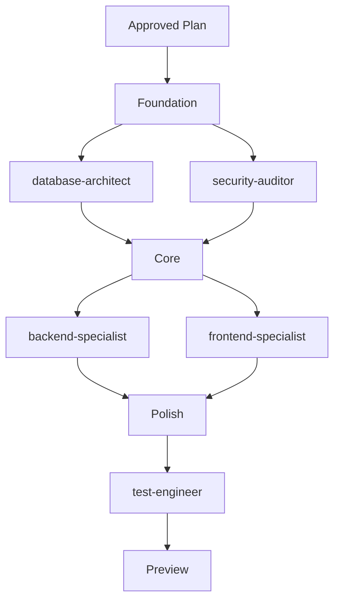
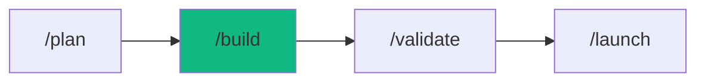

# /build - Application Factory

$ARGUMENTS

---

## Purpose

Ship production-ready applications from natural language descriptions by coordinating 4+ specialist agents with automated verification. **Differs from `/autopilot` (fully autonomous multi-domain orchestration) and `/cook` (targeted single-scope tasks) by focusing on new application creation from scratch with guided requirements discovery.** Uses `project-planner` for architecture, `database-architect` + `backend-specialist` + `frontend-specialist` for parallel implementation, and `test-engineer` for verification.

---

## 🤖 Meta-Agents Integration

| Phase | Agent | Action |
| ----- | ----- | ------ |
| **Pre-Flight** | `assessor` | Evaluate build risk level and auto-learned context |
| **Execution** | `orchestrator` / `critic` | Coordinate parallel execution and resolve schema/API conflicts |
| **Safety** | `recovery` | Save state and recover from build failures |
| **Post-Build** | `learner` | Log build architecture and implementation patterns |

```
Flow:
assessor.evaluate(risk) → recovery.save(state)
       ↓
orchestrator.init() → assign agents to parallel groups
       ↓
conflict? → critic.arbitrate(safety > correctness)
       ↓
failure? → recovery.restore() → learner.log(failure)
       ↓
success → learner.log(patterns)
```

---

## 🔴 MANDATORY: Build Pipeline

### Phase 1: Pre-flight & Auto-Learned Context

> **Rule 0.5-K:** Auto-learned pattern check.

1. Read `.agent/skills/auto-learned/patterns/` for past failures before proceeding.
2. Trigger `recovery` agent to run Checkpoint (`git commit -m "chore(checkpoint): pre-build"`).

### Phase 2: Requirements Discovery

| Field | Value |
|-------|-------|
| **INPUT** | $ARGUMENTS (app description — what to build) |
| **OUTPUT** | Requirements document: app type, users, core features, stack |
| **AGENTS** | `project-planner`, `assessor` |
| **SKILLS** | `idea-storm`, `project-planner`, `context-engineering` |

// turbo — telemetry: phase-2-requirements

1. If requirements are incomplete, ask clarifying questions:

```
1. What TYPE of app? (web/mobile/api/cli)
2. Who are the USERS? (consumers/business/developers)
3. What are the CORE FEATURES? (list 3-5 must-haves)
4. What STACK preferences? (or let me choose)
5. What is the TIMELINE? (MVP/full product)
```

2. Select tech stack based on app type:

| App Type | Recommended Stack | Agents Invoked |
|----------|------------------|----------------|
| Web SaaS | Next.js + Prisma + PostgreSQL | frontend, backend, database |
| E-commerce | Next.js + Stripe + Supabase | frontend, backend, security |
| Mobile | React Native + Expo + Firebase | mobile, backend, test |
| API | Hono + Prisma + Railway | backend, database, devops |
| Dashboard | Next.js + Chart.js | frontend, backend |

3. Smart defaults (when user doesn't specify):

| Aspect | Default |
|--------|---------|
| Framework | Next.js 15 |
| Styling | Tailwind + shadcn/ui |
| Database | PostgreSQL (Supabase) |
| Auth | Clerk |
| Deployment | Vercel |
| Testing | Vitest + Playwright |

### Phase 3: Planning & Design

| Field | Value |
|-------|-------|
| **INPUT** | Requirements from Phase 2 |
| **OUTPUT** | PLAN.md with task breakdown, agent assignments, file structure |
| **AGENTS** | `project-planner` |
| **SKILLS** | `project-planner`, `app-scaffold` |

// turbo — telemetry: phase-3-planning

1. Create PLAN.md with:
   - Task breakdown and agent assignments
   - File structure blueprint
   - Dependency graph between agents
   - Parallel execution groups
2. `assessor` evaluates risk level of the build plan
3. `recovery` saves current project state (if existing directory)

**⛔ CHECKPOINT: User approval required before Phase 4**

### Phase 4: Design System (UI Apps Only)

| Field | Value |
|-------|-------|
| **INPUT** | Approved PLAN.md (for apps with UI) |
| **OUTPUT** | Design tokens: colors, typography, effects |
| **AGENTS** | `frontend-specialist`, `orchestrator` |
| **SKILLS** | `studio`, `design-system` |

> **Skip this phase** if the app has no UI (API-only, CLI).

// turbo — telemetry: phase-4-studio-search
```bash
npx cross-env OTEL_SERVICE_NAME="workflow:build" TRACE_ID="$TRACE_ID" node .agent/skills/studio/scripts/search.ts "<app_type> <style> <keywords>" --design-system -p "<Project Name>"
```

### Phase 5: Parallel Build

| Field | Value |
|-------|-------|
| **INPUT** | Approved plan + design system tokens |
| **OUTPUT** | Complete application: schema, API routes, UI components, tests |
| **AGENTS** | `orchestrator`, `critic`, `database-architect`, `backend-specialist`, `frontend-specialist`, `test-engineer` |
| **SKILLS** | `data-modeler`, `nodejs-pro`, `api-architect`, `code-craft`, `test-architect` |

// turbo — telemetry: phase-5-build



| Parallel Group | Agents | Task |
|----------------|--------|------|
| **Foundation** | `database-architect`, `security-auditor` | Schema + auth setup |
| **Core** | `backend-specialist`, `frontend-specialist` | API routes + UI components |
| **Polish** | `test-engineer` | Tests + integration |

### Phase 6: Verification & Preview

| Field | Value |
|-------|-------|
| **INPUT** | All artifacts from Phase 5 |
| **OUTPUT** | Running preview + verification report |
| **AGENTS** | `test-engineer`, `learner` |
| **SKILLS** | `test-architect`, `problem-checker`, `auto-learner` |

// turbo — telemetry: phase-6-test
```bash
npx cross-env OTEL_SERVICE_NAME="workflow:build" TRACE_ID="$TRACE_ID" npm test
```

// turbo — telemetry: phase-6-lint-typecheck
```bash
npx cross-env OTEL_SERVICE_NAME="workflow:build" TRACE_ID="$TRACE_ID" npm run lint; npx cross-env OTEL_SERVICE_NAME="workflow:build" TRACE_ID="$TRACE_ID" npx tsc --noEmit
```

// turbo — telemetry: phase-6-preview
```bash
npx cross-env OTEL_SERVICE_NAME="workflow:build" TRACE_ID="$TRACE_ID" npm run dev
```

**Exit Gate — ALL must pass:**

| Check | Target | How to Verify |
|-------|--------|---------------|
| IDE Problems | 0 | `@[current_problems]` |
| Compilation | Pass | TypeScript check |
| Tests | All passing | npm test |
| Preview | Running | localhost:3000 responding |
| Schema | Valid | Prisma validate (if applicable) |

---

## ⛔ MANDATORY: Problem Verification Before Completion

> **CRITICAL:** This check MUST be performed before any `notify_user` or task completion.

### Check @[current_problems]

```
1. Read @[current_problems] from IDE
2. If errors/warnings > 0:
   a. Auto-fix: imports, types, lint errors
   b. Re-check @[current_problems]
   c. If still > 0 → STOP → Notify user
3. If count = 0 → Proceed to completion
```

### Auto-Fixable

| Type | Fix |
|------|-----|
| Missing import | Add import statement |
| JSX namespace | Import from 'react' |
| Unused variable | Remove or prefix `_` |
| Lint errors | Run eslint --fix |

> **Rule:** Never mark complete with errors in `@[current_problems]`. **NEVER mark complete without a working preview.**

---

## 🔙 Rollback & Recovery

If the Exit Gates fail and cannot be resolved automatically:
1. Restore to pre-build checkpoint (`git checkout -- .` or `git stash pop`).
2. Log failure via `learner` meta-agent.
3. Notify user with failure context and recovery options.

---

## Output Format

```markdown
## 🏗️ Building: [App Name]

### Stack Decision

| Layer | Choice | Reason |
|-------|--------|--------|
| Frontend | Next.js 15 | SSR, App Router, Vercel deploy |
| Backend | Hono + Prisma | Type-safe, edge-ready |
| Database | PostgreSQL | Relational, Supabase hosting |
| Auth | Clerk | Fast integration, social login |
| Styling | Tailwind + shadcn/ui | Rapid UI development |

### Agent Coordination

| Agent | Task | Status |
|-------|------|--------|
| `project-planner` | Architecture plan | ✅ Complete |
| `database-architect` | Schema design | ✅ Complete |
| `backend-specialist` | API routes | ✅ Complete |
| `frontend-specialist` | UI components | ✅ Complete |
| `test-engineer` | E2E tests | ✅ Complete |

### Preview

🌐 http://localhost:3000

### Next Steps

- [ ] Review the generated code
- [ ] Test core user flows
- [ ] Run `/validate` for comprehensive tests
- [ ] Deploy when ready: `/launch`
```

---

## Examples

```
/build SaaS dashboard with user analytics and auth
/build e-commerce store with Stripe payments and product catalog
/build blog engine with MDX content and CMS
/build real-time chat app with WebSocket and message history
/build REST API for mobile app with auth and rate limiting
```

---

## Key Principles

- **Requirements first** — discover what to build before building, ask clarifying questions
- **Smart stack defaults** — sensible tech choices unless user specifies otherwise
- **Parallel execution** — independent agents run simultaneously for faster delivery
- **Working preview required** — never mark complete without a running dev server
- **Exit gate enforced** — IDE problems = 0, tests passing, types valid before completion

---

## 🔗 Workflow Chain

**Skills Loaded (15):**

- `app-scaffold` - Full-stack scaffolding from natural language
- `react-pro` - React application development
- `nextjs-pro` - Next.js framework expertise
- `project-planner` - Task breakdown and architecture planning
- `studio` - Design system generation for UI apps
- `design-system` - UI/UX design tokens and components
- `code-craft` - Coding standards and best practices
- `data-modeler` - Database schema design
- `api-architect` - API design and endpoint patterns
- `test-architect` - Testing strategies and coverage
- `idea-storm` - Brainstorming and alternative analysis
- `nodejs-pro` - Node.js backend development
- `context-engineering` - Codebase parsing and framework detection
- `problem-checker` - IDE error detection and auto-fix
- `auto-learner` - Learning and logging execution patterns



| After /build | Run | Purpose |
|-------------|-----|---------|
| Build complete | `/validate` | Run comprehensive test suite |
| Needs preview | `/stage` | Start development environment |
| Ready to deploy | `/launch` | Deploy to production |
| Found bugs | `/diagnose` | Root cause investigation |

**Handoff to /validate:**

```markdown
✅ Build complete! Preview running at localhost:3000.
[X] agents coordinated, [Y] files created. Run `/validate` for full test suite.
```
