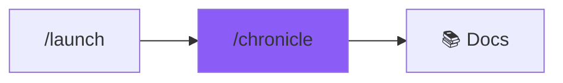

# /chronicle - Documentation Engine

$ARGUMENTS

---

## Purpose

Generate comprehensive documentation automatically. **Analyzes code structure and produces README, API specs, and inline comments.**

---

## 🤖 Meta-Agents Integration

| Phase | Agent | Action |
| ----- | ----- | ------ |
| **Pre-Generation** | `assessor` | Evaluate documentation scope |
| **Pattern Learning** | `learner` | Learn from existing doc patterns |
| **Post-Generation** | `learner` | Log documentation templates for reuse |

```
Flow:
assessor.evaluate(scope) → file count, complexity
       ↓
learner.analyze(existing_docs) → patterns
       ↓
generate → learner.log(templates)
```

---

## Sub-commands

```
/chronicle              - Full documentation suite
/chronicle readme       - Generate/update README.md
/chronicle api          - Generate API documentation
/chronicle inline       - Add inline code comments
/chronicle [file-path]  - Document specific file
/chronicle changelog    - Generate CHANGELOG.md
```

---

## 🔴 MANDATORY: Documentation Standards

### README.md Structure

```markdown
# Project Name

> One-line description

## Features
- Feature 1
- Feature 2

## Quick Start

### Prerequisites
- Node.js 18+
- PostgreSQL

### Installation
```bash
npm install
npm run dev
```

## API Reference
[Link to API docs]

## Contributing
[CONTRIBUTING.md]

## License
MIT
```

### API Documentation

| Element | Format |
|---------|--------|
| Endpoints | OpenAPI 3.0 |
| Types | TypeScript interfaces |
| Examples | cURL + JavaScript |
| Errors | Standard error codes |

### Inline Comments

```typescript
/**
 * Creates a new user account with email verification.
 * 
 * @param data - User registration data
 * @param data.email - Valid email address
 * @param data.password - Min 8 chars, 1 uppercase, 1 number
 * @returns Newly created user with verification token
 * @throws {ValidationError} If email is invalid
 * @throws {ConflictError} If email already exists
 * @example
 * const user = await createUser({
 *   email: 'user@example.com',
 *   password: 'SecurePass123'
 * });
 */
export async function createUser(data: CreateUserInput): Promise<User> {
  // Implementation
}
```

---

## Output Format

```markdown
## 📚 Chronicle Complete

### Generated Files

| File | Type | Lines |
|------|------|-------|
| README.md | Markdown | 89 |
| docs/API.md | OpenAPI | 234 |
| CHANGELOG.md | Changelog | 45 |

### Documentation Coverage

| Metric | Current | Target |
|--------|---------|--------|
| Functions Documented | 45/52 | 100% |
| API Endpoints | 12/12 | ✅ |
| README Sections | 8/8 | ✅ |

### Files Updated
- ✅ README.md - Added quick start
- ✅ docs/API.md - Added auth endpoints
- ✅ src/services/user.ts - Added JSDoc

### Next Steps
- [ ] Review generated docs
- [ ] Add usage examples
- [ ] Update CHANGELOG
```

---

## Examples

```
/chronicle
/chronicle readme
/chronicle api
/chronicle src/services/auth.ts
/chronicle changelog --since v1.0.0
```

---

## Key Principles

1. **Code as source** - extract docs from code
2. **Keep updated** - regenerate on changes
3. **Examples matter** - always include usage
4. **Types are docs** - use TypeScript annotations
5. **Minimal but complete** - no fluff

---

## 🔗 Workflow Chain



| After /chronicle | Run | Purpose |
|------------------|-----|---------|
| Docs generated | Review | Verify accuracy |
| Need more | `/chronicle api` | Generate API docs |

**Handoff:**
```markdown
Documentation generated. README.md and API docs updated.
```
