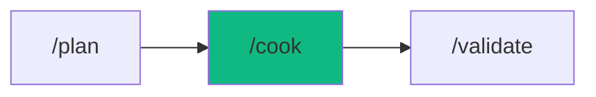

# /cook - The Implementer

$ARGUMENTS

---

## Purpose

Rapidly implement specific features, components, or logic based on clear instructions — skipping architectural debate to focus on pure coding speed. **Differs from `/build` (creates entire projects) and `/autopilot` (multi-agent orchestration) by executing targeted, single-scope tasks with minimal overhead.** Uses the domain-appropriate specialist agent (auto-routed) with `code-craft` for coding standards.

---

## Workflow Modes

| Mode | Research | Testing | Review Gates | Use When |
|------|----------|---------|--------------|----------|
| **interactive** (default) | ? | ? | User approval | Standard features |
| **--auto** | ? | ? | Auto if score = 9.5 | Trusted autonomous |
| **--fast** | ? | ? | User approval | Quick prototypes |
| **--no-test** | ? | ? | User approval | Experimental code |

---

## ?? Meta-Agents Integration

| Phase | Agent | Action |
| ----- | ----- | ------ |
| **Pre-Flight** | `assessor` | Evaluate risk and check knowledge-compiler patterns |
| **Execution** | `orchestrator` | Route tasks to specialist agents |
| **Safety** | `recovery` | Save checkpoint before code writes |
| **Post-Cook** | `learner` | Log execution pattern for reuse |

```
Flow:
instruction ? implement ? verify ? learner.log() ? done
```

---

## ?? MANDATORY: Cooking Protocol

### Phase 1: Pre-flight & knowledge-compiler Context

> **Rule 0.5-K:** knowledge-compiler pattern check.

1. Read `.agent/skills/knowledge-compiler/patterns/` for past failures before proceeding.
2. Trigger `recovery` agent to run Checkpoint (`git commit -m "chore(checkpoint): pre-cook"`).

### Phase 2: Mise en Place (Preparation)

| Field | Value |
|-------|-------|
| **INPUT** | $ARGUMENTS (implementation instruction or plan file path) |
| **OUTPUT** | Understanding of task, related files identified, dependencies mapped |
| **AGENTS** | `orchestrator`, `assessor` |
| **SKILLS** | `context-engineering`, `smart-router` |

1. Parse the instruction to understand exact scope
2. Read related files (imports, types, dependencies)
3. Identify existing code patterns to follow
4. Determine which specialist agent to invoke (frontend, backend, etc.)

### Phase 3: Implementation

| Field | Value |
|-------|-------|
| **INPUT** | Task understanding + related files from Phase 2 |
| **OUTPUT** | Created/modified source files implementing the requested feature |
| **AGENTS** | Auto-routed specialist (`nodejs-pro`, `react-pro`, etc.) |
| **SKILLS** | `code-craft` |

1. Write code following existing patterns strictly
2. One file at a time unless multi-file change is necessary
3. No whitespace changes in unrelated areas
4. Follow `code-craft` standards: 20 lines/function, 3 args max, 2 nesting levels

### Phase 4: Taste Test (Verification)

| Field | Value |
|-------|-------|
| **INPUT** | Modified/created files from Phase 3 |
| **OUTPUT** | Verification result: lint clean, no IDE errors |
| **AGENTS** | `learner` |
| **SKILLS** | `problem-checker`, `knowledge-compiler` |

// turbo — telemetry: phase-4-lint
```bash
npx cross-env OTEL_SERVICE_NAME="workflow:cook" TRACE_ID="$TRACE_ID" npm run lint
```

1. Check `@[current_problems]` for IDE errors
2. Auto-fix if possible (imports, types, lint)
3. Log pattern via `learner`

---

## ? MANDATORY: Problem Verification Before Completion

> **CRITICAL:** This check MUST be performed before any `notify_user` or task completion.

### Check @[current_problems]

```
1. Read @[current_problems] from IDE
2. If errors/warnings > 0:
   a. Auto-fix: imports, types, lint errors
   b. Re-check @[current_problems]
   c. If still > 0 ? STOP ? Notify user
3. If count = 0 ? Proceed to completion
```

### Auto-Fixable

| Type | Fix |
|------|-----|
| Missing import | Add import statement |
| Unused variable | Remove or prefix `_` |
| Lint errors | Run eslint --fix |

> **Rule:** Never mark complete with errors in `@[current_problems]`.

---

## ?? Rollback & Recovery

If implementation introduces errors that cannot be auto-fixed:
1. Restore previous state (`git checkout -- .` or `git stash pop`).
2. Log failure via `learner` meta-agent to prevent repeating the mistake.
3. Notify user with the specific errors to rethink the approach.

---

## Output Format

```markdown
## ?? Cooked: [Component/File Name]

### Changes Applied

| File | Action | Status |
|------|--------|--------|
| `path/to/file.ts` | Created | ? |
| `path/to/other.ts` | Modified | ? |

### Verification

| Check | Result |
|-------|--------|
| Syntax | ? Passed |
| Lint | ? No errors |
| IDE Problems | ? 0 |

### Next Steps

- [ ] Review the implementation
- [ ] Run `/validate` for full test suite
```

---

## Examples

```
/cook "Create a Button component with primary and secondary variants"
/cook "Implement login logic in auth.ts with JWT validation"
/cook "Refactor UserCard to use Tailwind v4 classes"
/cook "Add pagination to the products API endpoint"
/cook path/to/plan.md --auto
```

---

## Key Principles

- **Speed over ceremony** — no planning documents, no architecture debates, just code
- **Follow existing patterns** — match the codebase style, don't introduce new conventions
- **Minimal diff** — change only what's needed, no unrelated whitespace or refactoring
- **Verify before done** — always lint and check IDE problems, even for quick tasks

---

## ?? Workflow Chain

**Skills Loaded (5):**

- `code-craft` - Pragmatic coding standards and clean code
- `problem-checker` - IDE error detection and auto-fix
- `smart-router` - Request classifier and agent routing
- `context-engineering` - Codebase parsing and context gathering
- `knowledge-compiler` - Pattern reading and logging



| After /cook | Run | Purpose |
|------------|-----|---------|
| Task complete | `/validate` | Run tests to ensure correctness |
| Errors found | `/fix` | Fix any resulting issues |
| Need more features | `/build` | Add complex enhancements |

**Handoff to /validate:**

```markdown
?? Implementation complete. [X] files created/modified.
Run `/validate` to verify behavior with full test suite.
```
