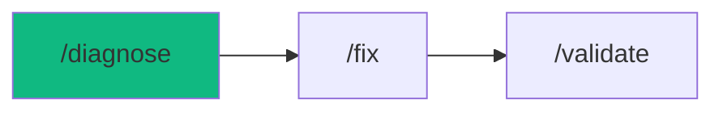

# /diagnose - Root Cause Detective

$ARGUMENTS

---

## Purpose

Systematic debugging using the scientific method — form hypotheses, gather evidence, and eliminate possibilities until the root cause is found. **Differs from `/fix` (applies targeted fixes for known issues) by focusing exclusively on investigation and root cause identification before any code changes.** Uses `debugger` agent with `debug-pro` for methodology and `code-review` for code analysis.

---

## 🤖 Meta-Agents Integration

| Phase | Agent | Action |
| ----- | ----- | ------ |
| **Pre-Flight** | `assessor` | Evaluate risk, check past bugs & auto-learned patterns |
| **Execution** | `orchestrator` | Coordinate diagnostic tasks and testing |
| **Safety** | `recovery` | Save state before debug and restore on failure |
| **Post-Fix** | `learner` | Log root cause and failure patterns for reuse |

```
Flow:
recovery.save() → learner.check(past_bugs)
       ↓
hypotheses → test → found? → assessor.evaluate(fix)
       ↓
apply fix → verify → learner.log(root_cause, fix)
       ↓ failure
recovery.restore()
```

---

## 🔴 MANDATORY: 5-Phase Investigation Protocol

### Phase 1: Pre-flight & Auto-Learned Context

> **Rule 0.5-K:** Auto-learned pattern check.

1. Read `.agent/skills/auto-learned/patterns/` for past failures before proceeding.
2. Trigger `recovery` agent to run Checkpoint (`git commit -m "chore(checkpoint): pre-diagnose"`).

### Phase 2: Symptom Collection

| Field | Value |
|-------|-------|
| **INPUT** | $ARGUMENTS (bug description — error message, unexpected behavior) |
| **OUTPUT** | Symptom report: error details, environment, reproduction steps |
| **AGENTS** | `debugger`, `assessor` |
| **SKILLS** | `debug-pro`, `context-engineering` |

1. `recovery` saves current state before any investigation changes
2. Gather evidence:

```
GATHER:
□ Exact error message (copy/paste)
□ When did it start?
□ What changed recently?
□ Reproduction steps
□ Expected vs actual behavior
□ Environment (dev/staging/prod)
```

3. `learner` checks past bug patterns for similar issues

### Phase 3: Hypothesis Formation

| Field | Value |
|-------|-------|
| **INPUT** | Symptom report from Phase 2 |
| **OUTPUT** | 3+ ranked hypotheses with likelihood and test methods |
| **AGENTS** | `debugger` |
| **SKILLS** | `debug-pro` |

Generate 3+ ranked hypotheses:

| # | Hypothesis | Likelihood | Test Method |
|---|-----------|------------|-------------|
| 1 | [Most likely cause] | 70% | [How to verify] |
| 2 | [Second possibility] | 20% | [How to verify] |
| 3 | [Edge case] | 10% | [How to verify] |

**Common Root Causes Checklist:**

| Category | Things to Check |
|----------|-----------------|
| **Data** | Null values, wrong types, stale cache |
| **Auth** | Expired tokens, missing headers, CORS |
| **Network** | Timeouts, DNS, SSL certificates |
| **Code** | Recent changes, missing await, wrong imports |
| **Environment** | Env vars, versions, dependencies |

### Phase 4: Evidence Gathering & Elimination

| Field | Value |
|-------|-------|
| **INPUT** | Ranked hypotheses from Phase 3 |
| **OUTPUT** | Investigation log: each hypothesis tested with verdict |
| **AGENTS** | `debugger` |
| **SKILLS** | `debug-pro`, `code-review` |

For each hypothesis (highest likelihood first):

1. Define the **TEST**
2. Predict the **OUTCOME** if hypothesis is true
3. Run the test
4. Record **ACTUAL** result
5. Verdict: ✅ Confirmed or ❌ Eliminated

### Phase 5: Fix & Prevention

| Field | Value |
|-------|-------|
| **INPUT** | Confirmed root cause from Phase 4 |
| **OUTPUT** | Code fix + prevention measures |
| **AGENTS** | `debugger` |
| **SKILLS** | `debug-pro`, `code-craft` |

1. `assessor` evaluates fix risk before applying
2. Apply the fix with before/after code comparison
3. Define prevention measures:
   - Add test case for this scenario
   - Add input validation if applicable
   - Update documentation
   - Add monitoring/alert if applicable
4. `learner` logs root cause and fix for future reference

### Phase 6: Verification

| Field | Value |
|-------|-------|
| **INPUT** | Applied fix from Phase 5 |
| **OUTPUT** | Verification result: fix confirmed, no regressions |
| **AGENTS** | `debugger`, `learner` |
| **SKILLS** | `debug-pro`, `problem-checker`, `auto-learner` |

// turbo — telemetry: phase-6-test
```bash
npx cross-env OTEL_SERVICE_NAME="workflow:diagnose" TRACE_ID="$TRACE_ID" npm test
```

1. Verify the fix resolves the original symptom
2. Check for regressions
3. If fix fails → `recovery.restore()` → re-investigate

---

## ⛔ MANDATORY: Problem Verification Before Completion

> **CRITICAL:** This check MUST be performed before any `notify_user` or task completion.

### Check @[current_problems]

```
1. Read @[current_problems] from IDE
2. If errors/warnings > 0:
   a. Auto-fix: imports, types, lint errors
   b. Re-check @[current_problems]
   c. If still > 0 → STOP → Notify user
3. If count = 0 → Proceed to completion
```

### Auto-Fixable

| Type | Fix |
|------|-----|
| Missing import | Add import statement |
| Unused variable | Remove or prefix `_` |
| Type mismatch | Fix type annotation |
| Lint errors | Run eslint --fix |

> **Rule:** Never mark complete with errors in `@[current_problems]`.

---

## 🔙 Rollback & Recovery

If investigation causes system instability or tests fail unexpectedly:
1. Restore to pre-diagnose checkpoint (`git checkout -- .` or `git stash pop`).
2. Log failure via `learner` meta-agent.
3. Notify user that debugging environment needs reset before attempting another diagnosis.

---

## Output Format

```markdown
## 🔍 Diagnosis: [Issue Title]

### Symptom

> [User's description of the problem]

### Environment

| Aspect | Value |
|--------|-------|
| File | `src/services/auth.ts` |
| Line | 42 |
| Environment | Development |
| Last Working | 2 commits ago |

### Hypotheses

| # | Hypothesis | Likelihood | Status |
|---|-----------|------------|--------|
| 1 | Null reference in user object | 70% | ✅ CONFIRMED |
| 2 | API timeout | 20% | ❌ Eliminated |
| 3 | Cache stale data | 10% | ⏳ Not tested |

### Root Cause

🎯 **[Clear explanation of the confirmed root cause]**

### Fix Applied

| File | Change | Status |
|------|--------|--------|
| `src/services/auth.ts` | Added null check | ✅ |

### Prevention

- [x] Added null check before accessing properties
- [ ] Add auth middleware to protect route
- [ ] Add test for unauthenticated access

### Next Steps

- [ ] Run `/validate` to verify fix with full test suite
- [ ] Monitor for recurrence
```

---

## Examples

```
/diagnose login returns 401 even with correct credentials
/diagnose form data not saving to database
/diagnose page crashes on mobile Safari
/diagnose API response is 10x slower since yesterday
/diagnose deployment fails on Vercel with exit code 1
```

---

## Key Principles

- **Never guess** — form hypotheses and test them systematically
- **Most likely first** — test the highest probability hypothesis before edge cases
- **Log everything** — document the investigation for future reference
- **Fix + Prevent** — don't just patch, prevent recurrence with tests and validation
- **Verify the fix** — always confirm the fix resolves the original symptom

---

## 🔗 Workflow Chain

**Skills Loaded (6):**

- `debug-pro` - Systematic 4-phase debugging methodology
- `code-review` - Code quality validation and analysis
- `code-craft` - Coding standards for fix implementation
- `context-engineering` - Codebase parsing and error trace analysis
- `problem-checker` - IDE problem verification and auto-fixing
- `auto-learner` - Finding past bugs and logging new patterns



| After /diagnose | Run | Purpose |
|----------------|-----|---------|
| Root cause found, fix applied | `/validate` | Verify fix with full test suite |
| Complex fix needed | `/fix` | Apply targeted fix |
| Ready to deploy | `/launch` | Deploy the fix |

**Handoff to /fix:**

```markdown
🔍 Root cause found: [description]. Fix applied to [files].
Run `/fix` for additional targeted fixes or `/validate` to verify.
```
