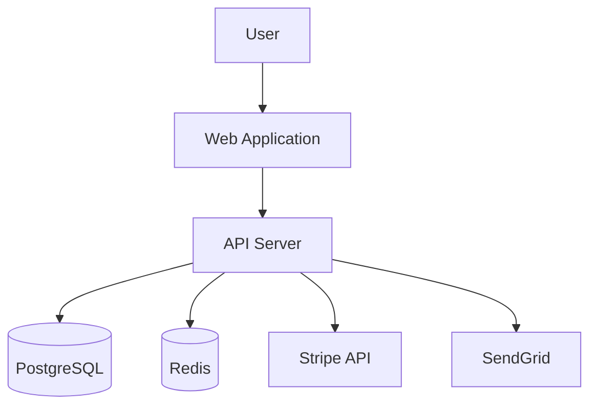
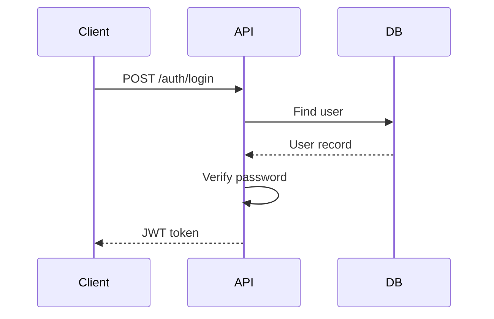
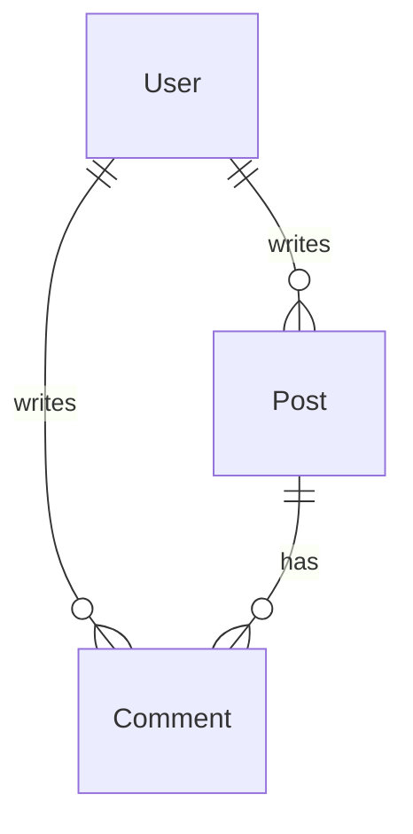

# /diagram - Architecture Diagrams

$ARGUMENTS

---

## Purpose

Generate and maintain architecture diagrams from code. C4 (Context, Container, Component), sequence diagrams, ER diagrams, dependency graphs, and data flow diagrams. Auto-sync when code changes.

---

## 🤖 Meta-Agents Integration

| Phase | Agent | Action |
|-------|-------|--------|
| **Pre-Generate** | `learner` | Recall diagram conventions |
| **Analysis** | `orchestrator` | Parallel scan of services + schema |
| **Post-Generate** | `learner` | Log patterns for reuse |

---

## Sub-commands

```
/diagram                - Generate all diagrams
/diagram update         - Update existing diagrams
/diagram c4             - C4 Context + Container
/diagram c4-component   - C4 Component level
/diagram sequence       - Sequence diagrams (key flows)
/diagram er             - ER diagram from schema
/diagram dependency     - Module dependency graph
/diagram flow           - Data flow diagram
/diagram [scope]        - Diagram specific area
```

---

## Phase 1: Codebase Analysis

**Auto-detect and scan:**

| Source | Detects | Diagram Type |
|--------|---------|-------------|
| Project structure | Services, modules | C4 Container |
| Import graph | Module dependencies | Dependency graph |
| Prisma/Drizzle schema | Tables, relations | ER diagram |
| API routes | Endpoint flows | Sequence diagram |
| Event handlers | Event chains | Data flow |
| External integrations | Third-party services | C4 Context |

---

## Phase 2: Diagram Types

### C4 Model (4 Levels)

| Level | Shows | When |
|-------|-------|------|
| **Context** | System + external actors | Always (high-level overview) |
| **Container** | Apps + databases + services | Always (technical overview) |
| **Component** | Internal modules + classes | On request (deep dive) |
| **Code** | Classes + methods | Rarely (detailed design) |

**Example C4 Context:**


### Sequence Diagrams

Auto-generated for key flows:


### ER Diagrams

Auto-generated from Prisma/Drizzle schema:


### Dependency Graph

Module dependency visualization:
```
/diagram dependency

src/
├── services/user.ts → [db, auth, email]
├── services/auth.ts → [db, jwt]
├── routes/api.ts → [services/*, middleware/*]
└── ⚠️ Circular: utils/cache ↔ services/user
```

### Data Flow Diagram

Event-driven flow visualization between system components.

---

## Phase 3: Diagram Rendering

### CLI Export

```bash
# Install Mermaid CLI
npm install -g @mermaid-js/mermaid-cli

# Convert to image
mmdc -i diagram.mmd -o diagram.svg
mmdc -i diagram.mmd -o diagram.png -t dark -b transparent

# Batch convert all
find docs/diagrams -name "*.mmd" -exec mmdc -i {} -o {}.svg \;
```

### Themes

`default` · `dark` · `forest` · `neutral` · `base`

### Rendering targets

| Target | Format | Tool |
|--------|--------|------|
| GitHub | Mermaid in markdown | Native support |
| Docs site | SVG/PNG export | mermaid-cli |
| Confluence | Image embed | Export + upload |
| Storybook | MDX embed | Mermaid plugin |

---

## Phase 4: Auto-Sync

**Keep diagrams in sync with code:**

```bash
/diagram update

Scanning codebase...
✅ Detected schema changes (2 new tables)
✅ New API endpoint: POST /api/payments
✅ New external service: Stripe

Updated:
- docs/diagrams/er.mmd (+2 tables)
- docs/diagrams/container.mmd (+Stripe)
- docs/diagrams/sequence-payment.mmd (new)
```

**Git hook integration:**
```bash
# .husky/pre-commit
npx /diagram update --check
# Fails if diagrams are out of sync
```

---

## Output Format

```markdown
## 🗂️ Diagrams Generated

### Files
| Diagram | Path | Status |
|---------|------|--------|
| C4 Context | docs/diagrams/context.mmd | ✅ Created |
| C4 Container | docs/diagrams/container.mmd | ✅ Created |
| ER | docs/diagrams/er.mmd | ✅ Created |
| Sequence: Auth | docs/diagrams/seq-auth.mmd | ✅ Created |
| Dependencies | docs/diagrams/deps.mmd | ✅ Created |

### Issues Found
- ⚠️ Circular dependency: utils/cache ↔ services/user
```

---

## 🔗 Workflow Chain

**Skills (2):** `system-design` · `mermaid-editor`

| After /diagram | Run | Purpose |
|----------------|-----|---------|
| Need full docs | `/chronicle` | Generate all docs |
| Need API first | `/api` | Create API then diagram |
| Circular deps | `/diagnose` | Fix dependency issues |

---

**Version:** 2.0.0 · **Updated:** v3.9.64
