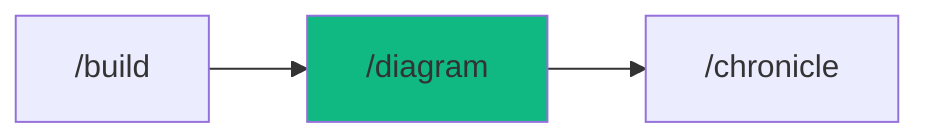

# /diagram - Architecture Diagrams

$ARGUMENTS

---

## Purpose

This workflow uses the **system-design** skill to:

- Generate C4 diagrams (Context, Container)
- Create sequence diagrams
- Generate ER diagrams from Prisma schema
- Update diagrams when code changes

## 🤖 Meta-Agents Integration

| Phase | Agent | Action |
| ----- | ----- | ------ |
| **Pre-Generate** | `learner` | Recall diagram conventions |
| **Post-Generate** | `learner` | Log diagram patterns for reuse |

---

## 🔗 Chain: documentation (system-design skill only)

**Skills Loaded (1):**

- `system-design` - C4, Mermaid, ER diagrams

## 📖 Usage

```bash
/diagram <scope>
```

## Examples

```bash
# Generate all diagrams
/diagram generate

# Update existing diagrams
/diagram update

# Specific diagram type
/diagram c4-context
```

## 📁„ Workflow Steps

1. **Analyze Codebase**
   - Scan project structure
   - Detect services and dependencies
   - Parse Prisma schema

2. **Generate Diagrams**
   - C4 Context diagram
   - C4 Container diagram
   - Sequence diagrams (key flows)
   - ER diagram from schema

3. **Save to docs/**
   - `docs/diagrams/context.mmd`
   - `docs/diagrams/container.mmd`
   - `docs/diagrams/er.mmd`

## ✅ Success Criteria

✓ **Diagrams Created** - C4, sequence, ER  
✓ **Auto-update** - Synced with code  
✓ **Mermaid Format** - Renderable in GitHub/docs

## 📊 Diagram Types

| Diagram      | Purpose             | Auto-detects      |
| ------------ | ------------------- | ----------------- |
| C4 Context   | System overview     | External services |
| C4 Container | Internal components | App structure     |
| Sequence     | User flows          | API calls         |
| ER           | Database schema     | Prisma models     |

## 📁 Related Workflows

- `/chronicle` - Generate all documentation
- `/build` - Create app first
- `/api` - Create API then diagram

---

## 🧜 Mermaid Quick Reference

### CLI Export

```bash
# Install
npm install -g @mermaid-js/mermaid-cli

# Convert to image
mmdc -i diagram.mmd -o diagram.svg
mmdc -i diagram.mmd -o diagram.png -t dark -b transparent
```

### Themes

`default` | `dark` | `forest` | `neutral` | `base`


## 💡 Example Output

```bash
You: "/diagram update"

Agent: Loading system-design
       ↓

[1/1] 🏗️ Updating Diagrams

   Scanning codebase...
   ✅ Detected schema changes (2 new tables)
   ✅ Updated ER diagram
   ✅ Updated C4 Container diagram
   ✅ All diagrams in sync with code

📂 Updated: docs/diagrams/
   - context.mmd
   - container.mmd
   - er.mmd
   - sequence-auth.mmd

✅ Diagrams updated!
```

---

## Output Format

```markdown
## 🗂️ Diagrams Generated

### Files Created
| Diagram | Path |
|---------|------|
| C4 Context | docs/diagrams/context.mmd |
| C4 Container | docs/diagrams/container.mmd |
| ER | docs/diagrams/er.mmd |

### Next Steps
- [ ] Review generated diagrams
- [ ] Add to documentation
- [ ] Set up auto-update hook
```

---

## 🔗 Workflow Chain



| After /diagram | Run | Purpose |
|----------------|-----|---------|
| Need full docs | `/chronicle` | Generate all documentation |
| Need API first | `/api` | Create API then diagram |
| Building app | `/build` | Create app first |

**Handoff:**
```markdown
✅ Diagrams generated! Add to your documentation with /chronicle.
```

---

**Version:** 1.0.0  
**Chain:** documentation (system-design)  
**Added:** v3.6.0 (FAANG upgrade - Phase 3)

