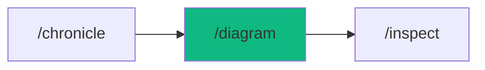

# /diagram - Architecture Diagrams

$ARGUMENTS

---

## Purpose

Generate and maintain architecture diagrams by analyzing source code, schemas, and project structure — producing C4 models, sequence diagrams, ER diagrams, dependency graphs, and data flow diagrams. **Differs from `/chronicle` (written documentation like README, API specs, ADR) by focusing exclusively on visual architecture representations in Mermaid format.** Uses `documentation-writer` for diagram generation with `system-design` for architectural analysis and `mermaid-editor` for rendering.

---

## 🤖 Meta-Agents Integration

| Phase | Agent | Action |
|-------|-------|--------|
| **Pre-Generate** | `learner` | Recall diagram conventions and project patterns |
| **Post-Generate** | `learner` | Log diagram templates for reuse |

```
Flow:
learner.recall(conventions) → analyze codebase
       ↓
generate diagrams → render to files
       ↓
learner.log(templates)
```

---

## Sub-Commands

| Command | Purpose | Output |
|---------|---------|--------|
| `/diagram` | Generate all diagrams | Full diagram suite |
| `/diagram update` | Update existing diagrams | Changed `.mmd` files |
| `/diagram c4` | C4 Context + Container | `docs/diagrams/context.mmd`, `container.mmd` |
| `/diagram c4-component` | C4 Component level | `docs/diagrams/component.mmd` |
| `/diagram sequence` | Sequence diagrams (key flows) | `docs/diagrams/seq-*.mmd` |
| `/diagram er` | ER diagram from schema | `docs/diagrams/er.mmd` |
| `/diagram dependency` | Module dependency graph | `docs/diagrams/deps.mmd` |
| `/diagram flow` | Data flow diagram | `docs/diagrams/flow.mmd` |
| `/diagram [scope]` | Diagram specific area | Scoped `.mmd` files |

---

## 🔴 MANDATORY: Diagram Generation Protocol

### Phase 1: Codebase Analysis

| Field | Value |
|-------|-------|
| **INPUT** | $ARGUMENTS (sub-command + optional scope) |
| **OUTPUT** | Architecture map: services, modules, schemas, routes, integrations |
| **AGENTS** | `documentation-writer` |
| **SKILLS** | `system-design` |

1. `learner` recalls existing diagram conventions
2. Auto-detect and scan:

| Source | Detects | Diagram Type |
|--------|---------|-------------|
| Project structure | Services, modules | C4 Container |
| Import graph | Module dependencies | Dependency graph |
| Prisma/Drizzle schema | Tables, relations | ER diagram |
| API routes | Endpoint flows | Sequence diagram |
| Event handlers | Event chains | Data flow |
| External integrations | Third-party services | C4 Context |

### Phase 2: Diagram Generation

| Field | Value |
|-------|-------|
| **INPUT** | Architecture map from Phase 1 |
| **OUTPUT** | Mermaid `.mmd` files in `docs/diagrams/` |
| **AGENTS** | `documentation-writer` |
| **SKILLS** | `system-design`, `mermaid-editor` |

Generate diagrams based on sub-command:

**C4 Model (4 Levels):**

| Level | Shows | When |
|-------|-------|------|
| **Context** | System + external actors | Always (high-level) |
| **Container** | Apps + databases + services | Always (technical) |
| **Component** | Internal modules + classes | On request |
| **Code** | Classes + methods | Rarely |

**Sequence Diagrams** — Auto-generated for key API flows (auth, CRUD, payment).

**ER Diagrams** — Auto-generated from Prisma/Drizzle schema.

**Dependency Graph** — Module import analysis with circular dependency detection.

**Data Flow** — Event-driven flow between system components.

### Phase 3: Verification & Sync

| Field | Value |
|-------|-------|
| **INPUT** | Generated `.mmd` files from Phase 2 |
| **OUTPUT** | Verified diagrams: valid mermaid syntax, no stale references |
| **AGENTS** | `documentation-writer` |
| **SKILLS** | `mermaid-editor` |

1. Validate all generated Mermaid syntax
2. Detect issues:
   - ⚠️ Circular dependencies
   - ⚠️ Stale references to removed modules
   - ⚠️ Missing connections
3. `learner` logs diagram templates for future reuse

---

## ⛔ MANDATORY: Problem Verification Before Completion

> **CRITICAL:** This check MUST be performed before any `notify_user` or task completion.

### Check @[current_problems]

```
1. Read @[current_problems] from IDE
2. If errors/warnings > 0:
   a. Auto-fix: imports, types, lint errors
   b. Re-check @[current_problems]
   c. If still > 0 → STOP → Notify user
3. If count = 0 → Proceed to completion
```

### Auto-Fixable

| Type | Fix |
|------|-----|
| Invalid mermaid syntax | Fix node/edge formatting |
| Missing import | Add import statement |
| Lint errors | Run eslint --fix |

> **Rule:** Never mark complete with errors in `@[current_problems]`.

---

## Output Format

```markdown
## 🗂️ Diagrams Generated

### Files

| Diagram | Path | Status |
|---------|------|--------|
| C4 Context | docs/diagrams/context.mmd | ✅ Created |
| C4 Container | docs/diagrams/container.mmd | ✅ Created |
| ER | docs/diagrams/er.mmd | ✅ Created |
| Sequence: Auth | docs/diagrams/seq-auth.mmd | ✅ Created |
| Dependencies | docs/diagrams/deps.mmd | ✅ Created |

### Issues Found

| Issue | Location | Severity |
|-------|----------|----------|
| Circular dependency | utils/cache ↔ services/user | ⚠️ Warning |

### Next Steps

- [ ] Review generated diagrams for accuracy
- [ ] Fix any circular dependencies flagged
- [ ] Run `/chronicle` for written documentation
```

---

## Examples

```
/diagram
/diagram c4
/diagram er
/diagram sequence auth payment checkout
/diagram dependency src/services/
/diagram update
```

---

## Key Principles

- **Code as source** — extract diagrams from code, don't maintain manually
- **Auto-sync** — regenerate when code changes to prevent diagram drift
- **Detect issues** — flag circular dependencies and stale references
- **Mermaid native** — use Mermaid format for GitHub/docs compatibility

---

## 🔗 Workflow Chain

**Skills Loaded (2):**

- `system-design` - Architectural analysis and decision-making
- `mermaid-editor` - Mermaid diagram syntax, rendering, and validation



| After /diagram | Run | Purpose |
|---------------|-----|---------|
| Need written docs | `/chronicle` | Generate README, API specs, ADR |
| Circular deps found | `/diagnose` | Investigate dependency issues |
| Need code review | `/inspect` | Architecture quality review |

**Handoff to /chronicle:**

```markdown
🗂️ Diagrams generated! [X] files created in docs/diagrams/.
Issues: [circular deps / none]. Run `/chronicle` for written documentation.
```
