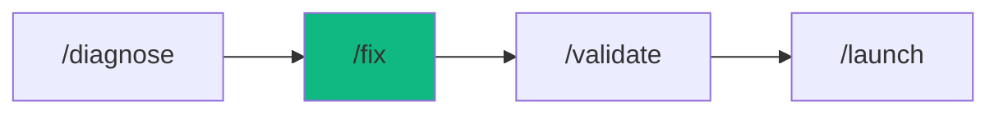

# /fix - The Mechanic

$ARGUMENTS

---

## Purpose

Apply immediate, targeted fixes for known errors, lint issues, or test failures — focusing on remediation rather than root cause analysis. **Differs from `/diagnose` (investigates unknown root causes with hypothesis testing) by assuming the problem is already identified and applying the solution directly.** Uses the domain-appropriate specialist agent (auto-routed) with `debug-pro` for fix methodology and `code-craft` for coding standards.

---

## Workflow Modes

| Mode | When | Behavior |
|------|------|----------|
| **--auto** (default) | Simple/moderate fixes | Auto-approve if confidence ≥ 9.5 |
| **--review** | Critical/production code | Pause for user approval |
| **--quick** | Type/lint errors | Fast fix cycle, minimal analysis |

## Complexity Routing

| Level | Indicators | Action |
|-------|-----------|--------|
| **Simple** | Single file, clear error | Quick fix → verify |
| **Moderate** | Multi-file, unclear scope | Standard workflow with `recovery` |
| **Complex** | System-wide impact | Escalate to `/diagnose` first |

---

## 🤖 Meta-Agents Integration

| Phase | Agent | Action |
| ----- | ----- | ------ |
| **Pre-Fix** | `recovery` | Save checkpoint of affected files |
| **Post-Fix** | `learner` | Log error pattern for future reference |

```
Flow:
recovery.save() → analyze error → apply fix → verify
       ↓ fail
recovery.restore() → learner.log(failure)
       ↓ success
learner.log(pattern)
```

---

## 🔴 MANDATORY: Repair Protocol

### Phase 1: Triage

| Field | Value |
|-------|-------|
| **INPUT** | $ARGUMENTS (error message, failing test, or issue description) |
| **OUTPUT** | Located error: file, line, immediate context, fix type |
| **AGENTS** | `debugger` |
| **SKILLS** | `debug-pro` |

1. Read error message or failure log
2. Locate the specific file and line
3. Classify fix type:

| Type | Action |
|------|--------|
| **Code Logic** | Correct algorithms, fix null handling, missing await |
| **Configuration** | Update env, tsconfig, or package.json |
| **Database** | Create migrations, fix schema, update queries |
| **Security** | Sanitize inputs, update dependencies, fix permissions |
| **Performance** | Optimize queries, add caching, reduce bundle |

4. `recovery` saves checkpoint of affected files

### Phase 2: Apply Fix

| Field | Value |
|-------|-------|
| **INPUT** | Located error and fix type from Phase 1 |
| **OUTPUT** | Modified source files with the fix applied |
| **AGENTS** | Auto-routed specialist (`backend-specialist`, `frontend-specialist`, etc.) |
| **SKILLS** | `code-craft`, `debug-pro` |

1. Apply the fix following existing code patterns
2. Minimal diff — change only what's needed
3. No unrelated formatting or refactoring

### Phase 3: Verification

| Field | Value |
|-------|-------|
| **INPUT** | Modified files from Phase 2 |
| **OUTPUT** | Verification result: error cleared, tests passing, no regressions |
| **AGENTS** | none |
| **SKILLS** | `problem-checker` |

// turbo
```bash
npm test
```

// turbo
```bash
npm run lint && npx tsc --noEmit
```

1. Verify the original error is resolved
2. Check for regressions in related components
3. If fix fails → `recovery.restore()` → escalate to `/diagnose`
4. `learner` logs error pattern for future reference

---

## ⛔ MANDATORY: Problem Verification Before Completion

> **CRITICAL:** This check MUST be performed before any `notify_user` or task completion.

### Check @[current_problems]

```
1. Read @[current_problems] from IDE
2. If errors/warnings > 0:
   a. Auto-fix: imports, types, lint errors
   b. Re-check @[current_problems]
   c. If still > 0 → STOP → Notify user
3. If count = 0 → Proceed to completion
```

### Auto-Fixable

| Type | Fix |
|------|-----|
| Missing import | Add import statement |
| Unused variable | Remove or prefix `_` |
| Type mismatch | Fix type annotation |
| Lint errors | Run eslint --fix |

> **Rule:** Never mark complete with errors in `@[current_problems]`.

---

## Output Format

```markdown
## 🔧 Fixed: [Error Description]

### The Issue

[Brief description of what was broken]

### The Fix

| File | Change | Type | Status |
|------|--------|------|--------|
| `path/to/file.ts` | Added null check | Code Logic | ✅ |

### Verification

| Check | Result |
|-------|--------|
| Error cleared | ✅ |
| Tests passing | ✅ |
| Lint clean | ✅ |
| IDE Problems | ✅ 0 |

### Next Steps

- [ ] Run `/validate` for full regression suite
- [ ] Deploy with `/launch` when ready
```

---

## Examples

```
/fix "TypeError: Cannot read property 'map' of undefined"
/fix "Login tests failing with 401 error"
/fix "ESLint: no-unused-vars in auth.ts"
/fix "TypeScript error TS2345 in UserService"
/fix "failing GitHub Actions CI for test suite"
```

---

## Key Principles

- **Fix, don't investigate** — assume the problem is known, apply the solution
- **Minimal diff** — change only what's needed, no unrelated refactoring
- **Verify immediately** — run tests and lint after every fix
- **Rollback ready** — checkpoint before fixing, restore on failure

---

## 🔗 Workflow Chain

**Skills Loaded (3):**

- `debug-pro` - Fix methodology and error analysis
- `code-craft` - Coding standards for fix implementation
- `problem-checker` - IDE error detection and auto-fix



| After /fix | Run | Purpose |
|-----------|-----|---------|
| Fix applied | `/validate` | Full regression suite |
| Ready to deploy | `/launch` | Deploy the fix |
| Fix failed | `/diagnose` | Re-analyze root cause |

**Handoff to /validate:**

```markdown
🔧 Fix applied to [files]. Error: [description] → resolved.
Run `/validate` to ensure no regressions or `/launch` to deploy.
```
