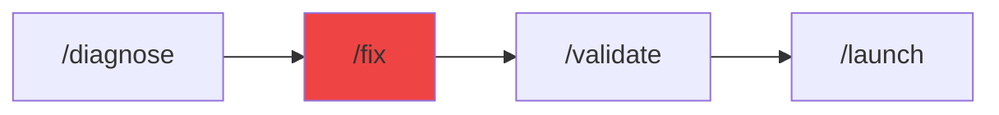

# /fix - The Mechanic

$ARGUMENTS

---

## Purpose

Apply immediate, targeted fixes for known errors, lint issues, or test failures. **Focuses on remediation rather than root cause analysis.**

> **Differences:**
> - `/diagnose`: Finds the root cause of complex bugs (Strategic)
> - `/fix`: Applies the solution to specific errors (Tactical)

---

## Workflow Modes

| Mode | When | Behavior |
|------|------|----------|
| **--auto** (default) | Simple/moderate | Auto-approve if score ≥9.5 |
| **--review** | Critical/production | Pause for approval |
| **--quick** | Type/lint errors | Fast debug → fix cycle |

---

## Complexity Routing

| Level | Indicators | Action |
|-------|------------|--------|
| **Simple** | Single file, clear error | Quick workflow |
| **Moderate** | Multi-file, unclear cause | Standard workflow |
| **Complex** | System-wide impact | Invoke `debug-pro` first |
| **Parallel** | 2+ independent issues | Fix in parallel |

## 🤖 Meta-Agents Integration

| Phase | Agent | Action |
| ----- | ----- | ------ |
| **Pre-Fix** | `recovery` | Save checkpoint |
| **Security** | `security-auditor`| Check fix for new vulnerabilities |
| **Post-Fix** | `learner` | Log error pattern |

```
Flow:
Error Log → Analyze → Fix (Code/Config/Data) → Verify (Test/Security)
```

---

## 🔴 MANDATORY: Repair Protocol

### Phase 1: Diagnostics (Triage)

1. Read error message / failure log
2. Locate the specific line/file
3. Understand the immediate context

// turbo
```bash
# Check current problems
node .agent/scripts-js/problem-checker.js
```

### Phase 2: Implementation (The Fix)

Invoke `code-craft` or `debug-pro` to apply the fix.

**Types of Fixes:**

| Type | Action |
| :--- | :--- |
| **Code Logic** | Correct algorithms, fix off-by-one, handle nulls |
| **Configuration** | Update `.env`, `tsconfig`, or `package.json` |
| **Database** | Create migrations, fix schema, update queries |
| **Security** | Sanitize inputs, update dependencies, fix permissions |
| **Performance** | Optimize queries, add caching, reduce bundle size |

### Phase 3: Comprehensive Verification (QC)

1. **Unit Test:** Run tests for the specific file
2. **Regression:** Check related components
3. **Security:** Ensure no new vulnerabilities introduced via `security-scanner`

// turbo
```bash
# Verify the fix worked
npm run test:quick -- [related_file]
```

### Phase 4: Deployment & Handoff

If verification passes:
1. Commit the fix
2. Prepare for deployment (if applicable)

---

## Output Format

```markdown
## 🔧 Fixed: [Error Description]

### The Issue
[Brief description of what was broken]

### The Fix
- [x] Modified `path/to/file`
- [x] Type: [Code/Config/Data/Security]
- [x] [Description of change, e.g., "Added missing check"]

### Verification
- [x] Error cleared
- [x] Tests passing
- [x] Security check passed

### Next Steps
- [ ] Run full regression suite
- [ ] `/launch` to deploy
```

---

## Examples

```bash
/fix "TypeError: Cannot read property 'map' of undefined"
/fix "Login tests failing with 401"
/fix "sanitize user input and implement CSP"
/fix "implement database query optimization"
/fix "failing GitHub Actions for test suite"
```

---

## 🔗 Workflow Chain

**Skills Loaded (2):**

- `debug-pro` - Root cause analysis and defense-in-depth
- `test-architect` - Regression test creation



| After /fix | Run | Purpose |
| :--- | :--- | :--- |
| **Success** | `/validate` | Ensure no regressions in full suite |
| **Success** | `/launch` | Deploy the fix to production |
| **Failed** | `/diagnose` | If fix fails, re-analyze root cause |

**Handoff:**
```markdown
Fix applied. Run `/validate` to ensure no side effects or `/launch` to deploy.
```
