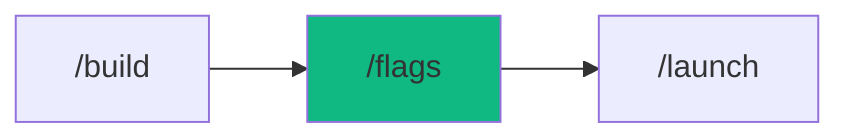

# /flags - Feature Flag Manager

$ARGUMENTS

---

## Purpose

Manage feature flags for A/B testing, gradual rollouts, and kill switches. **Toggle features without redeploying.**

---

## 🤖 Meta-Agents Integration

| Phase | Agent | Action |
| ----- | ----- | ------ |
| **Rollout Planning** | `assessor` | Evaluate risk of feature rollout |
| **State Backup** | `recovery` | Save flag state before changes |
| **A/B Learning** | `learner` | Learn from rollout success/failure patterns |
| **On Issues** | `recovery` | Quick rollback via kill switch |

```
Flow:
assessor.evaluate(rollout_risk) → safe %?
       ↓
recovery.save(flag_state) → enable flag
       ↓
monitor → issues? → recovery.restore() → learner.log()
       ↓
success → learner.log(pattern)
```

---

## Commands

| Command                              | Action                        |
| ------------------------------------ | ----------------------------- |
| `/flags`                             | Interactive flag manager      |
| `/flags list`                        | List all flags                |
| `/flags enable <name>`               | Enable a flag                 |
| `/flags disable <name>`              | Disable a flag                |
| `/flags rollout <name> <percentage>` | Set rollout percentage        |
| `/flags create <name>`               | Create new flag               |
| `/flags status <name>`               | Show flag details             |
| `/flags init`                        | Initialize .featureflags.json |

---

## Quick Start

### 1. Initialize

// turbo

```bash
node .agent/skills/cicd-pipeline/scripts/flag-manager.js init
```

### 2. List Flags

// turbo

```bash
node .agent/skills/cicd-pipeline/scripts/flag-manager.js list
```

### 3. Enable/Disable

```bash
node .agent/skills/cicd-pipeline/scripts/flag-manager.js enable new-checkout
node .agent/skills/cicd-pipeline/scripts/flag-manager.js disable maintenance-mode
```

### 4. Gradual Rollout

```bash
node .agent/skills/cicd-pipeline/scripts/flag-manager.js set new-feature --percentage 25
```

---

## Integration

### React

```tsx
import { useFeatureFlag } from "@/flags";

function App() {
  const showNew = useFeatureFlag("new-feature");
  return showNew ? <NewVersion /> : <OldVersion />;
}
```

### Node.js/Express

```javascript
import { isEnabled } from "./flags";

app.get("/api/checkout", (req, res) => {
  if (isEnabled("new-checkout", { userId: req.user.id })) {
    return newCheckout(req, res);
  }
  return oldCheckout(req, res);
});
```

---

## Configuration

File: `.featureflags.json`

```json
{
  "flags": {
    "new-checkout": {
      "enabled": true,
      "percentage": 50,
      "groups": ["beta-users"]
    }
  }
}
```

---

## Best Practices

1. **Name clearly** - `new-checkout-flow` not `flag1`
2. **Add descriptions** - Future you will thank you
3. **Clean up** - Remove flags after 100% rollout
4. **Test both states** - Ensure code works with flag on/off

---

## 🔗 Related

| Workflow    | Purpose           |
| ----------- | ----------------- |
| `/launch`   | Deploy with flags |
| `/validate` | Test flag states  |
| `/diagnose` | Debug flag issues |

---

## Examples

```
/flags list
/flags enable new-checkout
/flags rollout dark-mode 25
/flags create payment-v2
/flags status maintenance-mode
```

---

## Output Format

```markdown
## 🚩 Feature Flags Status

### Current Flags
| Flag | Enabled | Rollout | Groups |
|------|---------|---------|--------|
| new-checkout | ✅ | 100% | all |
| dark-mode | ⏳ | 25% | beta-users |

### Next Steps
- [ ] Monitor rollout metrics
- [ ] Increase percentage if stable
- [ ] Clean up after 100%
```

---

## 🔗 Workflow Chain

**Skills Loaded (2):**

- `cicd-pipeline` - Feature flag deployment strategies
- `server-ops` - Gradual rollout management



| After /flags | Run | Purpose |
|--------------|-----|---------|
| Ready to deploy | `/launch` | Deploy with flags |
| Need to test | `/validate` | Test flag states |
| Issues found | `/diagnose` | Debug flag issues |

**Handoff:**
```markdown
✅ Feature flags configured! Use `/launch` to deploy.
```

---

**Version:** 1.0.0  
**Chain:** deployment (cicd-pipeline)  
**Added:** v3.5.0
