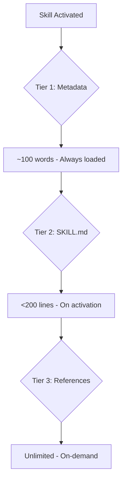
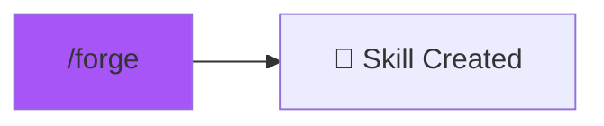

# /forge - Skill Creation Studio

$ARGUMENTS

---

## Purpose

Create, validate, and package Agent Skills following best practices. **Uses progressive disclosure architecture for optimal token management.**

---

## 🤖 Meta-Agents Integration

| Phase | Agent | Action |
| ----- | ----- | ------ |
| **Pre-Create** | `learner` | Analyze existing skill patterns |
| **Validation** | `assessor` | Evaluate skill quality and completeness |
| **Post-Create** | `learner` | Log new skill patterns for future reference |

---

## Sub-commands

```
/forge create <skill-name>    - Create new skill
/forge validate <skill-path>  - Validate existing skill
/forge package <skill-path>   - Package for distribution
```

---

## Workflow

### 1. Create New Skill
// turbo
```bash
python .agent/skills/skill-forge/scripts/init_skill.py <skill-name> --path .agent/skills/
```

This creates:
```
<skill-name>/
├── SKILL.md        # Entry point (<200 lines)
├── references/     # Detailed docs (on-demand)
├── scripts/        # Executable code
└── assets/         # Templates, images
```

### 2. Follow 200-Line Rule

**SKILL.md must be <200 lines.** Split into references:

| Section | Purpose | Size |
|---------|---------|------|
| Entry point | Navigation map + Quick reference | <200 lines |
| References | Detailed documentation | Unlimited |
| Scripts | Executable code | As needed |

### 3. Validate Skill
// turbo
```bash
python .agent/skills/skill-forge/scripts/quick_validate.py .agent/skills/<skill-name>
```

Checks:
- ✅ YAML frontmatter (name, description required)
- ✅ File size limits
- ✅ Directory structure
- ✅ Reference links

### 4. Package for Distribution
// turbo
```bash
python .agent/skills/skill-forge/scripts/package_skill.py .agent/skills/<skill-name>
```

Creates a distributable zip file.

---

## Progressive Disclosure Architecture



---

## Examples

```
/forge create api-patterns
/forge validate .agent/skills/my-skill
/forge package .agent/skills/my-skill
```

---

## Related Skills

- `SkillForge` - Full skill creation guide
- `ContextOptimizer` - Context optimization principles

---

## 🔗 Workflow Chain



| After /forge | Action |
|--------------|--------|
| Skill created | Test with `/autopilot` |
| Need docs | `/chronicle` |

**Handoff:**
```markdown
Skill created at .agent/skills/<name>/
```
