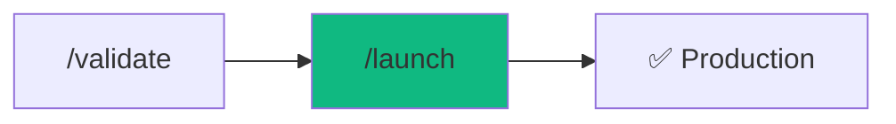

# /launch - Zero-Downtime Release

$ARGUMENTS

---

## Purpose

Production deployment with automated pre-flight checks, security scanning, and rollback capability. **Never deploy without verification.**

---

## 🔴 MANDATORY: Pre-Flight Checklist

### Gate 1: Code Quality
// turbo
```bash
python .agent/skills/code-quality/scripts/lint_runner.py .
```

| Check | Command | Required |
|-------|---------|----------|
| TypeScript | `npx tsc --noEmit` | ✅ |
| Linting | `npm run lint` | ✅ |
| Tests | `npm test` | ✅ |
| Build | `npm run build` | ✅ |

### Gate 2: Security
// turbo
```bash
python .agent/skills/security-scanner/scripts/security_scan.py .
```

| Check | Status |
|-------|--------|
| No hardcoded secrets | ✅ Required |
| Dependencies audited | ✅ Required |
| HTTPS configured | ✅ Required |
| Environment variables set | ✅ Required |

### Gate 3: Performance
| Check | Threshold |
|-------|-----------|
| Lighthouse Score | > 80 |
| Bundle Size | < 500KB |
| First Contentful Paint | < 2s |

---

## Sub-commands

```
/launch           - Interactive deployment wizard
/launch check     - Run pre-flight checks only
/launch preview   - Deploy to staging/preview
/launch ship      - Deploy to production
/launch rollback  - Rollback to previous version
```

---

## Deployment Pipeline

```mermaid
graph TD
    A[/launch] --> B{Pre-flight checks}
    B -->|Fail| C[Fix issues]
    C --> B
    B -->|Pass| D[Build application]
    D --> E{Build success?}
    E -->|No| C
    E -->|Yes| F[Deploy to platform]
    F --> G[Health check]
    G -->|Fail| H[Auto-rollback]
    G -->|Pass| I[✅ Live]
    H --> J[Alert team]
```

---

## Output Format

### Successful Launch

```markdown
## 🚀 Launch Complete

### Summary
| Metric | Value |
|--------|-------|
| Version | v2.1.0 |
| Environment | Production |
| Duration | 47 seconds |
| Platform | Vercel |

### Pre-Flight Results
✅ TypeScript: No errors
✅ Tests: 42/42 passed
✅ Security: No vulnerabilities
✅ Build: Success (234KB)

### URLs
🌐 **Production:** https://app.example.com
🔧 **Dashboard:** https://vercel.com/project

### Health Check
✅ API responding (200 OK)
✅ Database connected
✅ CDN cached

### What Changed
- Added user profile feature
- Fixed authentication bug
- Updated dependencies

### Rollback Available
Previous version (v2.0.5) saved.
Run `/launch rollback` if needed.
```

### Failed Launch

```markdown
## ❌ Launch Aborted

### Pre-Flight Failed
| Check | Result |
|-------|--------|
| TypeScript | ❌ 3 errors |
| Tests | ✅ Pass |
| Security | ⚠️ 1 warning |

### Blockers
1. **TypeScript Error** in `src/api/user.ts:42`
   - `Property 'id' does not exist on type 'null'`

### Resolution
1. Fix TypeScript error
2. Run `npm run build` locally
3. Try `/launch` again

### No Changes Made
Production is still running v2.0.5.
```

---

## Platform Configuration

| Platform | Command | Auto-detected |
|----------|---------|---------------|
| Vercel | `vercel --prod` | Next.js, Vite |
| Railway | `railway up` | Dockerfile |
| Fly.io | `fly deploy` | fly.toml |
| Netlify | `netlify deploy --prod` | Static sites |
| AWS | `sam deploy` | SAM template |

---

## Examples

```
/launch
/launch check
/launch preview
/launch ship --skip-tests
/launch rollback
/launch rollback --to v2.0.3
```

---

## Key Principles

1. **Never skip security** - always run vulnerability scan
2. **Rollback-first** - keep previous version ready
3. **Health check** - verify after deploy, not just during
4. **Notify on failure** - alert immediately if issues
5. **Document changes** - update changelog automatically

---

## 🔗 Workflow Chain



| After /launch | Run | Purpose |
|---------------|-----|---------|
| Deploy success | `/chronicle` | Generate docs |
| Deploy fail | `/diagnose` | Debug issue |
| Need rollback | `/launch rollback` | Revert |

**Handoff to /chronicle:**
```markdown
🚀 Deployed to production!
URL: https://app.example.com
Version: v2.1.0
Run /chronicle to generate updated documentation.
```
