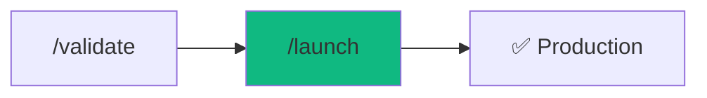

# /launch - Zero-Downtime Release

$ARGUMENTS

---

## Purpose

Production deployment with automated pre-flight checks, security scanning, and rollback capability. **Never deploy without verification.**

---

## 🤖 Meta-Agents Integration

| Phase | Agent | Action |
| ----- | ----- | ------ |
| **Pre-Deploy** | `assessor` | Evaluate deployment risk level |
| **Pre-Deploy** | `recovery` | Save state via `state_manager.js` |
| **On Failure** | `recovery` | Auto-rollback to saved state |
| **Post-Deploy** | `learner` | Extract lessons from any issues |

```
Flow:
assessor → recovery.save() → deploy → health check
                                          ↓
                               fail? → recovery.restore()
                                          ↓
                                      learner.log()
```

---

## 🔴 MANDATORY: Pre-Flight Checklist

### Gate 1: Code Quality

// turbo

```bash
node .agent/skills/code-review/scripts/lint_runner.js .
```

| Check      | Command            | Required |
| ---------- | ------------------ | -------- |
| TypeScript | `npx tsc --noEmit` | ✅       |
| Linting    | `npm run lint`     | ✅       |
| Tests      | `npm test`         | ✅       |
| Build      | `npm run build`    | ✅       |

### Gate 2: Security

// turbo

```bash
node .agent/skills/security-scanner/scripts/security_scan.js .
```

| Check                     | Status      |
| ------------------------- | ----------- |
| No hardcoded secrets      | ✅ Required |
| Dependencies audited      | ✅ Required |
| HTTPS configured          | ✅ Required |
| Environment variables set | ✅ Required |

### Gate 3: Performance

| Check                  | Threshold |
| ---------------------- | --------- |
| Lighthouse Score       | > 80      |
| Bundle Size            | < 500KB   |
| First Contentful Paint | < 2s      |

---

## Sub-commands

```
/launch           - Interactive deployment wizard
/launch check     - Run pre-flight checks only
/launch preview   - Deploy to staging/preview
/launch ship      - Deploy to production
/launch rollback  - Rollback to previous version
```

---

## Deployment Pipeline

```mermaid
graph TD
    A[/launch] --> B{Pre-flight checks}
    B -->|Fail| C[Fix issues]
    C --> B
    B -->|Pass| D[Build application]
    D --> E{Build success?}
    E -->|No| C
    E -->|Yes| F[Deploy to platform]
    F --> G[Health check]
    G -->|Fail| H[Auto-rollback]
    G -->|Pass| I[✅ Live]
    H --> J[Alert team]
```

---

## 🔄 AUTO-ROLLBACK SYSTEM (FAANG+)

### Phase 1: Pre-Deploy Checkpoint

Before ANY deployment, create restore point:

// turbo

```bash
# Create timestamped tag for rollback
git tag pre-deploy-$(date +%Y%m%d-%H%M%S)

# Save current commit hash
echo $(git rev-parse HEAD) > .deploy-checkpoint
```

**What this does:**

- Creates git tag `pre-deploy-20260128-211500`
- Saves commit hash to `.deploy-checkpoint`

---

### Phase 2: Deploy with Monitoring

```bash
# Deploy command (platform-specific)
$DEPLOY_COMMAND

# Exit code check
DEPLOY_EXIT_CODE=$?
```

---

### Phase 3: Health Check (60s timeout)

// turbo

```bash
# Health check script
node .agent/scripts-js/health-check.js $DEPLOY_URL --timeout 60
```

**Health Check Criteria:**
| Check | Endpoint | Expected |
|-------|----------|----------|
| API Status | `GET /api/health` | 200 OK |
| Database | `GET /api/health/db` | 200 OK |
| Response Time | - | < 2000ms |

---

### Phase 4: Auto-Rollback on Failure

**If health check fails:**

```bash
# Read checkpoint
CHECKPOINT=$(cat .deploy-checkpoint)

# Revert to checkpoint
git revert --no-commit HEAD..${CHECKPOINT}
git commit -m "auto-rollback: health check failed at $(date)"

# Re-deploy previous version
$DEPLOY_COMMAND
```

**Notification:**

```markdown
## ⚠️ AUTO-ROLLBACK TRIGGERED

| Metric      | Value               |
| ----------- | ------------------- |
| Time        | 2026-01-28 21:15:00 |
| Reason      | Health check failed |
| Reverted to | v2.0.5 (abc123)     |
| Duration    | 23 seconds          |

### What Failed

- API responded with 500
- Database connection timeout

### Next Steps

1. Check logs: `$PLATFORM logs --tail 100`
2. Run `/diagnose` to find root cause
3. Fix and try `/launch` again
```

---

### Rollback Commands

| Command                        | Action                             |
| ------------------------------ | ---------------------------------- |
| `/launch rollback`             | Rollback to last checkpoint        |
| `/launch rollback --to v2.0.3` | Rollback to specific version       |
| `/launch rollback --list`      | List available rollback points     |
| `/launch rollback --dry-run`   | Preview rollback without executing |

---

## Output Format

### Successful Launch

```markdown
## 🚀 Launch Complete

### Summary

| Metric      | Value      |
| ----------- | ---------- |
| Version     | v2.1.0     |
| Environment | Production |
| Duration    | 47 seconds |
| Platform    | Vercel     |

### Pre-Flight Results

✅ TypeScript: No errors
✅ Tests: 42/42 passed
✅ Security: No vulnerabilities
✅ Build: Success (234KB)

### URLs

🌐 **Production:** https://app.example.com
🔧 **Dashboard:** https://vercel.com/project

### Health Check

✅ API responding (200 OK)
✅ Database connected
✅ CDN cached

### What Changed

- Added user profile feature
- Fixed authentication bug
- Updated dependencies

### Rollback Available

Previous version (v2.0.5) saved.
Run `/launch rollback` if needed.
```

### Failed Launch

```markdown
## ❌ Launch Aborted

### Pre-Flight Failed

| Check      | Result       |
| ---------- | ------------ |
| TypeScript | ❌ 3 errors  |
| Tests      | ✅ Pass      |
| Security   | ⚠️ 1 warning |

### Blockers

1. **TypeScript Error** in `src/api/user.ts:42`
   - `Property 'id' does not exist on type 'null'`

### Resolution

1. Fix TypeScript error
2. Run `npm run build` locally
3. Try `/launch` again

### No Changes Made

Production is still running v2.0.5.
```

---

## Platform Configuration

| Platform | Command                 | Auto-detected |
| -------- | ----------------------- | ------------- |
| Vercel   | `vercel --prod`         | Next.js, Vite |
| Railway  | `railway up`            | Dockerfile    |
| Fly.io   | `fly deploy`            | fly.toml      |
| Netlify  | `netlify deploy --prod` | Static sites  |
| AWS      | `sam deploy`            | SAM template  |

---

## Examples

```
/launch
/launch check
/launch preview
/launch ship --skip-tests
/launch rollback
/launch rollback --to v2.0.3
```

---

## Key Principles

1. **Never skip security** - always run vulnerability scan
2. **Rollback-first** - keep previous version ready
3. **Health check** - verify after deploy, not just during
4. **Notify on failure** - alert immediately if issues
5. **Document changes** - update changelog automatically

---

## 🔗 Workflow Chain

**Skills Loaded (3):**

- `cicd-pipeline` - Safe deployment workflows, rollback strategies
- `server-ops` - Server management and scaling
- `security-scanner` - Pre-deploy security validation



| After /launch  | Run                | Purpose       |
| -------------- | ------------------ | ------------- |
| Deploy success | `/chronicle`       | Generate docs |
| Deploy fail    | `/diagnose`        | Debug issue   |
| Need rollback  | `/launch rollback` | Revert        |

**Handoff to /chronicle:**

```markdown
🚀 Deployed to production!
URL: https://app.example.com
Version: v2.1.0
Run /chronicle to generate updated documentation.
```
