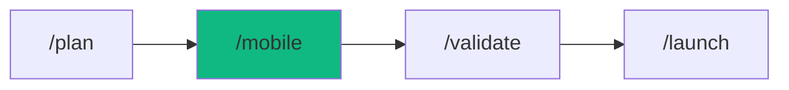

# /mobile - Mobile App Development

$ARGUMENTS

---

## Purpose

Orchestrate mobile app development from concept to app store submission — supporting React Native, Flutter, and native iOS/Android with push notifications, deep linking, offline sync, and CI/CD pipeline. **Differs from `/build` (general web apps) and `/game` (game-specific concerns) by focusing on mobile-specific platform conventions, touch interaction, offline-first architecture, and store submission requirements.** Uses `mobile-developer` with `mobile-design` for cross-platform development, coordinated by `orchestrator` for parallel implementation tracks.

---

## ?? Meta-Agents Integration

| Phase | Agent | Action |
| ----- | ----- | ------ |
| **Pre-Flight** | `assessor` | Evaluate platform risks, MFRI score, and knowledge-compiler context |
| **Execution** | `orchestrator` | Coordinate UI, API, push, and offline parallel tracks |
| **Safety** | `recovery` | Save state and recover from major implementation failures |
| **Conflict** | `critic` | Resolve cross-platform compatibility issues |
| **Post-Build** | `learner` | Log mobile execution telemetry and build patterns |

```
Flow:
assessor.evaluate(platform, MFRI) ? recovery.save()
       ?
orchestrator.parallel(UI, push, deeplink, offline)
       ? conflict
critic.resolve(iOS_vs_Android)
       ?
verify ? learner.log(patterns)
```

---

## ?? MANDATORY: Mobile Development Protocol

### Phase 1: Pre-flight & knowledge-compiler Context

> **Rule 0.5-K:** knowledge-compiler pattern check.

1. Read `.agent/skills/knowledge-compiler/patterns/` for past failures before proceeding.
2. Trigger `recovery` agent to run Checkpoint (`git commit -m "chore(checkpoint): pre-mobile"`).

### Phase 2: Requirements & Platform Selection

| Field | Value |
|-------|-------|
| **INPUT** | $ARGUMENTS (app concept description) |
| **OUTPUT** | Requirements doc: platform, framework, navigation, offline strategy |
| **AGENTS** | `project-planner`, `assessor` |
| **SKILLS** | `mobile-developer`, `idea-storm`, `context-engineering` |

// turbo — telemetry: phase-2-requirements

1. Ask critical questions:

| Question | Options | Impact |
|----------|---------|--------|
| Platform? | iOS / Android / Both | Build pipeline |
| Framework? | React Native / Flutter / Native | Architecture |
| Navigation? | Tabs / Drawer / Stack | UX pattern |
| Offline? | Required / Nice-to-have / No | Sync architecture |
| Devices? | Phone / Tablet / Both | Layout strategy |

2. Calculate MFRI (Mobile Feasibility Risk Index) — MFRI < 3 ? Redesign
3. `assessor` evaluates platform and framework risks

### Phase 3: Design & Architecture

| Field | Value |
|-------|-------|
| **INPUT** | Requirements doc from Phase 2 |
| **OUTPUT** | UI design, platform conventions, component architecture |
| **AGENTS** | `mobile-developer` |
| **SKILLS** | `mobile-design`, `mobile-developer` |

// turbo — telemetry: phase-3-design

Platform conventions:

| Aspect | iOS | Android |
|--------|-----|---------|
| Font | SF Pro | Roboto |
| Touch target | =44pt | =48dp |
| Back | Edge swipe | System back |
| Navigation | Tab bar (bottom) | Bottom nav / drawer |

### Phase 4: Core Implementation

| Field | Value |
|-------|-------|
| **INPUT** | Design + architecture from Phase 3 |
| **OUTPUT** | App scaffold with navigation, screens, and data layer |
| **AGENTS** | `orchestrator`, `mobile-developer` |
| **SKILLS** | `mobile-developer`, `smart-router` |

// turbo — telemetry: phase-4-core

1. Initialize project:

| Framework | Command |
|-----------|---------|
| React Native | `npx create-expo-app@latest ./` |
| Flutter | `flutter create .` |
| iOS Native | SwiftUI project |
| Android | Kotlin + Compose |

2. Performance patterns:
   - Lists: FlatList/FlashList (NEVER ScrollView for lists)
   - Memoization: React.memo + useCallback / const widgets
   - Images: Lazy load, cache, progressive quality
   - Navigation: Lazy screens, pre-fetch next screen data

### Phase 5: Mobile Features

| Field | Value |
|-------|-------|
| **INPUT** | App scaffold from Phase 4 |
| **OUTPUT** | Push notifications, deep linking, offline sync integrated |
| **AGENTS** | `mobile-developer`, `nodejs-pro` |
| **SKILLS** | `mobile-developer` |

// turbo — telemetry: phase-5-features

**Push Notifications:**

| Platform | Service |
|----------|---------|
| iOS | APNs via `@notifee/react-native` |
| Android | FCM via `@react-native-firebase/messaging` |
| Cross-platform | OneSignal |

**Deep Linking:**

| Platform | Config |
|----------|--------|
| iOS | apple-app-site-association in `/.well-known/` |
| Android | `assetlinks.json` in `/.well-known/` |

**Offline Sync (if required):**

| Pattern | Use When |
|---------|----------|
| **Cache-first** | Read-heavy, eventual consistency OK |
| **Optimistic UI** | Writes need instant feedback |
| **Queue + retry** | Writes must not be lost |
| **CRDT** | Multi-device conflict resolution |

### Phase 6: Security & Quality

| Field | Value |
|-------|-------|
| **INPUT** | Feature-complete app from Phase 5 |
| **OUTPUT** | Security hardened: secure storage, cert pinning, biometrics |
| **AGENTS** | `security-scanner` |
| **SKILLS** | `security-scanner` |

// turbo — telemetry: phase-6-security

Security checklist:
- [ ] Secure storage (Keychain / Keystore)
- [ ] Certificate pinning
- [ ] Biometric auth (Face ID / fingerprint)
- [ ] No sensitive data in logs
- [ ] Root/jailbreak detection

### Phase 7: CI/CD & Store Submission

| Field | Value |
|-------|-------|
| **INPUT** | Secured app from Phase 6 |
| **OUTPUT** | Platform builds, store submission assets |
| **AGENTS** | `mobile-developer` |
| **SKILLS** | `mobile-developer`, `cicd-pipeline` |

// turbo — telemetry: phase-7-cicd

| Tool | Purpose |
|------|---------|
| **EAS Build** (Expo) | Cloud builds, OTA updates |
| **Fastlane** | Automate screenshots, signing, upload |
| **GitHub Actions** | CI pipeline, automated testing |

| iOS App Store | Google Play |
|--------------|-------------|
| Privacy labels | Target current SDK |
| Screenshots (all sizes) | 64-bit build |
| App Transport Security | App bundle (AAB) |
| TestFlight beta | Internal testing track |

### Phase 8: Testing & Verification

| Field | Value |
|-------|-------|
| **INPUT** | Built app from Phase 7 |
| **OUTPUT** | Test results: crash-free rate, startup time, platform tests |
| **AGENTS** | `test-architect`, `learner` |
| **SKILLS** | `mobile-developer`, `perf-optimizer`, `problem-checker`, `knowledge-compiler` |

// turbo — telemetry: phase-8-test
```bash
npx cross-env OTEL_SERVICE_NAME="workflow:mobile" TRACE_ID="$TRACE_ID" npm run test:mobile
```

Key metrics:
- Crash-free rate: target > 99.5%
- Cold start time: target < 2s
- Screen load times, API latency
- DAU/MAU, retention (D1/D7/D30)

---

## ? MANDATORY: Problem Verification Before Completion

> **CRITICAL:** This check MUST be performed before any `notify_user` or task completion.

### Check @[current_problems]

```
1. Read @[current_problems] from IDE
2. If errors/warnings > 0:
   a. Auto-fix: imports, types, lint errors
   b. Re-check @[current_problems]
   c. If still > 0 ? STOP ? Notify user
3. If count = 0 ? Proceed to completion
```

### Auto-Fixable

| Type | Fix |
|------|-----|
| Missing import | Add import statement |
| Unused variable | Remove or prefix `_` |
| Type mismatch | Fix type annotation |
| Lint errors | Run eslint --fix |

> **Rule:** Never mark complete with errors in `@[current_problems]`.

---

## ?? Rollback & Recovery

If scaffolding or builds fail completely due to native dependencies or environment issues:
1. Revert to safe checkpoint using `recovery` meta-agent.
2. Trigger `diagnose` workflow to analyze framework/platform specific native errors (e.g. CocoaPods, Gradle).
3. Do not proceed with execution until environment is stable.

---

## Output Format

```markdown
## ?? Mobile App Built: [App Name]

### Configuration

| Setting | Value |
|---------|-------|
| Platform | iOS + Android |
| Framework | React Native (Expo) |
| Navigation | Tab-based |
| Offline | Cache-first |

### Features

| Feature | Status |
|---------|--------|
| Core screens | ? |
| Push notifications | ? |
| Deep linking | ? |
| Offline sync | ? |
| Security hardening | ? |
| CI/CD pipeline | ? |

### Performance

| Metric | Target | Actual | Status |
|--------|--------|--------|--------|
| Cold start | <2s | 1.4s | ? |
| Crash-free | >99.5% | 99.8% | ? |

### Next Steps

- [ ] Run TestFlight / internal testing
- [ ] Run `/validate` for full test suite
- [ ] Run `/launch` for store submission
```

---

## Examples

```
/mobile fitness tracking app for iOS and Android with React Native
/mobile e-commerce app with Flutter and offline cart
/mobile social media app with push notifications and deep linking
/mobile banking app with biometric auth and secure storage
/mobile food delivery app with real-time tracking
```

---

## Key Principles

- **Platform-native feel** — respect iOS HIG and Material Design conventions
- **Offline-first** — design for bad connectivity, don't assume always-online
- **FlatList always** — never use ScrollView for lists, always FlatList/FlashList
- **Permission timing** — show value before requesting permissions (notifications, location)
- **Deep link from day one** — integrate universal/app links early, not as afterthought

---

## ?? Workflow Chain

**Skills Loaded (10):**

- `mobile-developer` - React Native/Flutter/native patterns
- `mobile-design` - Platform-specific UI/UX conventions
- `security-scanner` - Secure mobile coding practices
- `idea-storm` - Requirements gathering
- `cicd-pipeline` - Mobile CI/CD and store submission
- `perf-optimizer` - Mobile performance profiling
- `problem-checker` - IDE problem verification
- `smart-router` - Dynamic agent routing
- `context-engineering` - Codebase parsing and component mapping
- `knowledge-compiler` - Learning and logging workflow patterns



| After /mobile | Run | Purpose |
|--------------|-----|---------|
| Need testing | `/validate` | Run mobile test suite |
| Performance tuning | `/optimize` | Profile and fix bottlenecks |
| Ready to ship | `/launch` | App store submission |

**Handoff to /validate:**

```markdown
?? Mobile app built! Platform: [platform], Framework: [framework].
Features: [count] integrated. Run `/validate` to test or `/launch` to submit.
```
