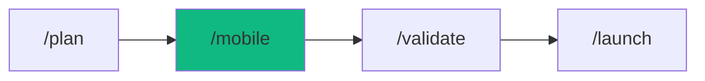

# /mobile - Mobile App Development

$ARGUMENTS

---

## Purpose

This workflow orchestrates mobile app development from concept to app store submission. Supports React Native, Flutter, and native iOS/Android development with full lifecycle management.

---

## 🤖 Meta-Agents Integration

| Phase | Agent | Action |
| ----- | ----- | ------ |
| **Requirements** | `assessor` | Evaluate platform and framework risks |
| **State Save** | `recovery` | Save checkpoints before major changes |
| **Implementation** | `orchestrator` | Coordinate parallel tasks |
| **Post-Build** | `learner` | Log mobile patterns for reuse |

---

## Phase 1: Requirements Clarification

1. **Ask critical questions BEFORE any design:**
   - Platform: iOS, Android, or both?
   - Framework: React Native, Flutter, or native?
   - Navigation: Tabs, drawer, or stack-based?
   - Offline: Does this need to work offline?
   - Devices: Phone only or tablet too?

2. **Calculate MFRI (Mobile Feasibility Risk Index):**
   - Read `mobile-design/SKILL.md` → Apply MFRI formula
   - If MFRI < 3 → Redesign before implementation

---

## Phase 2: Design & Architecture

3. **Load mobile-design skill:**
   ```
   Read: .agent/skills/mobile-design/SKILL.md
   Then read platform-specific files based on target
   ```

4. **Apply platform conventions:**
   - iOS: SF Pro font, 44pt touch targets, edge swipe back
   - Android: Roboto font, 48dp touch targets, system back button

5. **Create component architecture:**
   - Follow mobile-first principles
   - Ensure all touch targets ≥ 44-48px

---

## Phase 3: Implementation

6. **Load mobile-developer skill:**
   ```
   Read: .agent/skills/mobile-developer/SKILL.md
   ```

7. **Initialize project:**
   - React Native: `npx create-expo-app@latest ./`
   - Flutter: `flutter create .`
   - Native iOS: SwiftUI project
   - Native Android: Kotlin + Compose project

8. **Apply performance patterns:**
   - FlatList/FlashList for lists (NEVER ScrollView)
   - React.memo + useCallback for all components
   - const widgets in Flutter

---

## Phase 4: Security Implementation

9. **Load mobile-security-coder skill:**
   ```
   Read: .agent/skills/mobile-security-coder/SKILL.md
   ```

10. **Apply security checklist:**
    - [ ] Secure storage (Keychain/Keystore)
    - [ ] Certificate pinning
    - [ ] Biometric authentication
    - [ ] No sensitive data in logs

---

## Phase 5: Testing & Verification

11. **Run mobile audit script:**
    ```bash
    node .agent/skills/mobile-design/scripts/mobile_audit.js <project_path>
    ```

12. **Test checklist:**
    - [ ] Touch targets ≥ 44-48px
    - [ ] Works offline (if required)
    - [ ] Tested on low-end devices
    - [ ] Accessibility labels present

---

## Phase 6: App Store Preparation

13. **iOS App Store:**
    - Privacy labels configured
    - Screenshots for all device sizes
    - App Transport Security configured

14. **Google Play Store:**
    - Target API = current year's SDK
    - 64-bit build
    - App bundle format

---

> **Remember:** Mobile users are impatient, interrupted, using imprecise fingers on small screens. Design for the WORST conditions.

---

## Examples

```
/mobile iOS fitness app with React Native
/mobile cross-platform e-commerce app with Flutter
/mobile native Android banking app
/mobile tablet-optimized dashboard
/mobile offline-first notes app
```

---

## Output Format

```markdown
## 📱 Mobile App Development Complete

### Deliverables
| Item | Status |
|------|--------|
| App Build | ✅ iOS + Android |
| Security | ✅ Keychain/Keystore |
| Offline | ✅ Sync enabled |

### Next Steps
- [ ] Submit to TestFlight/Play Console
- [ ] Complete store listing
- [ ] Configure analytics
```

---

## 🔗 Workflow Chain

**Skills Loaded (3):**

- `mobile-first` - Mobile development orchestrator
- `mobile-developer` - React Native, Flutter, native development
- `mobile-design` - Touch interaction and platform conventions



| After /mobile | Run | Purpose |
|---------------|-----|---------|
| Need testing | `/validate` | Run mobile tests |
| Ready to ship | `/launch` | App store submission |
| Performance issues | `/optimize` | Fix bottlenecks |

**Handoff:**
```markdown
✅ Mobile app built! Run `/validate` to test, then `/launch` to submit.
```

---

**Version:** 1.0.0  
**Chain:** mobile-development  
**Added:** v3.6.0

