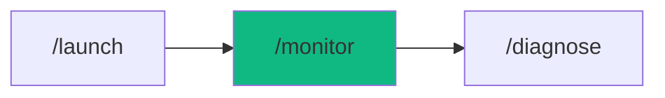

# /monitor - Production Observability

$ARGUMENTS

---

## Purpose

Set up production observability infrastructure — OpenTelemetry SDK, structured logging, Prometheus metrics, distributed tracing, and incident alerting with runbooks. **Differs from `/launch` (production deployment) and `/diagnose` (root cause analysis) by establishing the full observability foundation for production monitoring.** Uses `devops-engineer` with `observability` for instrumentation and `server-ops` for infrastructure configuration.

---

## 🤖 Meta-Agents Integration

| Phase | Agent | Action |
| ----- | ----- | ------ |
| **Pre-Setup** | `assessor` | Evaluate monitoring scope and provider selection |
| **Setup** | `recovery` | Save state before infrastructure changes |
| **Post-Setup** | `learner` | Log monitoring patterns for future setups |

```
Flow:
assessor.evaluate(scope, provider) → recovery.save()
       ↓
setup OpenTelemetry → logs → metrics → traces → alerts
       ↓
learner.log(monitoring_patterns)
```

---

## Sub-Commands

| Command | Action |
|---------|--------|
| `/monitor` | Full observability setup (all 5 phases) |
| `/monitor <app-name>` | Setup for specific application |
| `/monitor --provider datadog` | Use specific provider |

---

## 🔴 MANDATORY: Observability Setup Protocol

### Phase 0: Pre-flight & Auto-Learned Context

> **Rule 0.5-K:** Auto-learned pattern check.

1. Read `.agent/skills/auto-learned/patterns/` for past failures before proceeding.
2. Trigger `recovery` agent to run Checkpoint (`git commit -m "chore(checkpoint): pre-monitor"`).

### Phase 1: Foundation (OpenTelemetry)

| Field | Value |
|-------|-------|
| **INPUT** | $ARGUMENTS (app name + optional provider/requirements) |
| **OUTPUT** | OpenTelemetry SDK initialized, provider configured, auto-instrumentation enabled |
| **AGENTS** | `devops-engineer` |
| **SKILLS** | `observability` |

1. `assessor` evaluates monitoring scope
2. Select provider:

| Provider | Use Case |
|----------|----------|
| **Datadog** | Full-stack monitoring |
| **New Relic** | APM and infrastructure |
| **Sentry** | Error tracking and performance |
| **Grafana Cloud** | Open-source stack |
| **Self-hosted** | Prometheus + Jaeger + Loki |

3. Install OpenTelemetry SDK and configure exporters
4. Enable auto-instrumentation (HTTP, DB, Redis)

### Phase 2: Structured Logging

| Field | Value |
|-------|-------|
| **INPUT** | OpenTelemetry foundation from Phase 1 |
| **OUTPUT** | Structured logger with PII masking, correlation IDs, cloud aggregation |
| **AGENTS** | `devops-engineer` |
| **SKILLS** | `observability` |

1. Setup Pino/Winston with JSON formatting
2. Configure PII redaction (email, phone, SSN, credit card)
3. Cloud aggregation (Datadog Logs, CloudWatch, Loki)
4. Enable correlation IDs for request tracing

### Phase 3: Metrics & Dashboards

| Field | Value |
|-------|-------|
| **INPUT** | Logger from Phase 2 |
| **OUTPUT** | Prometheus `/metrics` endpoint, Golden Signals dashboard |
| **AGENTS** | `devops-engineer` |
| **SKILLS** | `observability`, `server-ops` |

1. Expose Prometheus `/metrics` endpoint
2. Configure Golden Signals:

| Signal | Metrics |
|--------|---------|
| **Latency** | p50, p95, p99 response times |
| **Traffic** | Requests/sec |
| **Errors** | Error rate (%) |
| **Saturation** | CPU, memory usage |

3. Add custom business metrics (signups, orders, revenue)
4. Create Grafana/Datadog dashboard

### Phase 4: Distributed Tracing (optional)

| Field | Value |
|-------|-------|
| **INPUT** | Metrics from Phase 3 |
| **OUTPUT** | Auto-instrumented traces with context propagation |
| **AGENTS** | `devops-engineer` |
| **SKILLS** | `observability` |

1. Enable auto-instrumentation (HTTP, Prisma, Redis)
2. Configure sampling (10% production, 100% dev)
3. Enable W3C trace context propagation
4. Verify traces visible in APM provider

### Phase 5: Alerting & Incident Response

| Field | Value |
|-------|-------|
| **INPUT** | Full observability stack from Phases 1-4 |
| **OUTPUT** | Alert rules, Slack/PagerDuty integration, runbooks |
| **AGENTS** | `devops-engineer` |
| **SKILLS** | `observability`, `server-ops` |

Default alert rules:

| Alert | Threshold | Severity | Notification |
|-------|-----------|----------|-------------|
| High Error Rate | >1% for 5min | Critical | Slack + PagerDuty |
| High Latency | p95 >500ms | High | Slack |
| Health Check Failed | <100% | Critical | Slack + PagerDuty |
| Memory Usage | >90% | High | Slack |
| Database Timeout | >3 in 5min | High | Slack |

Runbooks generated:
- High error rate investigation
- High latency debugging
- Health check failure response
- Database timeout resolution
- Memory leak investigation

---

## ⛔ MANDATORY: Problem Verification Before Completion

> **CRITICAL:** This check MUST be performed before any `notify_user` or task completion.

### Check @[current_problems]

```
1. Read @[current_problems] from IDE
2. If errors/warnings > 0:
   a. Auto-fix: imports, types, lint errors
   b. Re-check @[current_problems]
   c. If still > 0 → STOP → Notify user
3. If count = 0 → Proceed to completion
```

### Auto-Fixable

| Type | Fix |
|------|-----|
| Missing import | Add import statement |
| Type mismatch | Fix type annotation |
| Lint errors | Run eslint --fix |

> **Rule:** Never mark complete with errors in `@[current_problems]`.

---

## Output Format

```markdown
## 📊 Monitoring Setup Complete

### Configuration

| Component | Status |
|-----------|--------|
| OpenTelemetry | ✅ Initialized |
| Structured Logs | ✅ PII masking enabled |
| Metrics | ✅ /metrics exposed |
| Tracing | ✅ 10% sampling |
| Alerts | ✅ 5 critical configured |

### Files Created

| File | Purpose |
|------|---------|
| `lib/observability/setup.ts` | OpenTelemetry init |
| `lib/logger.ts` | Structured logger |
| `lib/metrics.ts` | Prometheus metrics |
| `alerts.yml` | Alert rules |
| `docs/runbooks/` | 5 playbooks |

### Next Steps

- [ ] Test alerts in staging first
- [ ] Add custom business metrics
- [ ] Configure additional alert rules as needed
- [ ] Deploy with `/launch`
```

---

## Examples

```
/monitor my-production-app
/monitor production API with Datadog
/monitor e-commerce app --provider grafana
/monitor microservices with PagerDuty alerts
/monitor backend API with custom business metrics
```

---

## Key Principles

- **Golden Signals first** — always track latency, traffic, errors, saturation
- **Monitor before production** — setup observability before going live
- **PII masking mandatory** — redact sensitive data for GDPR/CCPA compliance
- **Sample traces in production** — 10% default to control costs
- **Runbooks for every alert** — never alert without a response playbook

---

## 🔗 Workflow Chain

**Skills Loaded (2):**

- `observability` - OpenTelemetry, metrics, logging, tracing, alerting
- `server-ops` - Infrastructure management and monitoring endpoints



| After /monitor | Run | Purpose |
|---------------|-----|---------|
| Issues detected | `/diagnose` | Root cause analysis using traces |
| Ready to deploy | `/launch` | Deploy with monitoring |
| Issues occur | `/diagnose` | Debug using metrics and traces |

**Handoff to /diagnose:**

```markdown
📊 Monitoring configured! OpenTelemetry + logs + metrics + alerts active.
Run `/diagnose` to investigate issues or `/launch` to deploy.
```
