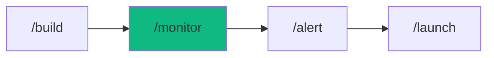

# /monitor - Production Observability

$ARGUMENTS

---

## Purpose

This workflow uses the **monitoring-production** chain to setup:

- OpenTelemetry observability foundation
- Structured observability with cloud aggregation
- Prometheus observability and dashboards
- Distributed observability (APM)
- Alerting and incident response

## 🤖 Meta-Agents Integration

| Phase | Agent | Action |
| ----- | ----- | ------ |
| **Pre-Setup** | `assessor` | Evaluate monitoring scope and complexity |
| **Configuration** | `orchestrator` | Coordinate multi-skill setup |
| **Post-Setup** | `learner` | Log monitoring patterns for future setups |

---

## 🔗 Chain: monitoring-production

**Skills Loaded (5):**

- `observability` - OpenTelemetry SDK, provider integration (Datadog, Sentry, New Relic)
- `observability` - Structured observability (Pino/Winston), PII masking, log aggregation
- `observability` - Prometheus observability, Golden Signals (latency, traffic, errors, saturation)
- `observability` - Distributed observability, custom spans, context propagation
- `observability` - Alert rules, Slack/PagerDuty integration, runbooks

## 📖 Usage

```bash
/monitor <description>
```

## Examples

```bash
# Basic monitoring setup
/monitor my-production-app

# With specific provider
/monitor production app with Datadog

# With custom requirements
/monitor e-commerce API
Requirements:
- Datadog APM
- Error rate alerts
- Slack notifications
- Custom business observability
```

## 📁„ Workflow Steps

This workflow automatically:

1. **Observability Foundation**
   - Install OpenTelemetry SDK
   - Configure providers (Datadog/Sentry/New Relic)
   - Setup auto-instrumentation
   - Configure resource attributes

2. **Structured observability**
   - Setup Pino/Winston logger
   - JSON-formatted logs
   - PII redaction (email, phone, SSN)
   - Cloud aggregation (Datadog Logs, CloudWatch, Loki)
   - Correlation IDs for request observability

3. **observability Collection**
   - Expose Prometheus `/observability` endpoint
   - Golden Signals (latency, traffic, errors, saturation)
   - Custom business observability
   - Create Grafana/Datadog dashboards

4. **Distributed observability** (Optional)
   - Enable auto-instrumentation (HTTP, DB, Redis)
   - Custom span creation
   - Trace context propagation (W3C)
   - APM integration (Datadog APM, Sentry)
   - Sampling strategy (10% production, 100% dev)

5. **Incident Response**
   - Configure alert rules (error rate, latency, downtime)
   - Setup Slack webhook integration
   - PagerDuty on-call routing
   - Generate runbooks for common issues
   - Post-mortem templates

## 🎨 Supported Platforms

### Observability Providers

- **Datadog** - Full-stack monitoring
- **New Relic** - APM and infrastructure
- **Sentry** - Error tracking and performance
- **Grafana Cloud** - Open-source stack
- **Self-hosted** - Prometheus + Jaeger + Loki

### Log Aggregation

- **Datadog Logs**
- **AWS CloudWatch**
- **Grafana Loki**
- **Elasticsearch**

### observability Platforms

- **Prometheus** + Grafana
- **Datadog observability**
- **New Relic observability**
- **CloudWatch observability**

## ✅ Success Criteria

After running `/monitor`, you will have:

✓ **Observability SDK** - OpenTelemetry initialized
✓ **Structured Logs** - JSON logs with PII masking
✓ **observability Endpoint** - `/observability` exposing Prometheus format
✓ **Dashboards** - Pre-configured with Golden Signals
✓ **Alerts** - At least 3 critical alerts (error rate, latency, health check)
✓ **Notifications** - Slack/PagerDuty integration working
✓ **Runbooks** - Documentation for incident response

## 📊 What Gets Monitored

### Application observability

- HTTP request rate (requests/sec)
- Response time (p50, p95, p99)
- Error rate (%)
- Active connections
- Database query performance
- Cache hit rate

### Infrastructure observability

- CPU usage
- Memory usage
- Disk usage
- Network I/O

### Business observability

- User signups
- Orders processed
- Revenue (if applicable)
- Custom KPIs

## 📁 Related Workflows

- `/optimize` - Performance profiling and optimization
- `/alert` - Configure additional alert rules
- `/launch` - Deploy with monitoring pre-configured
- `/diagnose` - Debug issues using monitoring data

## 💡 Tips

**When to use `/monitor`:**

- After deploying to production
- When setting up new services
- After incidents (to prevent recurrence)
- Regulatory compliance (audit observability)

**Golden Signals are mandatory:**

- **Latency** - How long requests take
- **Traffic** - How many requests
- **Errors** - How many fail
- **Saturation** - Resource usage

**Best practices:**

- Set up monitoring BEFORE going to production
- Test alerts in staging first
- Keep runbooks up-to-date
- Use PII masking for GDPR/CCPA compliance
- Sample traces in production (10%) to save costs

## 📚 Example Output

```bash
You: "/monitor my-production-app"

Agent: Loading monitoring-production chain
       ↓
Skills: observability, observability, observability, observability, observability
       ↓

[1/5] 📁§ Observability Setup
   ✅ OpenTelemetry SDK initialized
   ✅ Service: my-production-app
   ✅ Environment: production
   ✅ Datadog exporter configured
   ✅ Auto-instrumentation: HTTP, Prisma, Redis

[2/5] 📝 observability
   ✅ Structured observability with Pino
   ✅ Log levels: error, warn, info, debug
   ✅ PII redaction: password, creditCard, ssn, email, phone
   ✅ Logs aggregated to Datadog
   ✅ Correlation IDs enabled

[3/5] 📊 observability
   ✅ Prometheus observability exposed at /observability
   ✅ Golden Signals configured:
      - Latency: p50, p95, p99
      - Traffic: requests/sec
      - Errors: error rate
      - Saturation: CPU, memory
   ✅ Custom observability: 12 configured
   ✅ Dashboard created in Datadog

[4/5] 📁 Distributed observability (optional)
   ✅ Automatic instrumentation: HTTP, Prisma, Redis
   ✅ Sampling rate: 10% (production)
   ✅ Trace context propagation enabled
   ✅ Traces visible in Datadog APM

[5/5] 🚨 Incident Response
   ✅ Alert rules configured: 5 critical, 8 high
   ✅ Slack webhook: #oncall
   ✅ PagerDuty integration: production-alerts
   ✅ Runbooks generated: 5 playbooks
   ✅ Post-mortem template created

✅ Monitoring Complete!

📊 Dashboard: https://app.datadoghq.com/dashboard/my-app
📝 Logs: https://app.datadoghq.com/logs?service=my-app
📁 Traces: https://app.datadoghq.com/apm/services/my-app
🚨 Alerts: https://app.datadoghq.com/monitors

Created:
✓ lib/observability/setup.ts
✓ lib/logger.ts
✓ lib/observability.ts
✓ .env (with required variables)
✓ docs/runbooks/ (5 playbooks)
✓ alerts.yml (13 alert rules)
✓ README-MONITORING.md
```

## 🚨 Alert Examples

The workflow configures these critical alerts by default:

| Alert               | Threshold     | Severity | Notification      |
| ------------------- | ------------- | -------- | ----------------- |
| High Error Rate     | >1% for 5min  | Critical | Slack + PagerDuty |
| High Latency        | p95 >500ms    | High     | Slack             |
| Health Check Failed | <100% success | Critical | Slack + PagerDuty |
| Memory Usage        | >90%          | High     | Slack             |
| Database Timeout    | >3 in 5min    | High     | Slack             |

## 📖 Runbooks Generated

The workflow creates runbooks for:

- High error rate investigation
- High latency debugging
- Health check failure response
- Database timeout resolution
- Memory leak investigation

---

## Output Format

```markdown
## 📊 Monitoring Setup Complete

### Configuration
| Component | Status |
|-----------|--------|
| OpenTelemetry | ✅ Initialized |
| Logs | ✅ Aggregated |
| Metrics | ✅ /metrics exposed |
| Alerts | ✅ 5 critical configured |

### Next Steps
- [ ] Test alerts in staging
- [ ] Add custom business metrics
- [ ] Update runbooks
```

---

## 🔗 Workflow Chain



| After /monitor | Run | Purpose |
|----------------|-----|---------|
| Configure alerts | `/alert` | Set up alert rules |
| Ready to deploy | `/launch` | Deploy with monitoring |
| Issues occur | `/diagnose` | Debug using metrics |

**Handoff:**
```markdown
✅ Monitoring configured! Run `/alert` to set up alerting, then `/launch` to deploy.
```

---

**Version:** 1.0.0  
**Chain:** monitoring-production  
**Added:** v3.4.0 (FAANG upgrade)

