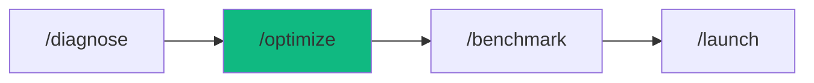

# /optimize - Performance Optimization

$ARGUMENTS

---

## Purpose

Profile application performance, optimize bottlenecks (database queries, bundle size, caching), and validate improvements with load testing. **Differs from `/benchmark` (runs load tests only, no optimization) and `/monitor` (tracks production metrics) by actively identifying and fixing performance issues across frontend, backend, and infrastructure.** Uses `performance-specialist` with `perf-optimizer` for profiling and `backend-specialist` with `data-modeler` for database optimization.

---

## 🤖 Meta-Agents Integration

| Phase | Agent | Action |
| ----- | ----- | ------ |
| **Pre-Optimize** | `recovery` | Save current state before changes |
| **Post-Optimize** | `learner` | Log optimization patterns for reuse |

```
Flow:
recovery.save() → profile → optimize → benchmark
       ↓
benchmark → worse? → recovery.restore()
       ↓ better
learner.log(optimization_patterns)
```

---

## 🔴 MANDATORY: Performance Optimization Protocol

### Phase 1: Performance Profiling

| Field | Value |
|-------|-------|
| **INPUT** | $ARGUMENTS (app/component to optimize + optional targets) |
| **OUTPUT** | Performance audit: bottlenecks identified with metrics |
| **AGENTS** | `performance-specialist` |
| **SKILLS** | `perf-optimizer` |

1. `recovery` saves current state before any changes
2. Run profiling:

| Area | Profile | Metrics |
|------|---------|---------|
| Frontend | Lighthouse, bundle analysis | LCP, CLS, FID, bundle KB |
| Backend | API profiling | p50, p95, p99 latency |
| Database | Query analysis | Query count, duration, N+1 |
| Cache | Hit/miss analysis | Hit rate %, DB load |

3. Identify bottlenecks and rank by impact

Performance targets:

| Metric | Target | Critical |
|--------|--------|----------|
| p95 Latency | <200ms | <500ms |
| Error Rate | <0.5% | <1% |
| Cache Hit Rate | >80% | >70% |
| Concurrent Users | 10,000+ | 5,000+ |
| LCP | <2.5s | <4s |
| CLS | <0.1 | <0.25 |

### Phase 2: Database Optimization

| Field | Value |
|-------|-------|
| **INPUT** | Bottleneck report from Phase 1 |
| **OUTPUT** | Optimized queries, added indexes, fixed N+1 patterns |
| **AGENTS** | `backend-specialist` |
| **SKILLS** | `data-modeler`, `perf-optimizer` |

| Issue | Solution | Impact |
|-------|----------|--------|
| N+1 queries | Use `include` or JOINs | 90%+ faster |
| Missing indexes | Add indexes on foreign keys | 95%+ faster |
| Small connection pool | Increase to 20-50 | Eliminates timeouts |
| Unoptimized queries | Rewrite with proper filtering | Variable |

### Phase 3: Caching & Frontend

| Field | Value |
|-------|-------|
| **INPUT** | Optimized database from Phase 2 |
| **OUTPUT** | Redis cache configured, CDN setup, bundle optimized |
| **AGENTS** | `performance-specialist` |
| **SKILLS** | `perf-optimizer`, `caching-strategy` |

Backend caching:
- Redis cache-aside pattern
- TTL strategy per data volatility
- Target: >80% cache hit rate

Frontend optimization:
- Code splitting and lazy loading
- Image optimization (WebP, lazy load)
- CDN configuration (Cloudflare/Vercel)
- HTTP caching headers

### Phase 4: Load Testing & Validation

| Field | Value |
|-------|-------|
| **INPUT** | Optimized application from Phase 3 |
| **OUTPUT** | Load test results: before/after comparison, go/no-go |
| **AGENTS** | `performance-specialist` |
| **SKILLS** | `perf-optimizer` |

1. Run realistic user scenarios at target scale
2. Compare before/after metrics
3. If regression detected → `recovery` restores checkpoint
4. If improved → `learner` logs patterns

---

## ⛔ MANDATORY: Problem Verification Before Completion

> **CRITICAL:** This check MUST be performed before any `notify_user` or task completion.

### Check @[current_problems]

```
1. Read @[current_problems] from IDE
2. If errors/warnings > 0:
   a. Auto-fix: imports, types, lint errors
   b. Re-check @[current_problems]
   c. If still > 0 → STOP → Notify user
3. If count = 0 → Proceed to completion
```

### Auto-Fixable

| Type | Fix |
|------|-----|
| Missing import | Add import statement |
| Unused variable | Remove or prefix `_` |
| Type mismatch | Fix type annotation |
| Lint errors | Run eslint --fix |

> **Rule:** Never mark complete with errors in `@[current_problems]`.

---

## Output Format

```markdown
## ⚡ Performance Optimization Complete

### Improvements

| Metric | Before | After | Improvement |
|--------|--------|-------|-------------|
| p95 Latency | 850ms | 180ms | 79% faster |
| DB Load | 1000 qps | 150 qps | 85% reduction |
| Cache Hit | 0% | 85% | New caching |
| Bundle Size | 1.2MB | 380KB | 68% smaller |

### Changes Applied

| Area | Change | Impact |
|------|--------|--------|
| Database | Added indexes, fixed N+1 | ✅ 95% faster |
| Cache | Redis + CDN | ✅ 85% hit rate |
| Frontend | Code splitting | ✅ 68% smaller |

### Load Test Result

| Metric | Target | Actual | Status |
|--------|--------|--------|--------|
| p95 | <200ms | 180ms | ✅ |
| Error rate | <0.5% | 0.2% | ✅ |
| Concurrent | 5,000+ | 5,000 | ✅ |

### Next Steps

- [ ] Run `/benchmark` for extended load testing
- [ ] Run `/monitor` to track production metrics
- [ ] Run `/launch` to deploy optimized version
```

---

## Examples

```
/optimize my-slow-api
/optimize checkout flow target p95 < 200ms
/optimize production app 10K users
/optimize frontend bundle size reduction
/optimize database queries for user service
```

---

## Key Principles

- **Profile before optimizing** — measure first, don't guess bottlenecks
- **Database first** — fix queries and indexes before adding caching
- **Cache second** — add Redis/CDN after database is optimized
- **Validate with load tests** — prove improvements with realistic traffic
- **Rollback on regression** — if metrics worsen, restore immediately

---

## 🔗 Workflow Chain

**Skills Loaded (3):**

- `perf-optimizer` - Performance profiling, Core Web Vitals, bundle analysis
- `data-modeler` - Database query optimization, index recommendations
- `caching-strategy` - Redis caching, CDN, cache-aside patterns



| After /optimize | Run | Purpose |
|----------------|-----|---------|
| Validate results | `/benchmark` | Extended load testing |
| Ready to deploy | `/launch` | Deploy optimized version |
| Track metrics | `/monitor` | Setup production monitoring |

**Handoff to /benchmark:**

```markdown
⚡ Optimization complete! Latency: [before]ms → [after]ms ([X]% faster).
Run `/benchmark` to validate at scale or `/launch` to deploy.
```
