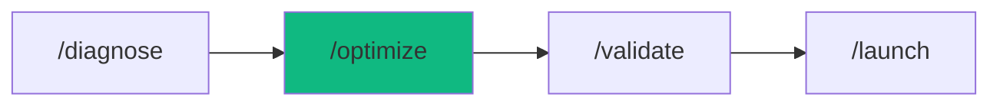

# /optimize - Performance Optimization

$ARGUMENTS

---

## Purpose

Profile application performance, optimize bottlenecks (database queries, bundle size, caching), and validate improvements with load testing. **Differs from `/validate` (runs test suites, no optimization) and `/monitor` (tracks production metrics) by actively identifying and fixing performance issues across frontend, backend, and infrastructure.** Uses `perf-optimizer` with `perf-optimizer` for profiling and `nodejs-pro` with `data-modeler` for database optimization.

---

## 🤖 Meta-Agents Integration

| Phase | Agent | Action |
| ----- | ----- | ------ |
| **Pre-Flight** | `assessor` | Evaluate optimization scope and knowledge-compiler context |
| **Execution** | `orchestrator` | Coordinate profiling, database, and cache optimization |
| **Safety** | `recovery` | Save state and recover/rollback from performance regressions |
| **Post-Optimize**| `learner` | Log optimization telemetry and performance patterns |

```
Flow:
recovery.save() → profile → optimize → benchmark
       ↓
benchmark → worse? → recovery.restore()
       → better
learner.log(optimization_patterns)
```

---

## ⚡ MANDATORY: Performance Optimization Protocol

### Phase 1: Pre-flight & knowledge-compiler Context

> **Rule 0.5-K:** knowledge-compiler pattern check.

1. Read `.agent/skills/knowledge-compiler/patterns/` for past failures before proceeding.
2. Trigger `recovery` agent to run Checkpoint (`git commit -m "chore(checkpoint): pre-optimize"`).

### Phase 2: Performance Profiling

| Field | Value |
|-------|-------|
| **INPUT** | $ARGUMENTS (app/component to optimize + optional targets) |
| **OUTPUT** | Performance audit: bottlenecks identified with metrics |
| **AGENTS** | `perf-optimizer`, `assessor` |
| **SKILLS** | `perf-optimizer`, `context-engineering` |

// turbo — telemetry: phase-2-profile

1. `recovery` saves current state before any changes
2. Run profiling:

| Area | Profile | Metrics |
|------|---------|---------|
| Frontend | Lighthouse, bundle analysis | LCP, CLS, FID, bundle KB |
| Backend | API profiling | p50, p95, p99 latency |
| Database | Query analysis | Query count, duration, N+1 |
| Cache | Hit/miss analysis | Hit rate %, DB load |

3. Identify bottlenecks and rank by impact

Performance targets:

| Metric | Target | Critical |
|--------|--------|----------|
| p95 Latency | <200ms | <500ms |
| Error Rate | <0.5% | <1% |
| Cache Hit Rate | >80% | >70% |
| Concurrent Users | 10,000+ | 5,000+ |
| LCP | <2.5s | <4s |
| CLS | <0.1 | <0.25 |

### Phase 3: Database Optimization

| Field | Value |
|-------|-------|
| **INPUT** | Bottleneck report from Phase 2 |
| **OUTPUT** | Optimized queries, added indexes, fixed N+1 patterns |
| **AGENTS** | `nodejs-pro`, `orchestrator` |
| **SKILLS** | `data-modeler`, `perf-optimizer`, `smart-router` |

// turbo — telemetry: phase-3-db

| Issue | Solution | Impact |
|-------|----------|--------|
| N+1 queries | Use `include` or JOINs | 90%+ faster |
| Missing indexes | Add indexes on foreign keys | 95%+ faster |
| Small connection pool | Increase to 20-50 | Eliminates timeouts |
| Unoptimized queries | Rewrite with proper filtering | Variable |

### Phase 4: Caching & Frontend

| Field | Value |
|-------|-------|
| **INPUT** | Optimized database from Phase 3 |
| **OUTPUT** | Redis cache configured, CDN setup, bundle optimized |
| **AGENTS** | `perf-optimizer`, `orchestrator` |
| **SKILLS** | `perf-optimizer`, `server-ops`, `smart-router` |

// turbo — telemetry: phase-4-cache

Backend caching:
- Redis cache-aside pattern
- TTL strategy per data volatility
- Target: >80% cache hit rate

Frontend optimization:
- Code splitting and lazy loading
- Image optimization (WebP, lazy load)
- CDN configuration (Cloudflare/Vercel)
- HTTP caching headers

### Phase 5: Load Testing & Validation

| Field | Value |
|-------|-------|
| **INPUT** | Optimized application from Phase 4 |
| **OUTPUT** | Load test results: before/after comparison, go/no-go |
| **AGENTS** | `perf-optimizer`, `learner` |
| **SKILLS** | `perf-optimizer`, `problem-checker`, `knowledge-compiler` |

// turbo — telemetry: phase-5-loadtest

1. Run realistic user scenarios at target scale
2. Compare before/after metrics
3. If regression detected → `recovery` restores checkpoint
4. If improved → `learner` logs patterns

---

## → MANDATORY: Problem Verification Before Completion

> **CRITICAL:** This check MUST be performed before any `notify_user` or task completion.

### Check @[current_problems]

```
1. Read @[current_problems] from IDE
2. If errors/warnings > 0:
   a. Auto-fix: imports, types, lint errors
   b. Re-check @[current_problems]
   c. If still > 0 → STOP → Notify user
3. If count = 0 → Proceed to completion
```

### Auto-Fixable

| Type | Fix |
|------|-----|
| Missing import | Add import statement |
| Unused variable | Remove or prefix `_` |
| Type mismatch | Fix type annotation |
| Lint errors | Run eslint --fix |

> **Rule:** Never mark complete with errors in `@[current_problems]`.

---

## 🔄 Rollback & Recovery

If performance optimization causes regression, breaks functionality, or ruins benchmarks:
1. Revert to safe checkpoint using `recovery` meta-agent immediately.
2. Discard unoptimized caching layers or breaking query rewrites.
3. Log failure reason via `learner`.

---

## Output Format

```markdown
## → Performance Optimization Complete

### Improvements

| Metric | Before | After | Improvement |
|--------|--------|-------|-------------|
| p95 Latency | 850ms | 180ms | 79% faster |
| DB Load | 1000 qps | 150 qps | 85% reduction |
| Cache Hit | 0% | 85% | New caching |
| Bundle Size | 1.2MB | 380KB | 68% smaller |

### Changes Applied

| Area | Change | Impact |
|------|--------|--------|
| Database | Added indexes, fixed N+1 | → 95% faster |
| Cache | Redis + CDN | → 85% hit rate |
| Frontend | Code splitting | → 68% smaller |

### Load Test Result

| Metric | Target | Actual | Status |
|--------|--------|--------|--------|
| p95 | <200ms | 180ms | → |
| Error rate | <0.5% | 0.2% | → |
| Concurrent | 5,000+ | 5,000 | → |

### Next Steps

- [ ] Run `/validate` for extended test coverage
- [ ] Run `/monitor` to track production metrics
- [ ] Run `/launch` to deploy optimized version
```

---

## Examples

```
/optimize my-slow-api
/optimize checkout flow target p95 < 200ms
/optimize production app 10K users
/optimize frontend bundle size reduction
/optimize database queries for user service
```

---

## Key Principles

- **Profile before optimizing** — measure first, don't guess bottlenecks
- **Database first** — fix queries and indexes before adding caching
- **Cache second** — add Redis/CDN after database is optimized
- **Validate with load tests** — prove improvements with realistic traffic
- **Rollback on regression** — if metrics worsen, restore immediately

---

## 🔗 Workflow Chain

**Skills Loaded (7):**

- `perf-optimizer` - Performance profiling, Core Web Vitals, bundle analysis
- `data-modeler` - Database query optimization, index recommendations
- `server-ops` - Redis caching, CDN, cache-aside patterns
- `context-engineering` - Codebase parsing and context extraction
- `smart-router` - Dynamic agent routing for backend/frontend
- `problem-checker` - IDE problem verification
- `knowledge-compiler` - Learning and logging optimization patterns



| After /optimize | Run | Purpose |
|----------------|-----|---------|
| Validate results | `/validate` | Run full test suite |
| Ready to deploy | `/launch` | Deploy optimized version |
| Track metrics | `/monitor` | Setup production monitoring |

**Handoff to /validate:**

```markdown
✅ Optimization complete! Latency: [before]ms → [after]ms ([X]% faster).
Run `/validate` to verify at scale or `/launch` to deploy.
```
