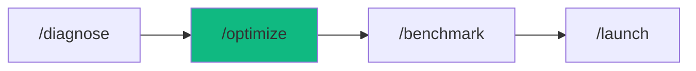

# /optimize - Performance Optimization

$ARGUMENTS

---

## Purpose

This workflow uses the **performance-audit** chain to:

- Profile application performance (Lighthouse, bundle size, API latency)
- Optimize database queries (indexes, N+1 fixes)
- Implement caching layers (Redis, CDN)
- Validate improvements with load testing

## 🤖 Meta-Agents Integration

| Phase | Agent | Action |
| ----- | ----- | ------ |
| **Pre-Optimize** | `recovery` | Save current state before changes |
| **Optimization** | `orchestrator` | Coordinate parallel optimization tasks |
| **Post-Optimize** | `learner` | Log optimization patterns for reuse |
| **Failure** | `recovery` | Rollback if optimization degrades performance |

```
Flow:
recovery.save() → orchestrator.run(optimizations)
       ↓
benchmark → worse? → recovery.restore()
       ↓
better → learner.log(optimization_patterns)
```

---

## 🔗 Chain: performance-audit

**Skills Loaded (4):**

- `perf-optimizer` - Performance profiling (Core Web Vitals, bundle analysis)
- `data-modeler` - Query optimization, index recommendations
- `perf-optimizer` - Redis caching, CDN configuration
- `perf-optimizer` - k6/Artillery load testing, scalability validation

## 📖 Usage

```bash
/optimize <description>
```

## Examples

```bash
# Basic optimization
/optimize my-slow-api

# With specific target
/optimize checkout flow (target: p95 <200ms)

# Production optimization
/optimize production app (10K+ users)
```

## 📁„ Workflow Steps

This workflow automatically:

1. **Performance Profiling**
   - Run Lighthouse audit (Core Web Vitals)
   - Analyze bundle size
   - Profile API response times
   - Identify slow database queries

2. **Database Optimization**
   - Detect N+1 queries
   - Add missing indexes
   - Optimize slow queries
   - Tune connection pool

3. **Cache Implementation**
   - Setup Redis cache
   - Configure CDN (Cloudflare/Vercel)
   - Set HTTP caching headers
   - Implement cache-aside pattern

4. **Load Testing**
   - Run realistic user scenarios
   - Test at target scale (10K+ users)
   - Measure p95 latency, error rate
   - Identify remaining bottlenecks

## ✅ Success Criteria

After running `/optimize`, you will have:

✓ **Bottlenecks Identified** - Slow queries, large bundles
✓ **Performance Improved** - 50%+ latency reduction
✓ **Caching Implemented** - >80% cache hit rate
✓ **Load Test Passed** - Supports target concurrent users

## 📊 What Gets Optimized

### Frontend

- Bundle size reduction (code splitting)
- Image optimization (WebP, lazy loading)
- Core Web Vitals (LCP <2.5s, CLS <0.1)

### Backend

- Database query optimization (indexes, N+1 fixes)
- Redis caching (80%+ hit rate)
- API response time (p95 <200ms)
- Connection pool tuning

### Infrastructure

- CDN configuration
- HTTP caching headers
- Horizontal scaling recommendations

## 🎨 Performance Targets

| Metric               | Target  | Critical |
| -------------------- | ------- | -------- |
| **p95 Latency**      | <200ms  | <500ms   |
| **Error Rate**       | <0.5%   | <1%      |
| **Cache Hit Rate**   | >80%    | >70%     |
| **Concurrent Users** | 10,000+ | 5,000+   |

## 📁 Related Workflows

- `/benchmark` - Run load tests only (no optimization)
- `/monitor` - Setup monitoring after optimization
- `/launch` - Deploy optimized version

## 💡 Tips

**When to use `/optimize`:**

- API response times >500ms
- High database load
- Poor Lighthouse scores
- Before launch to production

**Best practices:**

- Profile BEFORE optimizing
- Fix database issues first (biggest impact)
- Add caching second
- Validate with load tests
- Monitor after deployment

## 📚 Example Output

```bash
You: "/optimize my-slow-api"

Agent: Loading performance-audit chain
       ↓
Skills: perf-optimizer, data-modeler, perf-optimizer, perf-optimizer
       ↓

[1/4] 📁 Performance Profiling
   ⚠️ API p95 latency: 850ms (target: <200ms)
   ❌ Database queries: 15 per request
   ❌ Slow query: users.findMany (2.5s)
   ⚠️ No caching detected

[2/4] 🗄️ Database Tuning
   ✅ Added index: idx_users_email
   ✅ Fixed N+1: user posts (15 queries → 1)
   ✅ Connection pool: 10 → 20
   ✅ Query time: 2.5s → 50ms (98% faster)

[3/4] ⚡ Cache Optimization
   ✅ Redis configured
   ✅ Cache-aside pattern implemented
   ✅ CDN configured for static assets
   ✅ Cache hit rate: 85%
   ✅ Database load: 1000 qps → 150 qps

[4/4] 🧪 Load Testing
   Testing: 5,000 concurrent users
   ✅ p95 latency: 180ms (target: <200ms ✓)
   ✅ Error rate: 0.2% (target: <1% ✓)
   ✅ Throughput: 4,150 rps
   ✅ PASS

📊 Performance Improvement:
   - Latency: 850ms → 180ms (79% faster)
   - Database load: 85% reduction
   - Supports: 5,000+ users ✅

✅ Optimization complete!

Files modified:
   ✓ Add indexes to schema
   ✓ Redis cache setup (lib/cache/)
   ✓ CDN config (next.config.js)
   ✓ Load test script (tests/load/)
```

## 🚨 Common Bottlenecks Fixed

| Issue                 | Solution                    | Impact                |
| --------------------- | --------------------------- | --------------------- |
| N+1 queries           | Use `include` or JOINs      | 90%+ faster           |
| Missing indexes       | Add indexes on foreign keys | 95%+ faster           |
| No caching            | Redis + CDN                 | 70% DB load reduction |
| Small connection pool | Increase to 20-50           | Eliminates timeouts   |

---

## Output Format

```markdown
## ⚡ Performance Optimization Complete

### Improvements
| Metric | Before | After | Improvement |
|--------|--------|-------|-------------|
| p95 Latency | [X]ms | [Y]ms | [Z]% faster |
| DB Load | [X] qps | [Y] qps | [Z]% reduction |
| Cache Hit | 0% | [X]% | New caching |

### Next Steps
- [ ] Run load test to validate
- [ ] Monitor in production
- [ ] Set up alerts for regression
```

---

## 🔗 Workflow Chain



| After /optimize | Run | Purpose |
|-----------------|-----|---------|
| Validate results | `/benchmark` | Run load tests |
| Ready to deploy | `/launch` | Deploy optimized version |
| Set up monitoring | `/monitor` | Track performance |

**Handoff:**
```markdown
✅ Optimization complete! Run `/benchmark` to validate, then `/launch` to deploy.
```

---

**Version:** 1.0.0  
**Chain:** performance-audit  
**Added:** v3.5.0 (FAANG upgrade - Phase 2)

