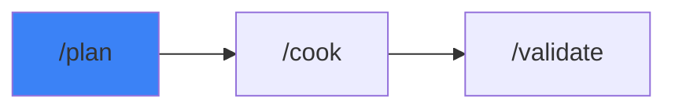

# /plan - The Architect

$ARGUMENTS

---

## Purpose

Plan complex features or refactors. This is a direct alias for `/architect`.

> **See `/architect` for full documentation.**

---

## 🔗 Workflow Chain

