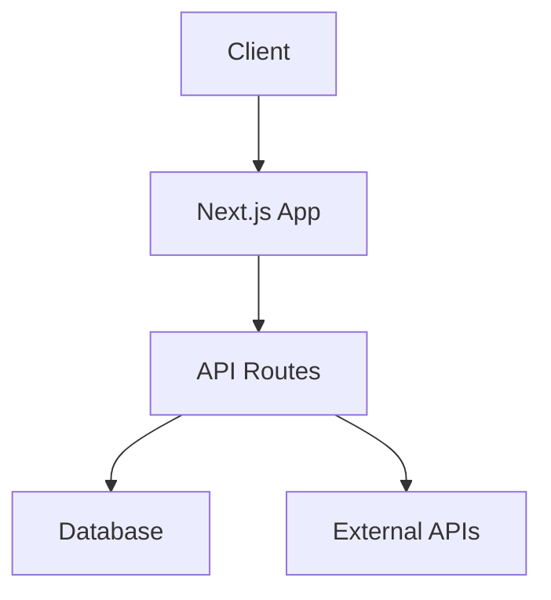
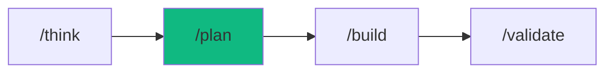

# /plan - Project Blueprint

$ARGUMENTS

---

## Purpose

Create comprehensive project plans with task breakdown, architecture decisions, and agent assignments. **NO CODE - only planning artifacts.**

---

## 🛠️ Architecture Tools

### 1. Diagram Generator

Generate architecture diagrams with Mermaid:

```mermaid
# Context Diagram (C4 Level 1)
graph TD
    User[👤 User] --> App[📱 Application]
    App --> DB[(🗄️ Database)]
    App --> API[🌐 External API]
```

```mermaid
# Container Diagram (C4 Level 2)
graph TD
    subgraph Frontend
        Web[Next.js App]
        Mobile[React Native]
    end
    subgraph Backend
        API[API Gateway]
        Auth[Auth Service]
        Core[Core Service]
    end
    subgraph Data
        DB[(PostgreSQL)]
        Cache[(Redis)]
    end
    Web --> API
    Mobile --> API
    API --> Auth
    API --> Core
    Core --> DB
    Core --> Cache
```

### 2. Dependency Analyzer

Check project dependencies:
```bash
# NPM projects
npx depcheck
npx npm-check-updates

# Visualize dependencies
npx dependency-cruiser src --output-type dot | dot -T svg > deps.svg
```

### 3. Architecture Decision Records (ADR)

Generate ADR template:
```markdown
# ADR-001: [Decision Title]

## Status
Proposed | Accepted | Deprecated | Superseded

## Context
What is the issue that we're seeing that is motivating this decision?

## Decision
What is the change that we're proposing and/or doing?

## Consequences
What becomes easier or more difficult because of this change?
```

---

## 🤖 Meta-Agents Integration

| Phase | Agent | Action |
| ----- | ----- | ------ |
| **Risk Evaluation** | `assessor` | Evaluate architecture risk before approval |
| **Execution Planning** | `orchestrator` | Plan parallel vs sequential execution |
| **Pattern Learning** | `learner` | Learn from past architecture decisions |

```
Flow:
create plan → assessor.evaluate(plan)
       ↓
risk level? → add mitigations to plan
       ↓
orchestrator.plan(execution_order)
       ↓
handoff to /build with execution plan
```

---

## 🔴 MANDATORY: 4-Phase Planning

### Phase 1: Requirements Discovery
Ask these if not provided:
```
1. What is the GOAL? (one sentence)
2. Who are the USERS? (persona)
3. What are MUST-HAVE features? (3-5 items)
4. What are NICE-TO-HAVE? (optional)
5. What is the TIMELINE? (deadline)
6. What are CONSTRAINTS? (budget, tech, team)
```

### Phase 2: Architecture Decision
| Decision | Options | Recommendation |
|----------|---------|----------------|
| Frontend | Next.js / Vite / SPA | [Choice + Why] |
| Backend | Hono / Express / FastAPI | [Choice + Why] |
| Database | PostgreSQL / MongoDB / Supabase | [Choice + Why] |
| Auth | Clerk / NextAuth / Custom | [Choice + Why] |
| Hosting | Vercel / Railway / AWS | [Choice + Why] |

### Phase 3: Task Breakdown
```
Level 1: Epics (major features)
Level 2: Stories (user-facing items)
Level 3: Tasks (technical work)
Level 4: Subtasks (atomic units)
```

### Phase 4: Agent Assignment
| Task | Agent | Dependency | Estimate |
|------|-------|------------|----------|
| Schema design | database-architect | None | 30m |
| API routes | backend-specialist | Schema | 2h |
| UI components | frontend-specialist | API | 3h |
| Tests | test-engineer | All | 1h |

---

## 📐 Architecture Patterns Reference

### Recommended Patterns

| Pattern | When to Use | Complexity |
|---------|-------------|------------|
| **Monolith** | MVP, small team, fast iteration | Low |
| **Microservices** | Large team, independent scaling | High |
| **Serverless** | Event-driven, variable load | Medium |
| **Modular Monolith** | Growing team, future split | Medium |

### Data Patterns

| Pattern | Use Case |
|---------|----------|
| **Repository** | Clean data access layer |
| **CQRS** | Read/write optimization |
| **Event Sourcing** | Audit trail, complex domain |
| **Saga** | Distributed transactions |

### Security Patterns

| Pattern | Implementation |
|---------|----------------|
| **Authentication** | JWT, OAuth2, Session |
| **Authorization** | RBAC, ABAC, PBAC |
| **API Security** | Rate limiting, CORS, CSP |
| **Data Protection** | Encryption at rest, TLS |

---

## Output Format

Generated file: `docs/PLAN-{slug}.md`

```markdown
# Project Plan: [Name]

## Overview
| Aspect | Value |
|--------|-------|
| Goal | [One sentence] |
| Timeline | [X days/weeks] |
| Complexity | Low/Medium/High |
| Team | [Agents involved] |

## Stack Decision

| Layer | Choice | Rationale |
|-------|--------|-----------|
| Frontend | Next.js 15 | SSR, Vercel integration |
| Styling | Tailwind + shadcn/ui | Rapid development |
| Backend | Hono on Edge | Type-safe, fast |
| Database | PostgreSQL (Supabase) | Free tier, realtime |
| Auth | Clerk | Social login, fast setup |

## Architecture



## Task Breakdown

### Epic 1: [Feature Name]
- [ ] Story 1.1: [Description]
  - [ ] Task 1.1.1: [Technical work]
  - [ ] Task 1.1.2: [Technical work]
- [ ] Story 1.2: [Description]

### Epic 2: [Feature Name]
- [ ] Story 2.1: [Description]

## Agent Execution Plan

| Phase | Agent | Task | Duration |
|-------|-------|------|----------|
| 1 | database-architect | Schema + migrations | 30m |
| 2 | backend-specialist | API endpoints | 2h |
| 3 | frontend-specialist | UI components | 3h |
| 4 | test-engineer | E2E tests | 1h |

## Verification Checklist

- [ ] All features implemented
- [ ] Tests passing
- [ ] Security scan clean
- [ ] Performance acceptable
- [ ] Documentation complete

## Next Steps

After plan approval:
1. Run `/build` to start implementation
2. Or modify this plan as needed
```

---

## 🔧 Tech Stack Quick Reference

### Frontend
| Stack | Best For | Learning Curve |
|-------|----------|----------------|
| Next.js | Full-stack, SEO | Medium |
| Vite + React | SPA, fast build | Low |
| Remix | Forms, nested routes | Medium |
| Astro | Content sites | Low |

### Backend
| Stack | Best For | Language |
|-------|----------|----------|
| Hono | Edge, lightweight | TypeScript |
| Express | Flexibility, ecosystem | JavaScript |
| FastAPI | ML, async, docs | Python |
| NestJS | Enterprise, structure | TypeScript |

### Database
| Type | Options | Use Case |
|------|---------|----------|
| SQL | PostgreSQL, Supabase | Structured data |
| NoSQL | MongoDB, Firebase | Flexible schema |
| Graph | Neo4j | Relationships |
| Vector | Pinecone, pgvector | AI/embeddings |

---

## Examples

```
/plan e-commerce site with cart and checkout
/plan REST API for user management
/plan mobile fitness app with tracking
/plan SaaS dashboard with analytics
/plan microservices architecture for fintech
```

---

## 🔗 Workflow Chain



### After Planning

```markdown
✅ Plan created: docs/PLAN-{slug}.md

Next steps:
- Review the architecture decisions
- Adjust task breakdown if needed
- Run `/build` to start implementation
```

| After /plan | Run | Purpose |
|-------------|-----|---------|
| Plan approved | `/build` | Start implementation |
| Need changes | Edit PLAN.md | Modify plan |
| Complex project | `/autopilot` | Full orchestration |
