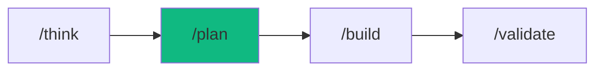

# /plan - Project Blueprint

$ARGUMENTS

---

## Purpose

Create comprehensive project plans with task breakdown, architecture decisions, tech stack selection, and agent assignments — generating `docs/PLAN-{slug}.md` as the execution blueprint. **Differs from `/think` (explores options) and `/build` (writes code) by producing planning artifacts only — NO CODE.** Uses `project-planner` with `project-planner` skill for task decomposition and `idea-storm` for requirements discovery.

---

## 🤖 Meta-Agents Integration

| Phase | Agent | Action |
| ----- | ----- | ------ |
| **Risk Evaluation** | `assessor` | Evaluate architecture risk before approval |
| **Post-Planning** | `learner` | Learn from past architecture decisions |

```
Flow:
requirements → architecture → task breakdown
       ↓
assessor.evaluate(plan_risk)
       ↓
agent assignment → PLAN.md → learner.log()
       ↓
handoff to /build
```

---

## 🔴 MANDATORY: 4-Phase Planning Protocol

### Phase 1: Requirements Discovery

| Field | Value |
|-------|-------|
| **INPUT** | $ARGUMENTS (project description) |
| **OUTPUT** | Requirements doc: goal, users, features, constraints |
| **AGENTS** | `project-planner` |
| **SKILLS** | `idea-storm` |

Ask if not provided:

| Question | Purpose |
|----------|---------|
| What is the GOAL? | One sentence objective |
| Who are the USERS? | Target persona |
| MUST-HAVE features? | 3-5 core items |
| NICE-TO-HAVE? | Optional features |
| TIMELINE? | Deadline or estimate |
| CONSTRAINTS? | Budget, tech, team |

### Phase 2: Architecture Decision

| Field | Value |
|-------|-------|
| **INPUT** | Requirements from Phase 1 |
| **OUTPUT** | Tech stack decisions with rationale, architecture diagram |
| **AGENTS** | `project-planner` |
| **SKILLS** | `system-design`, `project-planner` |

| Decision | Options | Selection Criteria |
|----------|---------|-------------------|
| Frontend | Next.js / Vite / Remix / Astro | SSR needs, SEO, complexity |
| Backend | Hono / Express / FastAPI / NestJS | Scale, team, language |
| Database | PostgreSQL / MongoDB / Supabase | Structure, scale, cost |
| Auth | Clerk / NextAuth / Custom | Speed, features, budget |
| Hosting | Vercel / Railway / AWS | Scale, budget, complexity |

Architecture patterns:

| Pattern | When | Complexity |
|---------|------|-----------|
| **Monolith** | MVP, small team | Low |
| **Modular Monolith** | Growing team, future split | Medium |
| **Serverless** | Event-driven, variable load | Medium |
| **Microservices** | Large team, independent scaling | High |

Generate C4 architecture diagram (mermaid) and ADR for key decisions.

### Phase 3: Task Breakdown

| Field | Value |
|-------|-------|
| **INPUT** | Architecture decisions from Phase 2 |
| **OUTPUT** | Hierarchical task list: Epics → Stories → Tasks → Subtasks |
| **AGENTS** | `project-planner` |
| **SKILLS** | `project-planner` |

```
Level 1: Epics (major features)
Level 2: Stories (user-facing items)
Level 3: Tasks (technical work)
Level 4: Subtasks (atomic units)
```

### Phase 4: Agent Assignment & Plan Generation

| Field | Value |
|-------|-------|
| **INPUT** | Task breakdown from Phase 3 |
| **OUTPUT** | `docs/PLAN-{slug}.md` with execution plan |
| **AGENTS** | `project-planner` |
| **SKILLS** | `project-planner` |

1. Assign agents to tasks based on capability:

| Task Type | Agent | Skill |
|-----------|-------|-------|
| Schema design | `database-architect` | `data-modeler` |
| API routes | `backend-specialist` | `nodejs-pro` |
| UI components | `frontend-specialist` | `frontend-development` |
| Tests | `test-engineer` | `test-architect` |

2. `assessor` evaluates architecture risk
3. Generate `docs/PLAN-{slug}.md`

---

## ⛔ MANDATORY: Problem Verification Before Completion

> **CRITICAL:** This check MUST be performed before any `notify_user` or task completion.

### Check @[current_problems]

```
1. Read @[current_problems] from IDE
2. If errors/warnings > 0:
   a. Auto-fix: imports, types, lint errors
   b. Re-check @[current_problems]
   c. If still > 0 → STOP → Notify user
3. If count = 0 → Proceed to completion
```

> **Note:** /plan produces markdown artifacts, not code. This check applies to any generated config or schema files.

---

## Output Format

Generated file: `docs/PLAN-{slug}.md`

```markdown
## 📋 Plan: [Project Name]

### Overview

| Aspect | Value |
|--------|-------|
| Goal | [One sentence] |
| Timeline | [X days/weeks] |
| Complexity | Low / Medium / High |
| Agents | [Count] assigned |

### Stack Decision

| Layer | Choice | Rationale |
|-------|--------|-----------|
| Frontend | Next.js 15 | SSR, Vercel integration |
| Backend | Hono | Type-safe, edge |
| Database | PostgreSQL | Structured, scalable |

### Architecture

[Mermaid C4 diagram]

### Task Breakdown

- [ ] Epic 1: [Feature]
  - [ ] Story 1.1: [Description]
    - [ ] Task 1.1.1: [Work item]

### Agent Execution Plan

| Phase | Agent | Task | Duration |
|-------|-------|------|----------|
| 1 | `database-architect` | Schema | 30m |
| 2 | `backend-specialist` | API | 2h |
| 3 | `frontend-specialist` | UI | 3h |
| 4 | `test-engineer` | Tests | 1h |

### Next Steps

- [ ] Review architecture decisions
- [ ] Approve plan
- [ ] Run `/build` to start implementation
```

---

## Examples

```
/plan e-commerce site with cart and checkout
/plan REST API for user management
/plan mobile fitness app with tracking
/plan SaaS dashboard with analytics
/plan microservices architecture for fintech
```

---

## Key Principles

- **No code** — /plan produces planning artifacts only, never implementations
- **Ask before assuming** — clarify requirements with Socratic questions
- **Decisions with rationale** — every tech choice must explain WHY
- **Atomic tasks** — break down to the smallest executable unit
- **Agent-ready** — assign agents so `/build` can execute immediately

---

## 🔗 Workflow Chain

**Skills Loaded (3):**

- `idea-storm` - Socratic questioning and requirements clarification
- `project-planner` - Task breakdown and dependency planning
- `system-design` - Architecture decision-making framework



| After /plan | Run | Purpose |
|------------|-----|---------|
| Plan approved | `/build` | Start implementation |
| Complex project | `/autopilot` | Full orchestration |
| Need more thinking | `/think` | Explore alternatives |

**Handoff to /build:**

```markdown
📋 Plan created: docs/PLAN-{slug}.md
Stack: [stack]. Tasks: [count]. Agents: [count].
Review and run `/build` to start implementation.
```
