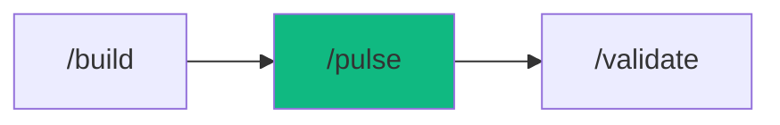

# /pulse - Project Health Dashboard

$ARGUMENTS

---

## Purpose

Display real-time project health — agent progress, file statistics, build metrics, preview server status, and 7-day trends in a single dashboard view. **Differs from `/monitor` (production observability with OpenTelemetry) and `/inspect` (code quality review) by providing a development-time project overview for tracking build progress.** Uses `assessor` for health risk evaluation and `execution-reporter` for agent status aggregation.

---

## 🤖 Meta-Agents Integration

| Phase | Agent | Action |
| ----- | ----- | ------ |
| **Status Collection** | `assessor` | Evaluate project health risks from metrics |
| **Trend Analysis** | `learner` | Track metrics over time for trend detection |

```
Flow:
collect(session, preview, metrics) → assessor.evaluate(health)
       ↓
dashboard output → learner.log(trends)
```

---

## 🔴 MANDATORY: Health Dashboard Protocol

### Phase 1: Data Collection

| Field | Value |
|-------|-------|
| **INPUT** | $ARGUMENTS (optional: specific section to check) |
| **OUTPUT** | Raw status data: session, preview, metrics |
| **AGENTS** | none |
| **SKILLS** | `execution-reporter` |

1. Collect session status:

// turbo
```bash
node .agent/scripts-js/session_manager.js status
```

2. Check preview server:

// turbo
```bash
node .agent/scripts-js/auto_preview.js status
```

3. Collect project metrics (file count, git activity, dependencies):

// turbo
```bash
git log --oneline -10
```

### Phase 2: Health Analysis & Display

| Field | Value |
|-------|-------|
| **INPUT** | Raw status data from Phase 1 |
| **OUTPUT** | Formatted dashboard with health indicators |
| **AGENTS** | none |
| **SKILLS** | `execution-reporter` |

Analyze collected data and evaluate KPI thresholds (see below).

3. Evaluate KPI thresholds:

| Metric | Good | Warning | Critical |
|--------|------|---------|----------|
| Build Time | < 5s | 5-15s | > 15s |
| Bundle Size | < 250KB | 250-500KB | > 500KB |
| Test Coverage | > 80% | 60-80% | < 60% |
| Lighthouse | > 90 | 70-90 | < 70 |

### Phase 3: Risk Assessment

| Field | Value |
|-------|-------|
| **INPUT** | Dashboard metrics from Phase 2 |
| **OUTPUT** | Health summary with risk flags and recommendations |
| **AGENTS** | none |
| **SKILLS** | `project-planner` |

1. `assessor` evaluates metrics against KPI thresholds
2. Flag critical metrics with ❌
3. Suggest next workflow based on findings

---

## ⛔ MANDATORY: Problem Verification Before Completion

> **CRITICAL:** This check MUST be performed before any `notify_user` or task completion.

### Check @[current_problems]

```
1. Read @[current_problems] from IDE
2. If errors/warnings > 0:
   a. Auto-fix: imports, types, lint errors
   b. Re-check @[current_problems]
   c. If still > 0 → Include in dashboard output
3. If count = 0 → Show clean status
```

> **Note:** /pulse is a read-only dashboard. Problems are reported, not fixed.

---

## Output Format

```markdown
## 📊 Project Pulse

### Project Info

| Field | Value |
|-------|-------|
| Name | [project-name] |
| Stack | [framework, db, auth] |
| Status | ✅ Active |

### Agent Board

| Agent | Task | Status |
|-------|------|--------|
| `database-architect` | Schema | ✅ Complete |
| `backend-specialist` | API | ✅ Complete |
| `frontend-specialist` | UI | ⏳ 60% |
| `test-engineer` | Tests | ⏳ Waiting |

### Metrics

| Metric | Value | Status |
|--------|-------|--------|
| Build Time | 2.3s | ✅ |
| Bundle Size | 245KB | ✅ |
| Test Coverage | 87% | ✅ |
| Lighthouse | 92 | ✅ |

### Preview

| Field | Value |
|-------|-------|
| URL | http://localhost:3000 |
| Health | ✅ OK |

### Next Steps

- [ ] Run `/validate` when agents complete
- [ ] Run `/optimize` if metrics degrade
- [ ] Run `/launch` when ready to deploy
```

---

## Examples

```
/pulse
/pulse my-ecommerce
/pulse --metrics-only
```

---

## Key Principles

- **Read-only** — /pulse observes and reports, never modifies
- **Single command** — one command for complete project visibility
- **KPI thresholds** — color-code metrics against defined targets
- **Trend awareness** — show 7-day trends to detect regressions early

---

## 🔗 Workflow Chain

**Skills Loaded (2):**

- `execution-reporter` - Agent status and progress tracking
- `project-planner` - Task breakdown visualization



| After /pulse | Run | Purpose |
|-------------|-----|---------|
| See issues | `/diagnose` | Debug problems |
| Ready to test | `/validate` | Run test suite |
| Ready to deploy | `/launch` | Deploy to production |

**Handoff to /validate:**

```markdown
📊 Pulse: [X] features complete, [Y] agents active. Preview at localhost:3000.
Run `/validate` to test or `/diagnose` for issues.
```
